# High-Level Design: Complete Guide to Load Balancers & Consistent Hashing

## Table of Contents
1. [Introduction to High-Level Design](#introduction)
2. [Load Balancers - Deep Dive](#load-balancers)
3. [Consistent Hashing - Complete Guide](#consistent-hashing)
4. [Real-World Scenarios](#real-world-scenarios)
5. [Implementation Examples](#implementation-examples)
6. [Common Pitfalls & Best Practices](#pitfalls)
7. [Interview Preparation](#interview-prep)

---

## 📚 Introduction to High-Level Design {#introduction}

**High-Level Design (HLD)** focuses on the architecture and design of systems at a macro level. It answers questions like:
- How do components interact?
- How does the system scale?
- How do we ensure reliability and performance?

Two fundamental concepts in HLD are:
1. **Load Balancers**: Traffic distribution
2. **Consistent Hashing**: Data distribution

---

## 🔧 Load Balancers - Deep Dive {#load-balancers}

### What is a Load Balancer?

A load balancer is a **reverse proxy** that sits between clients and servers, distributing incoming requests across multiple backend servers to ensure:
- No single server is overwhelmed
- High availability
- Better resource utilization

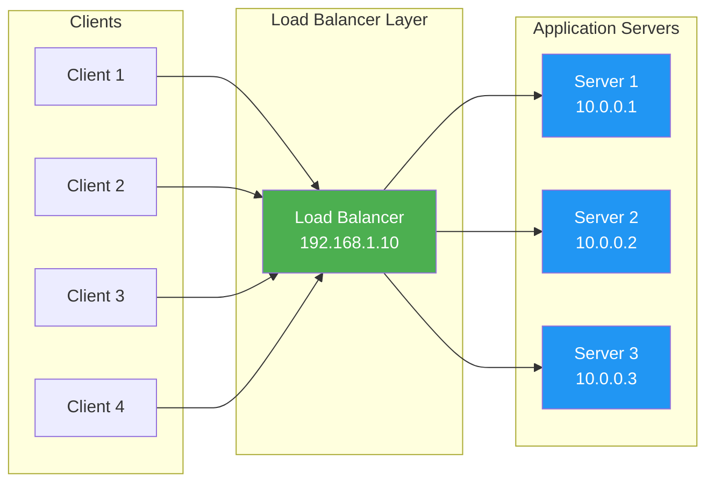

---

### Why Use Load Balancers? (6 Key Benefits)

#### 1. **Scalability (Horizontal Scaling)**
Add more servers without changing application code.

**Example**: Your app handles 100 requests/sec with 1 server. Add 2 more servers → handle 300 requests/sec.

#### 2. **High Availability (Resilience)**
If one server fails, traffic is automatically routed to healthy servers.

**Uptime Calculation**:
- Single server: 99.9% uptime = ~8.76 hours downtime/year
- 3 servers with LB: 99.99% uptime = ~52 minutes downtime/year

#### 3. **Performance Optimization**
Distribute load evenly to prevent hotspots.

#### 4. **Security Layer**
- Hides backend server IPs
- Can provide DDoS protection
- SSL/TLS termination point

#### 5. **Geographical Distribution**
Route users to nearest data center for lower latency.

#### 6. **Maintenance Without Downtime**
Take servers offline for updates while others handle traffic.

---

### How Load Balancers Work

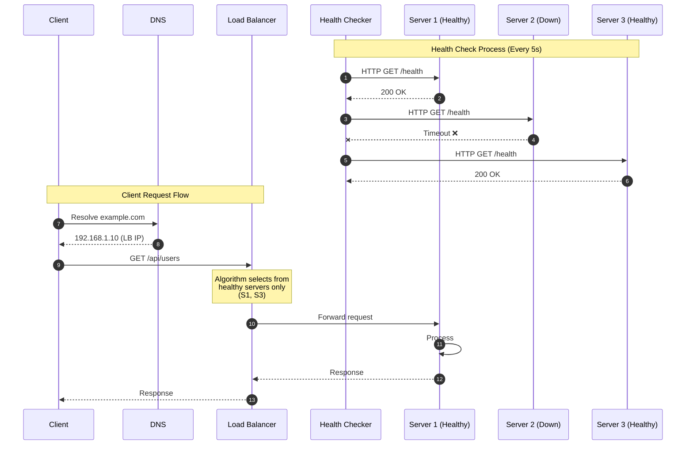

**Key Steps**:
1. **Health Checks**: Continuous monitoring (HTTP, TCP, custom)
2. **Server Selection**: Algorithm chooses from healthy pool
3. **Request Forwarding**: LB acts as proxy
4. **Response Delivery**: Back to client

---

### Load Balancing Algorithms (Detailed)

#### 1. **Round Robin**
Distributes requests sequentially in circular order.

```
Request 1 → Server 1
Request 2 → Server 2
Request 3 → Server 3
Request 4 → Server 1 (cycle repeats)
```

**✅ Pros**:
- Simple, fair distribution
- No overhead

**❌ Cons**:
- Doesn't consider server load
- Assumes all servers have equal capacity

**Use Case**: Homogeneous servers with similar workloads

---

#### 2. **Weighted Round Robin**
Assigns weights based on server capacity.

```
Server 1 (weight: 3) → 3 requests
Server 2 (weight: 2) → 2 requests
Server 3 (weight: 1) → 1 request
```

**Use Case**: Servers with different hardware specs

---

#### 3. **Least Connections**
Routes to server with fewest active connections.

```
Server 1: 10 connections
Server 2: 5 connections  ← New request goes here
Server 3: 8 connections
```

**✅ Pros**:
- Better for long-lived connections (WebSockets, databases)
- Dynamic load balancing

**Use Case**: Variable request processing times

---

#### 4. **IP Hash (Session Persistence)**
Uses client IP to determine server.

```
hash(client_ip) % number_of_servers = server_index
```

**Example**:
```
hash("192.168.1.100") % 3 = 2 → Always Server 2
hash("192.168.1.101") % 3 = 0 → Always Server 0
```

**✅ Pros**:
- Session affinity (sticky sessions)
- User always hits same server

**❌ Cons**:
- Uneven distribution if IPs are not random
- Adding/removing servers disrupts sessions

**Use Case**: Applications requiring session state (shopping carts)

---

#### 5. **Least Response Time**
Combines active connections + average response time.

**Use Case**: Servers in different geographical locations

---

### Layer 4 vs Layer 7 Load Balancing

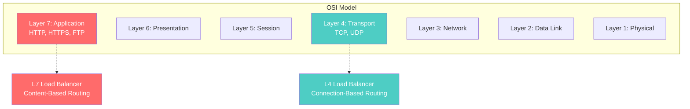

#### Layer 4 Load Balancer (Transport Layer)

**Operates on**: IP address + Port number

**Routing based on**:
- Source/Destination IP
- TCP/UDP ports

**Example**:
```
Client: 192.168.1.100:54321
↓
LB: 192.168.1.10:80 → Forwards to → Server: 10.0.0.1:8080
```

**✅ Advantages**:
- **Fast**: No need to inspect packet contents
- **Lower latency**: Minimal processing
- **Protocol agnostic**: Works with any TCP/UDP traffic

**❌ Limitations**:
- Cannot route based on content
- No cookie-based routing
- No URL-based routing

**Use Cases**:
- Database load balancing
- Gaming servers
- VoIP systems

---

#### Layer 7 Load Balancer (Application Layer)

**Operates on**: HTTP/HTTPS content

**Routing based on**:
- URL path
- HTTP headers
- Cookies
- Query parameters

**Example Routing Rules**:
```
/api/users     → Backend API Servers
/static/*      → CDN Servers
/admin/*       → Admin Servers
Header: mobile → Mobile App Servers
```

**✅ Advantages**:
- **Smart routing**: Content-aware decisions
- **SSL termination**: Decrypt once at LB
- **Compression**: Reduce bandwidth
- **Caching**: Store frequent responses
- **WAF Integration**: Web Application Firewall

**❌ Limitations**:
- Higher latency (must inspect packets)
- More CPU intensive
- Limited to HTTP/HTTPS

**Use Cases**:
- Microservices architecture
- Multi-tenant applications
- API gateways

---

### Health Checks in Detail

Health checks are periodic tests to verify server availability.

#### Types of Health Checks

##### 1. **Active Health Checks**
LB actively pings servers.

```http
GET /health HTTP/1.1
Host: backend-server.local

Response:
HTTP/1.1 200 OK
{
  "status": "healthy",
  "database": "connected",
  "cache": "connected"
}
```

**Configuration Example**:
```yaml
health_check:
  interval: 5s         # Check every 5 seconds
  timeout: 3s          # Wait 3s for response
  unhealthy_threshold: 2  # 2 failures = unhealthy
  healthy_threshold: 3    # 3 successes = healthy
  path: /health
  expected_codes: [200, 204]
```

##### 2. **Passive Health Checks**
Monitor actual traffic for failures.

```
If 5 consecutive requests to Server 1 fail:
  → Mark Server 1 as unhealthy
  → Stop routing traffic
```

---

## 🔄 Consistent Hashing - Complete Guide {#consistent-hashing}

### The Problem: Traditional Hashing

Imagine you have a **distributed cache** with 3 servers to store user data.

**Traditional Approach**: `server_index = hash(user_id) % number_of_servers`

#### Example with 3 Servers:

```python
# Initial setup: 3 servers
servers = 3

user_100 = hash("user_100") % 3  # Let's say hash = 12345
# 12345 % 3 = 0 → Server 0

user_200 = hash("user_200") % 3  # hash = 67890
# 67890 % 3 = 0 → Server 0

user_300 = hash("user_300") % 3  # hash = 11111
# 11111 % 3 = 2 → Server 2
```

**Data Distribution**:
```
Server 0: user_100, user_200
Server 1: (some users)
Server 2: user_300
```

#### ❌ The Problem: Adding/Removing Servers

Now you add **1 more server** (total = 4):

```python
servers = 4  # Added Server 3

user_100 = 12345 % 4 = 1  # Was 0, now 1 ❌
user_200 = 67890 % 4 = 2  # Was 0, now 2 ❌
user_300 = 11111 % 4 = 3  # Was 2, now 3 ❌
```

**Impact**:
- **ALL users** need to be remapped
- **Massive cache invalidation** (cache miss storm)
- **Database overload** as cache is rebuilt

**Real-World Impact**:
- **Before**: 95% cache hit rate
- **After adding server**: 5% cache hit rate (95% cache miss!)
- **Recovery time**: Hours to rebuild cache

---

### The Solution: Consistent Hashing

Consistent hashing minimizes remapping when servers change.

#### Core Concept: The Hash Ring

Imagine a **circular hash space** from 0 to 2^32 - 1 (or 0 to 359° like a circle).

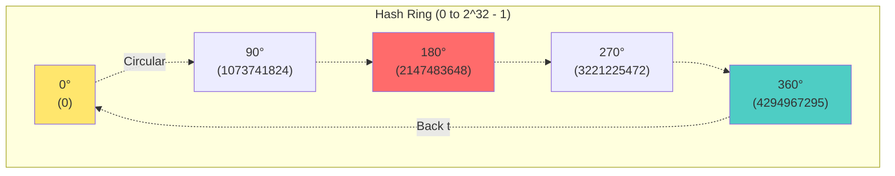

#### Step-by-Step Process

##### Step 1: Hash Servers onto the Ring

```python
hash("Server_A") = 100  → Position 100 on ring
hash("Server_B") = 200  → Position 200 on ring
hash("Server_C") = 300  → Position 300 on ring
```

##### Step 2: Hash Keys (Users) onto the Ring

```python
hash("user_100") = 150  → Position 150 on ring
hash("user_200") = 250  → Position 250 on ring
hash("user_300") = 50   → Position 50 on ring
```

##### Step 3: Assign Keys to Servers (Clockwise)

**Rule**: Each key is assigned to the **first server found moving clockwise** from its position.

```
user_300 (50)  → clockwise → Server_A (100)
user_100 (150) → clockwise → Server_B (200)
user_200 (250) → clockwise → Server_C (300)
```

**Visual Representation**:

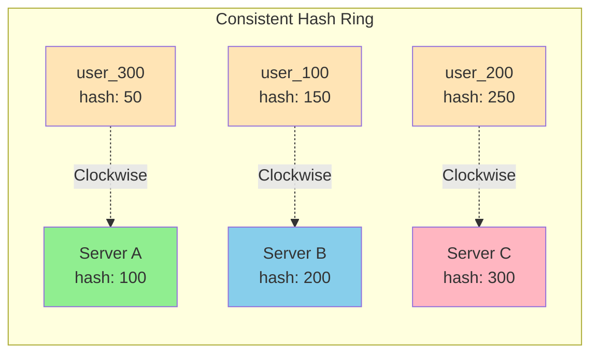

---

### Adding a Server: Minimal Impact

Now let's add **Server_D** with hash position 175.

```python
hash("Server_D") = 175
```

**New Ring**:
```
user_300 (50)  → Server_A (100)  [No change ✅]
user_100 (150) → Server_D (175)  [Changed ❌]
user_200 (250) → Server_C (300)  [No change ✅]
```

**Impact Analysis**:
- **Only 1 out of 3 users** remapped (33%)
- **Traditional hashing**: 100% remapped
- **Actual large scale**: With 1000 servers, only ~0.1% remapped

---

### Virtual Nodes (Vnodes) - Solving the Imbalance Problem

#### Problem with Simple Hashing

If servers hash to positions close together, load is uneven:

```
Server_A: 100  → handles users from 50-99   (50 positions)
Server_B: 110  → handles users from 100-109 (10 positions) ❌ Underutilized
Server_C: 300  → handles users from 110-299 (190 positions) ❌ Overloaded
```

#### Solution: Virtual Nodes

Each **physical server** is represented by **multiple virtual nodes** on the ring.

```python
# Instead of:
hash("Server_A") = 100

# Create multiple virtual nodes:
hash("Server_A_vnode_1") = 50
hash("Server_A_vnode_2") = 150
hash("Server_A_vnode_3") = 250
hash("Server_A_vnode_4") = 350
```

**Benefits**:
1. **Better distribution**: More positions = more even load
2. **Smooth scaling**: Load redistributed across many servers
3. **Fault tolerance**: Failures spread across survivors

**Common Practice**: 100-200 virtual nodes per server

---

### Real-World Implementation Example

```python
import hashlib
from bisect import bisect_right

class ConsistentHashRing:
    def __init__(self, num_virtual_nodes=150):
        self.num_virtual_nodes = num_virtual_nodes
        self.ring = {}  # {hash_value: server_name}
        self.sorted_keys = []  # Sorted hash values
        
    def _hash(self, key):
        """Hash function using MD5"""
        return int(hashlib.md5(key.encode()).hexdigest(), 16)
    
    def add_server(self, server_name):
        """Add a server with virtual nodes"""
        for i in range(self.num_virtual_nodes):
            vnode_key = f"{server_name}_vnode_{i}"
            hash_value = self._hash(vnode_key)
            self.ring[hash_value] = server_name
            self.sorted_keys.append(hash_value)
        
        self.sorted_keys.sort()
        print(f"Added {server_name} with {self.num_virtual_nodes} virtual nodes")
    
    def remove_server(self, server_name):
        """Remove a server and its virtual nodes"""
        for i in range(self.num_virtual_nodes):
            vnode_key = f"{server_name}_vnode_{i}"
            hash_value = self._hash(vnode_key)
            del self.ring[hash_value]
            self.sorted_keys.remove(hash_value)
        
        print(f"Removed {server_name}")
    
    def get_server(self, key):
        """Find which server handles this key"""
        if not self.ring:
            return None
        
        hash_value = self._hash(key)
        
        # Find first server clockwise
        index = bisect_right(self.sorted_keys, hash_value)
        
        # Wrap around if needed
        if index == len(self.sorted_keys):
            index = 0
        
        return self.ring[self.sorted_keys[index]]

# Usage
ring = ConsistentHashRing(num_virtual_nodes=150)
ring.add_server("Server_A")
ring.add_server("Server_B")
ring.add_server("Server_C")

# Find which server handles user_100
server = ring.get_server("user_100")
print(f"user_100 is on {server}")

# Add new server
ring.add_server("Server_D")
# Only some users move to Server_D, most stay on original servers
```

---

## 🌍 Real-World Scenarios {#real-world-scenarios}

### Scenario 1: E-Commerce Website (Black Friday Sale)

**Challenge**: Handle 100x normal traffic spike.

**Architecture**:

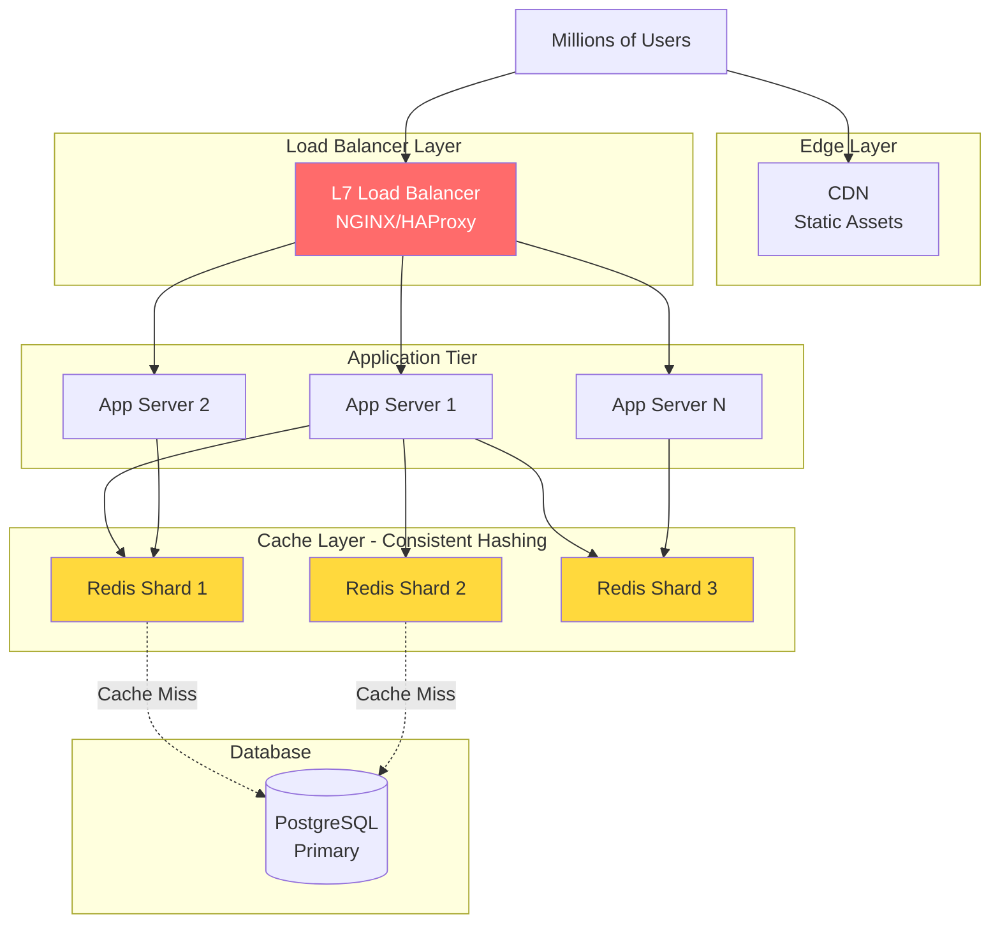

**Solution**:
1. **L7 Load Balancer**: Routes `/api/*` to app servers, `/static/*` to CDN
2. **Auto-scaling**: Add app servers based on CPU usage
3. **Consistent Hashing**: Redis cache distributed using consistent hashing
   - When adding Redis shards, minimal cache invalidation
4. **Result**: Handled 10M requests/hour with 99.9% uptime

---

### Scenario 2: Social Media Platform (Session Management)

**Challenge**: Keep user sessions consistent.

**Problem**: User logs in → gets Server 1 → next request goes to Server 2 → logged out!

**Solution Options**:

#### Option A: Sticky Sessions (IP Hash)
```nginx
upstream backend {
    ip_hash;  # Same IP → Same server
    server backend1.example.com;
    server backend2.example.com;
    server backend3.example.com;
}
```

**❌ Problems**:
- If server goes down, sessions lost
- Uneven distribution (office buildings share IPs)

#### Option B: Centralized Session Store (Better)
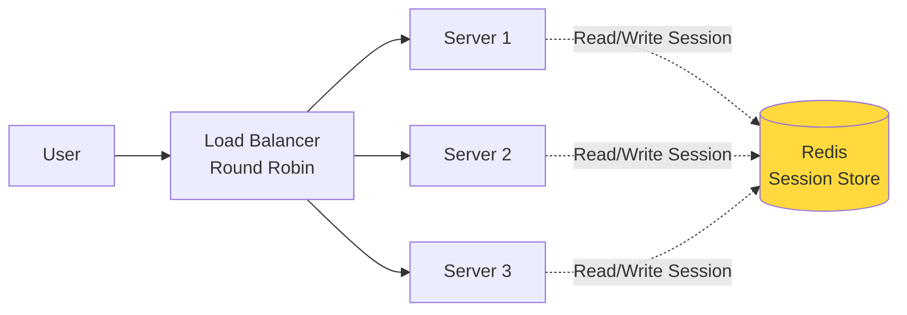

**Benefits**:
- Any server can handle any request
- Session survives server failures
- True stateless servers

---

### Scenario 3: Content Delivery Network (CDN)

**Use Case**: Netflix-style video streaming.

**Challenge**: Billions of users worldwide need low-latency access to videos.

**Architecture**:

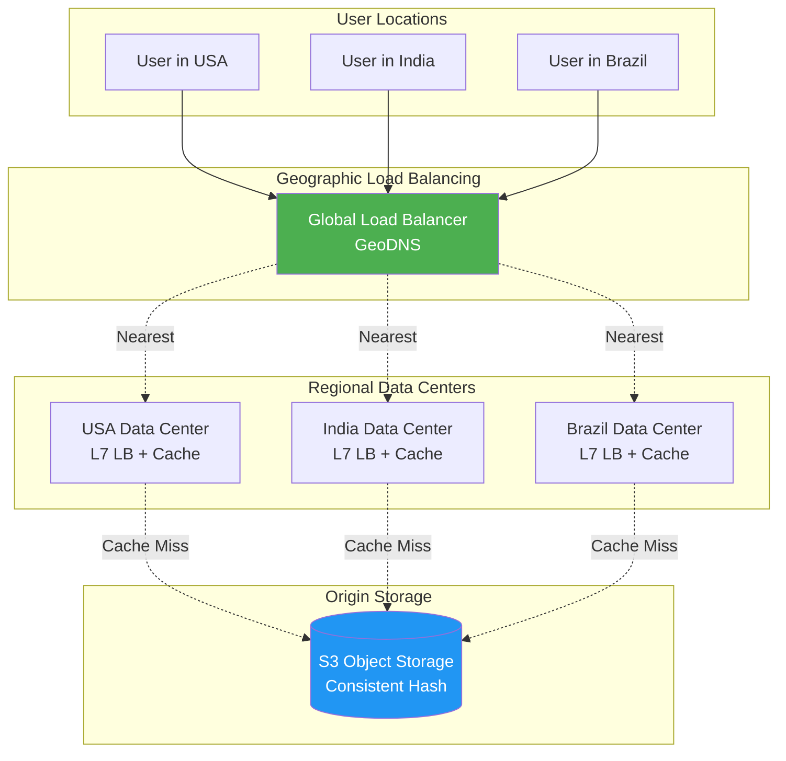

**How Consistent Hashing Helps**:
1. **Object Storage**: Videos distributed across storage nodes
2. **Cache Servers**: Each region has cache cluster
3. **Scaling**: Add cache nodes without full invalidation
4. **Result**: 99.99% cache hit rate, <100ms latency globally

---

## 💻 Implementation Examples {#implementation-examples}

### Example 1: Building a Simple Load Balancer in Python

```python
import socket
import threading
from itertools import cycle

class SimpleLoadBalancer:
    def __init__(self, backend_servers):
        self.backend_servers = cycle(backend_servers)  # Round-robin iterator
        self.lock = threading.Lock()
    
    def get_next_server(self):
        """Thread-safe round-robin server selection"""
        with self.lock:
            return next(self.backend_servers)
    
    def handle_client(self, client_socket):
        """Forward client request to backend server"""
        # Get next backend server
        backend_host, backend_port = self.get_next_server()
        
        try:
            # Connect to backend
            backend_socket = socket.socket(socket.AF_INET, socket.SOCK_STREAM)
            backend_socket.connect((backend_host, backend_port))
            
            # Forward client data to backend
            client_data = client_socket.recv(4096)
            backend_socket.sendall(client_data)
            
            # Get backend response
            backend_response = backend_socket.recv(4096)
            
            # Send response back to client
            client_socket.sendall(backend_response)
            
        except Exception as e:
            print(f"Error: {e}")
        finally:
            backend_socket.close()
            client_socket.close()
    
    def start(self, host='0.0.0.0', port=8080):
        """Start the load balancer"""
        server_socket = socket.socket(socket.AF_INET, socket.SOCK_STREAM)
        server_socket.setsockopt(socket.SOL_SOCKET, socket.SO_REUSEADDR, 1)
        server_socket.bind((host, port))
        server_socket.listen(100)
        
        print(f"Load Balancer listening on {host}:{port}")
        
        while True:
            client_socket, address = server_socket.accept()
            print(f"Connection from {address}")
            
            # Handle in new thread
            client_thread = threading.Thread(
                target=self.handle_client,
                args=(client_socket,)
            )
            client_thread.start()

# Usage
if __name__ == "__main__":
    backend_servers = [
        ('localhost', 5001),
        ('localhost', 5002),
        ('localhost', 5003),
    ]
    
    lb = SimpleLoadBalancer(backend_servers)
    lb.start()
```

---

### Example 2: NGINX Configuration (Production-Ready)

```nginx
# /etc/nginx/nginx.conf

upstream backend_api {
    # Load balancing algorithm
    least_conn;  # Use least connections
    
    # Backend servers
    server api1.example.com:8000 weight=3;  # More powerful server
    server api2.example.com:8000 weight=2;
    server api3.example.com:8000 weight=1;
    
    # Health check configuration
    server api4.example.com:8000 backup;  # Only used if others fail
}

server {
    listen 80;
    server_name example.com;
    
    # Redirect HTTP to HTTPS
    return 301 https://$server_name$request_uri;
}

server {
    listen 443 ssl http2;
    server_name example.com;
    
    # SSL Configuration
    ssl_certificate /etc/ssl/certs/example.com.crt;
    ssl_certificate_key /etc/ssl/private/example.com.key;
    
    # Security headers
    add_header Strict-Transport-Security "max-age=31536000" always;
    
    # Static content (CDN)
    location /static/ {
        alias /var/www/static/;
        expires 1y;
        add_header Cache-Control "public, immutable";
    }
    
    # API endpoints (Load balanced)
    location /api/ {
        proxy_pass http://backend_api;
        
        # Preserve client information
        proxy_set_header Host $host;
        proxy_set_header X-Real-IP $remote_addr;
        proxy_set_header X-Forwarded-For $proxy_add_x_forwarded_for;
        proxy_set_header X-Forwarded-Proto $scheme;
        
        # Timeouts
        proxy_connect_timeout 5s;
        proxy_send_timeout 30s;
        proxy_read_timeout 30s;
        
        # Health check
        proxy_next_upstream error timeout http_500 http_502 http_503;
    }
    
    # Admin panel (IP-restricted, sticky sessions)
    location /admin/ {
        # IP whitelist
        allow 192.168.1.0/24;
        deny all;
        
        # Sticky sessions for admin
        ip_hash;
        proxy_pass http://backend_api;
    }
}
```

---

## ⚠️ Common Pitfalls & Best Practices {#pitfalls}

### Pitfall 1: Not Considering Session State

**Problem**: Round-robin breaks sessions if app is stateful.

**Solution**:
- Use centralized session store (Redis, Memcached)
- Or use sticky sessions (but prefer stateless)

---

### Pitfall 2: Ignoring Health Checks

**Problem**: Load balancer sends traffic to dead servers.

**Solution**:
```yaml
health_check:
  active: true
  interval: 5s
  timeout: 3s
  unhealthy_threshold: 2
  path: /health
```

---

### Pitfall 3: Poor Consistent Hashing Implementation

**Problem**: Too few virtual nodes → uneven distribution.

**Solution**: Use 100-200 virtual nodes per physical server.

---

### Pitfall 4: Single Point of Failure

**Problem**: Load balancer itself fails → entire system down.

**Solution**: **Active-Active** or **Active-Passive** LB pairs

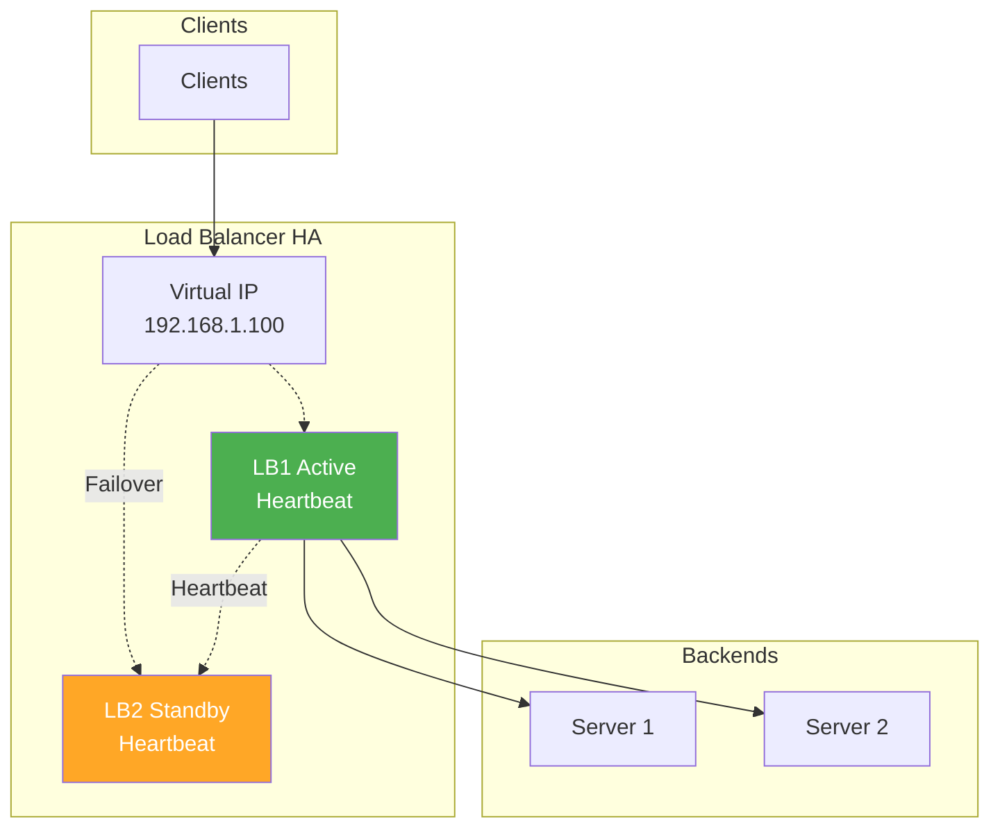

---

### Best Practices Summary

| Practice | Description |
|----------|-------------|
| **Stateless Servers** | Store state in databases/cache, not on servers |
| **Health Checks** | Always configure active health monitoring |
| **SSL Termination** | Handle encryption at load balancer |
| **Connection Pooling** | Reuse connections to backends |
| **Rate Limiting** | Prevent abuse at LB level |
| **Monitoring** | Track latency, error rates, server health |
| **Graceful Shutdown** | Drain connections before server maintenance |
| **Auto-scaling** | Add/remove servers based on metrics |

---

## 📝 Interview Preparation {#interview-prep}

### Common Questions

#### Q1: "Design a URL shortener service for 1 billion users"

**Answer using concepts**:
1. **Load Balancer**: L7 LB for API requests
2. **Consistent Hashing**: Distribute URL mappings across database shards
3. **Caching**: Redis with consistent hashing for popular URLs

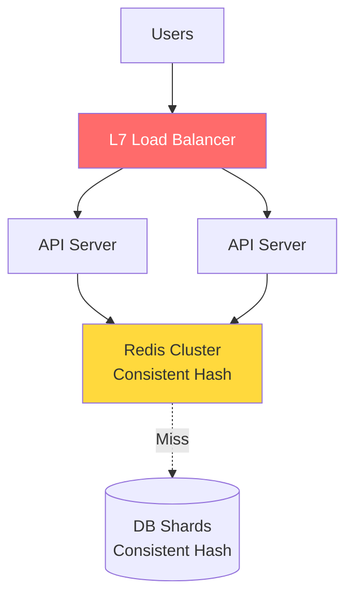

---

#### Q2: "How would you handle a server failure in your load balancer?"

**Answer**:
1. **Health Checks**: Detect failure within 5-10 seconds
2. **Remove from Pool**: Stop sending traffic immediately
3. **Alert**: Notify ops team
4. **Auto-healing**: Auto-restart or provision new instance
5. **Graceful Recovery**: Slowly add back once healthy

---

#### Q3: "When would you use consistent hashing vs. traditional hashing?"

**Answer**:

| Use Consistent Hashing | Use Traditional Hashing |
|------------------------|-------------------------|
| Distributed caching (Redis, Memcached) | Static server count |
| Microservices sharding | Small scale (<10 servers) |
| CDN cache distribution | Temporary/development |
| Database horizontal partitioning | Performance not critical |

---

### Design Exercise: Design Instagram Feed Service

**Requirements**:
- 500M daily active users
- Each user follows 200 people
- Real-time feed updates

**Solution**:

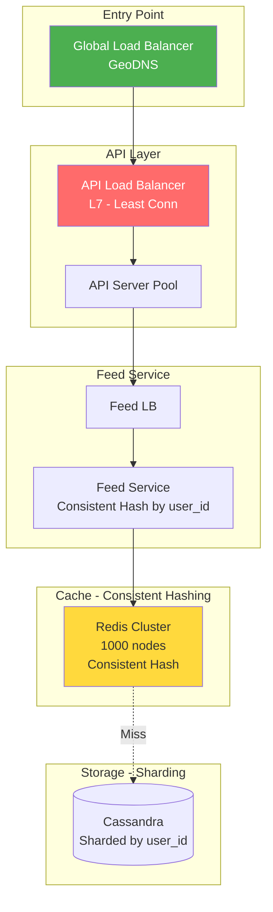

**Key Decisions**:
1. **Global LB**: Route to nearest region (latency)
2. **API LB**: Least connections (variable processing time)
3. **Feed Service**: Consistent hash by user_id (session affinity)
4. **Cache**: Consistent hashing for scaling (add nodes without full invalidation)
5. **Database**: Sharding by user_id (co-locate user data)

---

## 🎓 Summary & Key Takeaways

### Load Balancers
✅ Distribute traffic across servers  
✅ Improve scalability, availability, performance  
✅ L4 = Fast but simple | L7 = Smart but slower  
✅ Algorithms: Round Robin, Least Conn, IP Hash  
✅ Always configure health checks  

### Consistent Hashing
✅ Minimizes remapping when scaling  
✅ Uses hash ring concept  
✅ Virtual nodes solve distribution imbalance  
✅ Critical for distributed caches and databases  
✅ Only ~1/n keys remapped when adding/removing nodes  

### When to Use What

| Scenario | Load Balancer Type | Distribution Strategy |
|----------|-------------------|----------------------|
| **Web application** | L7 (NGINX) | Round Robin / Least Conn |
| **Microservices** | L7 with path routing | URL-based routing |
| **Database read replicas** | L4 | Least Connections |
| **Distributed cache** | App-level | Consistent Hashing |
| **Session-heavy app** | L7 | Centralized sessions (not IP hash!) |
| **Global CDN** | GeoDNS + L7 | Geographic + Consistent Hash |

---

## 📚 Further Learning

1. **Tools to Explore**:
   - NGINX, HAProxy, Envoy
   - Redis Cluster, Cassandra
   - AWS ELB/ALB, Google Cloud Load Balancing

2. **Projects to Build**:
   - Simple load balancer in your favorite language
   - Consistent hash implementation
   - Distributed cache service

3. **Advanced Topics**:
   - Service mesh (Istio, Linkerd)
   - API Gateway patterns
   - Rate limiting strategies
   - Circuit breakers

---

**Happy Learning! 🚀**
