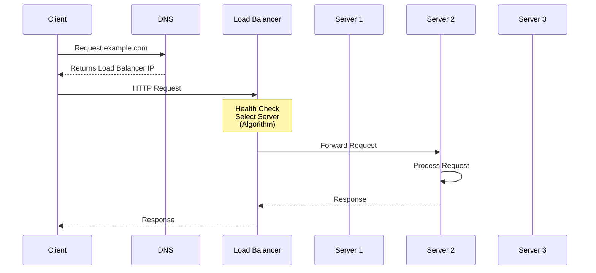
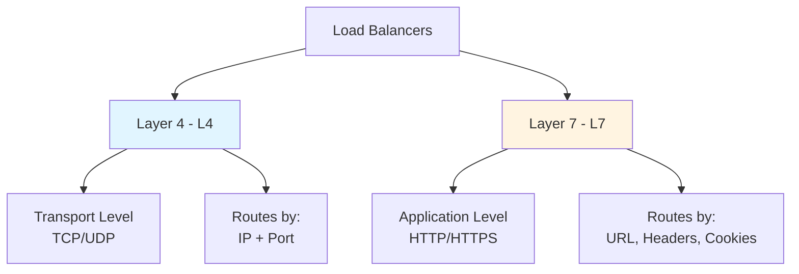
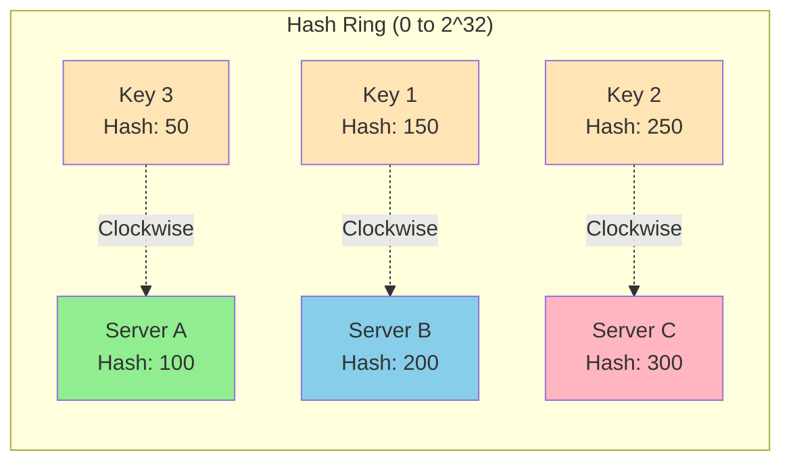
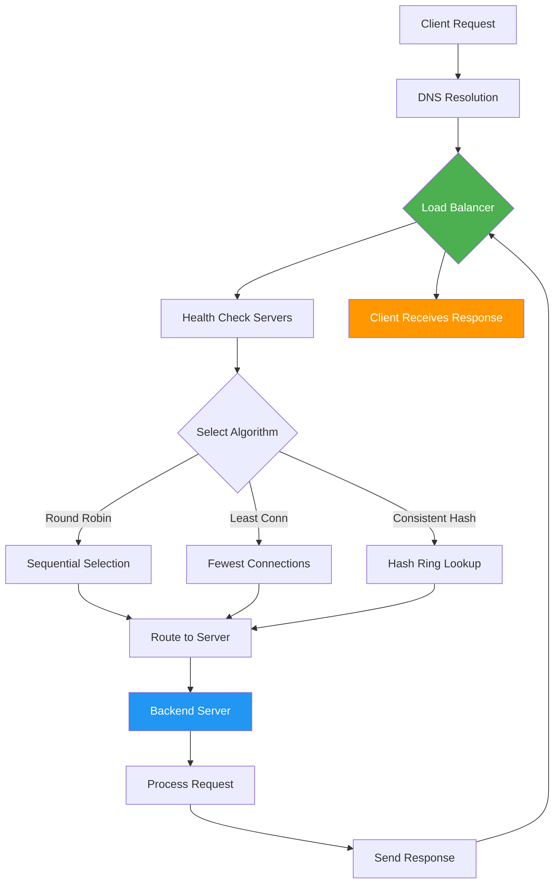

# Load Balancer & Consistent Hashing - High Level Design

## 🎯 What is a Load Balancer?

A **Load Balancer** is a reverse proxy that distributes incoming network traffic across multiple backend servers, ensuring no single server gets overwhelmed.

---

## 🔍 Why Use a Load Balancer?

| Benefit | Description |
|---------|-------------|
| **Scalability** | Add more servers to handle increased traffic |
| **Resilience/Availability** | Failover to healthy servers if one fails |
| **Performance** | Distribute load evenly across servers |
| **Security** | Provides abstraction layer and DDoS protection |
| **SSL Offloading** | Handles SSL encryption/decryption centrally |

---

## ⚙️ How Does It Work?

### Key Components:

1. **Reverse Proxy**: Acts as intermediary between clients and servers
2. **Health Checks**: Periodically pings servers to ensure they're online
3. **Routing Algorithms**:
   - **Round Robin**: Sequential distribution
   - **Least Connections**: Routes to server with fewest active connections
   - **IP Hash**: Uses client IP for session persistence

---

## 📊 Types of Load Balancers

---

## 🔄 Consistent Hashing

### The Problem with Traditional Hashing

**Traditional**: `server = hash(key) % number_of_servers`

❌ **Issue**: When you add/remove servers, almost ALL keys get remapped → massive cache invalidation

### The Solution: Consistent Hashing

### How It Works:

1. **Hash Ring**: Imagine a circular ring from 0 to 2^32 - 1
2. **Hash Servers**: Each server is hashed onto the ring
3. **Hash Keys**: Each request/key is hashed onto the ring
4. **Mapping Rule**: A key is assigned to the **first server** encountered moving **clockwise**

### Benefits:

✅ **Minimal Reorganization**: When a server is added/removed, only `~1/n` keys need remapping (not all)

✅ **Cache Efficiency**: Most cached data remains valid after scaling

---

## 🚀 Complete Workflow

---

## 📝 Quick Summary

| Component | Purpose |
|-----------|---------|
| **Load Balancer** | Distributes traffic across servers |
| **Health Checks** | Monitors server availability |
| **L4 Load Balancer** | Routes based on IP/Port (faster) |
| **L7 Load Balancer** | Routes based on content (smarter) |
| **Consistent Hashing** | Minimizes remapping when scaling |

---

## 🎓 Key Takeaways

1. Load balancers improve **scalability**, **availability**, and **performance**
2. **Layer 4** is faster but less flexible; **Layer 7** is content-aware
3. **Consistent hashing** is crucial for distributed systems with caching
4. Health checks ensure traffic only goes to healthy servers
5. Different algorithms suit different use cases
