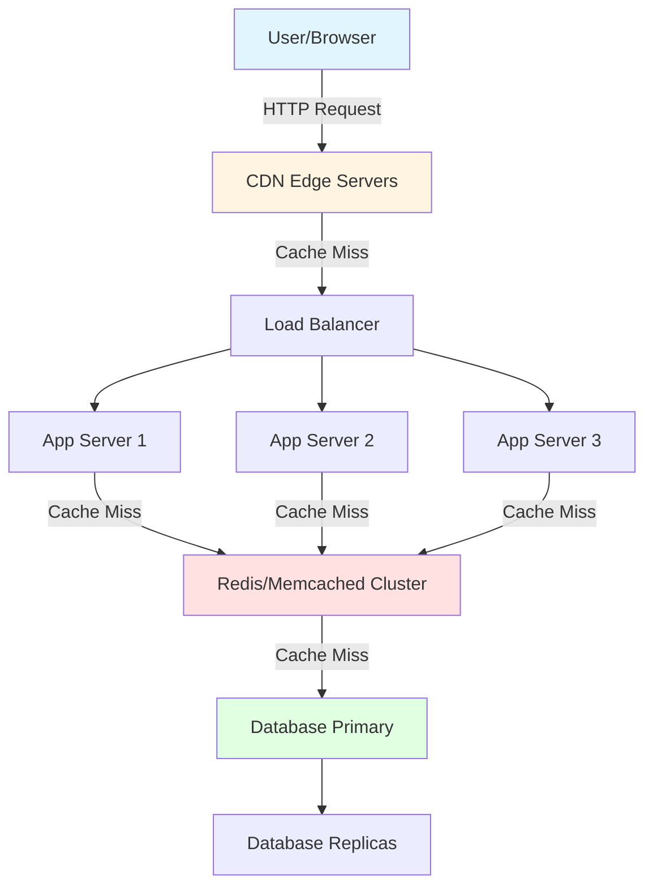
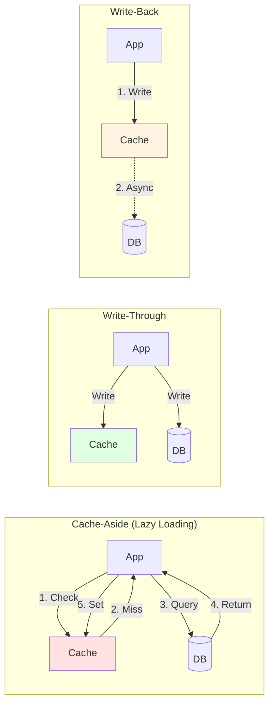
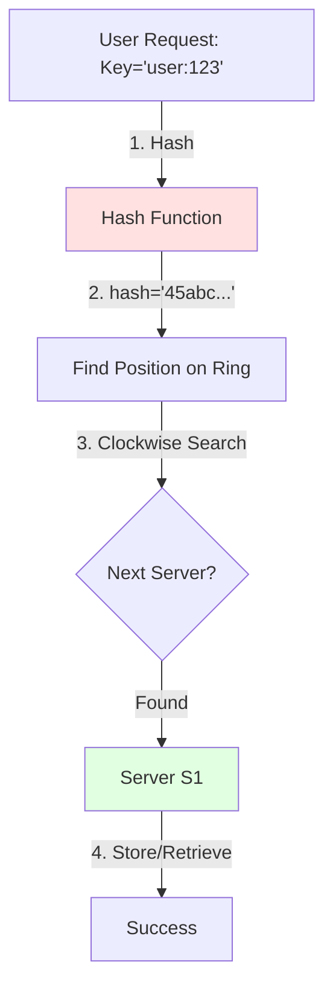

# 🚀 Caching - Complete System Design Guide

> **Last Updated:** February 18, 2026  
> **Topics Covered:** Caching Layers, Strategies, Invalidation, Eviction Policies, Distributed Caching, Consistent Hashing

---

## 📋 Table of Contents

1. [Introduction to Caching](#introduction-to-caching)
2. [Why Caching Matters](#why-caching-matters)
3. [Types of Caching (Multiple Layers)](#types-of-caching-multiple-layers)
4. [Caching Strategies](#caching-strategies)
5. [Cache Invalidation](#cache-invalidation)
6. [Cache Eviction Policies](#cache-eviction-policies)
7. [Distributed Caching](#distributed-caching)
8. [Consistent Hashing](#consistent-hashing)
9. [Common Caching Problems and Solutions](#common-caching-problems-and-solutions)
10. [CDN and Content Delivery](#cdn-and-content-delivery)
11. [Local vs Global Cache](#local-vs-global-cache)
12. [Real-World Use Cases](#real-world-use-cases)
13. [Best Practices](#best-practices)
14. [References and Resources](#references-and-resources)

---

## 🎯 Introduction to Caching

**Caching** is a technique used to temporarily store frequently accessed data in fast-access storage layers (typically in-memory) to reduce latency, improve performance, and decrease load on primary data sources like databases.

### The Tea Analogy 🍵

Think of caching like making tea:

- **Supermarket (Database)**: Slow access, wide selection of ingredients, always has fresh items
- **Fridge (Cache)**: Fast access, limited space, stores frequently used items, items can go stale

Just like you store tea leaves, sugar, and milk in your fridge instead of going to the supermarket every time, we cache frequently accessed data in fast storage instead of querying the database repeatedly.

```
┌─────────────────────────┐          ┌─────────────────────────┐
│   SUPERMARKET 🏪        │          │      FRIDGE ❄️          │
│  (Database)             │          │     (Cache)             │
├─────────────────────────┤          ├─────────────────────────┤
│ • Slow access           │          │ • Fast access           │
│ • Wide selection        │   VS     │ • Limited space         │
│ • Always fresh          │          │ • Frequently used items │
│ • Source of truth       │          │ • Can go stale          │
└─────────────────────────┘          └─────────────────────────┘
        ↓                                      ↑
   (Slow trip)                          (Quick grab)
        └──────────────┬──────────────────────┘
                 Making Tea 🍵
```

### Multiple Levels of Cache

Modern systems implement caching at multiple levels, similar to how CPUs use L1, L2, L3 cache hierarchy:

- **CPU/Register Level** - Fastest, smallest
- **L1, L2, L3 Cache** - Progressively slower but larger
- **RAM** - Fast main memory
- **HDD/SSD** - Persistent storage

---

## ⚡ Why Caching Matters

### Performance Metrics

| Metric | Without Cache | With Cache | Improvement |
|--------|--------------|------------|-------------|
| Response Time | 500-1000ms | 5-50ms | **10-100x faster** |
| Database Load | 100% | 10-30% | **70-90% reduction** |
| Throughput | 1000 req/s | 10000+ req/s | **10x increase** |
| Cost | High (DB scaling) | Lower (cheaper RAM) | **Significant savings** |

### Key Benefits

1. ⚡ **Reduced Latency** - Data served from memory (RAM) vs disk (database)
2. 💰 **Lower Costs** - Reduced database queries means less expensive database infrastructure
3. 📈 **Higher Scalability** - Handle more concurrent users with same resources
4. 🛡️ **Better Availability** - Cache can serve data even if database is temporarily unavailable
5. 🔄 **Improved User Experience** - Faster page loads and API responses

---

## 🏗️ Types of Caching (Multiple Layers)

Caching can be implemented at various architectural layers. Each layer serves a specific purpose and has different characteristics.



```
┌──────────────────────────────────────────────────────────────┐
│                    CACHING LAYERS                            │
├──────────────────────────────────────────────────────────────┤
│                                                              │
│  🌐 Layer 1: Browser Cache (Client-Side)                   │
│     └─ HTML, CSS, JS, Images  │  Latency: ~0ms             │
│                                                              │
│  🌍 Layer 2: CDN (Edge)                                     │
│     └─ Static Assets, API     │  Latency: 10-50ms          │
│                                                              │
│  ⚖️  Layer 3: Load Balancer                                 │
│     └─ Session routing        │  Latency: 1-5ms            │
│                                                              │
│  🔧 Layer 4: Application Cache (Redis/Memcached)           │
│     └─ Query results, objects │  Latency: 1-5ms            │
│                                                              │
│  💾 Layer 5: Database Cache                                 │
│     └─ Query cache, buffers   │  Latency: 10-100ms         │
│                                                              │
└──────────────────────────────────────────────────────────────┘
```

### 1. **Client-Side Cache (Browser Cache)**

**Location:** User's browser  
**What it caches:** HTML, CSS, JavaScript, Images, Videos, Static resources

#### Examples:
- **DNS Cache**: Stores IP addresses for domain names
- **Static Media**: CSS, JS, images via cache-control headers
- **Cookies/Local Storage**: Session data, user preferences
- **IndexedDB**: Large structured data in browser

#### Cache Headers:
```http
Cache-Control: public, max-age=31536000, immutable
ETag: "33a64df551425fcc55e4d42a148795d9f25f89d4"
```

#### Benefits:
✅ No network calls after first load  
✅ Instant page rendering  
✅ Works offline (with service workers)

#### Challenges:
❌ Cache invalidation complexity  
❌ Different users have different cache states  
❌ Limited storage space

---

### 2. **CDN (Content Delivery Network)**

**Location:** Edge servers distributed globally  
**What it caches:** Static content, sometimes dynamic responses

```
                    🌍 CDN ARCHITECTURE 🌍
                    
┌─────────────┐                          ┌─────────────┐
│   User in   │                          │  User in    │
│     USA     │                          │   Europe    │
└──────┬──────┘                          └──────┬──────┘
       │                                        │
       │ ① Request                              │ ① Request
       ├──────────┐                    ┌────────┤
       ↓          │                    │        ↓
 ┌──────────┐    │                    │  ┌──────────┐
 │ CDN Edge │    │                    │  │ CDN Edge │
 │ (USA)    │    │                    │  │ (EU)     │
 └────┬─────┘    │                    │  └────┬─────┘
      │          │                    │       │
      │ ② Cache  │                    │       │ ② Cache
      │   Miss   │                    │       │   Hit!
      │          │                    │       │
      ↓          │                    │       ↓
 ┌──────────────┴────────────────────┴────────────┐
 │         Origin Server (Cloudflare)             │
 │       cdn.cloudflare.com/scaler/logo.png       │
 └──────────────┬────────────────────┬────────────┘
                │                    │
       ③ Fetch  │                    │ ✅ Return
       & Cache  │                    │    Cached
                ↓                    ↓
```

#### How CDN Gets Data:

When a user requests `scaler.com/logo.png`:

1. **User's Server** → Request with ``
2. **CDN Check** → If cached at edge location, serve immediately
3. **Origin Pull** → If not cached, CDN fetches from origin server (`cloudflare.com/scaler/logo.png`)
4. **Cache & Serve** → CDN caches and serves to user

#### Popular CDN Providers:

- **Google Cloud CDN** - USA (global presence)
- **Cloudflare** - 275,000+ servers worldwide
- **Akamai** - Enterprise focused
- **Amazon CloudFront** - AWS integrated
- **Fastly** - Developer-friendly

#### DNS Resolution for Nearest CDN:

Two approaches:
1. **Geo DNS** (location-based routing)
2. **Anycast** (route to closest server automatically)

**References:**
- [Cloudflare: What is a CDN?](https://www.cloudflare.com/learning/cdn/what-is-a-cdn/)
- [Anycast vs GeoDNS](https://www.cloudflare.com/en-gb/learning/cdn/glossary/anycast-network/)
- [Constellix: Anycast Network](https://constellix.com/news/anycast-vs-geodns)

#### Benefits:
✅ Reduced latency (geographically closer)  
✅ Decreased origin server load  
✅ DDoS protection  
✅ Faster load times globally

---

### 3. **Load Balancer Cache**

**Location:** Between clients and application servers  
**What it caches:** API responses, session data

#### Use Cases:
- Cache responses for identical requests
- Sticky sessions (route same user to same server)
- SSL/TLS session caching

---

### 4. **Application Server Cache (In-Memory)**

**Location:** Within application server process  
**What it caches:** Query results, computed data, session objects


#### Technologies:
- **Redis** - In-memory data structure store
- **Memcached** - High-performance distributed cache
- **In-process cache** - Application-level (e.g., `@lru_cache` in Python)

#### Architecture Considerations:

**Stateful Servers (with cache):**
- ❌ Complex scaling
- ❌ Session affinity required
- ❌ Cache becomes unavailable during deployments

**Solution: External Cache Layer**
- ✅ Stateless application servers
- ✅ Easy horizontal scaling
- ✅ Shared cache across all servers

---

### 5. **Database Cache**

**Location:** Inside database engine  
**What it caches:** Query results, frequently accessed rows, execution plans

#### Examples:
- **MySQL Query Cache** - Caches SELECT query results
- **PostgreSQL Buffer Pool** - Caches table pages in memory
- **Redis as DB Cache** - External cache layer for database queries

---

## 🔄 Caching Strategies

Different strategies for reading and writing data between application, cache, and database.



### 1. **Cache-Aside (Lazy Loading)** 🔵

**Most Common Strategy** - Application manages cache explicitly

#### Read Flow:
```
1. Application checks cache
2. IF cache HIT → return data
3. IF cache MISS:
   a. Query database
   b. Store result in cache (with TTL)
   c. Return data
```

#### Write Flow:
```
1. Application writes to database
2. Application invalidates/updates cache
```

#### Code Example (Python):
```python
def get_user(user_id):
    # Try cache first
    user = cache.get(f"user:{user_id}")
    
    if user is not None:
        return user  # Cache HIT
    
    # Cache MISS - fetch from DB
    user = db.query("SELECT * FROM users WHERE id = ?", user_id)
    
    # Store in cache for 1 hour
    cache.set(f"user:{user_id}", user, ttl=3600)
    
    return user
```

#### Pros:
✅ Simple to implement  
✅ Cache only what's needed (lazy)  
✅ Cache failures don't break the application

#### Cons:
❌ Initial requests always hit database (cold start)  
❌ Cache can become stale if not invalidated properly  
❌ Additional latency on cache miss (3 operations: check cache, query DB, update cache)

#### Best For:
- Read-heavy workloads
- General-purpose caching
- When cache misses are acceptable

---

### 2. **Read-Through Cache** 🟢

Cache sits between application and database, handles fetching automatically

#### Read Flow:
```
1. Application asks cache for data
2. IF cache HIT → return data
3. IF cache MISS:
   a. Cache fetches from database (not application)
   b. Cache stores the data
   c. Return to application
```

#### Pros:
✅ Application code is simpler (cache is abstraction)  
✅ Consistent caching logic

#### Cons:
❌ More complex cache implementation  
❌ Cold start penalty still exists

#### Best For:
- Microservices with dedicated cache service
- When you want to abstract caching logic

---

### 3. **Write-Through Cache** 🟡

**Synchronous writes** - Data written to cache and database simultaneously

#### Write Flow:
```
1. Application writes data
2. SIMULTANEOUSLY:
   a. Write to cache
   b. Write to database
3. Return success only when both complete
```

#### Pros:
✅ Cache is always consistent with database  
✅ No stale data  
✅ Good for read-heavy scenarios

#### Cons:
❌ Higher write latency (two writes instead of one)  
❌ Wasted cache space (writing data that's never read)

#### Best For:
- When data consistency is critical
- Read-heavy workloads where fresh data is important
- Financial applications, inventory systems

---

### 4. **Write-Back (Write-Behind) Cache** 🟠

**Asynchronous writes** - Write to cache immediately, database later

#### Write Flow:
```
1. Application writes to cache (FAST)
2. Return success immediately
3. Cache asynchronously writes to database (batch or delayed)
```

#### Pros:
✅ Extremely fast writes  
✅ Can batch multiple writes (performance)  
✅ Handles write spikes well

#### Cons:
❌ **Risk of data loss** if cache crashes before DB write  
❌ More complex to implement  
❌ Eventual consistency only

#### Best For:
- Write-heavy applications
- Logging, analytics, metrics collection
- Social media interactions (likes, views)
- When some data loss is acceptable

---

### Strategy Comparison Table

| Strategy | Read Performance | Write Performance | Consistency | Complexity | Data Loss Risk |
|----------|------------------|-------------------|-------------|------------|----------------|
| **Cache-Aside** | Good (on hit) | Good | Eventual | Low | Low |
| **Read-Through** | Good (on hit) | Good | Eventual | Medium | Low |
| **Write-Through** | Excellent | Slower | Strong | Medium | None |
| **Write-Back** | Excellent | Excellent | Eventual | High | **Medium-High** |

---

## 🔄 Cache Invalidation

> *"There are only two hard things in Computer Science: cache invalidation and naming things."* - Phil Karlton

Cache invalidation ensures that stale data doesn't persist in the cache when the source data changes.

### Strategies for Cache Invalidation:

### 1. **TTL (Time To Live)** ⏰

Set an expiration time on cached data

```python
# Cache for 5 minutes
cache.set("user:123", user_data, ttl=300)
```

**Pros:** Simple, automatic cleanup  
**Cons:** Data can be stale until expiration, arbitrary expiration times

---

### 2. **Manual Invalidation** 🔧

Explicitly delete/update cache when data changes

```python
def update_user(user_id, new_data):
    # Update database
    db.update("users", user_id, new_data)
    
    # Invalidate cache
    cache.delete(f"user:{user_id}")
```

**Pros:** Precise control  
**Cons:** Easy to forget, requires discipline

---

### 3. **Event-Based Invalidation** 📡

Use pub/sub or message queues to propagate invalidation

```python
# When user updates
publish("user.updated", {"user_id": 123})

# Cache listener
subscribe("user.updated", lambda event: cache.delete(f"user:{event['user_id']}"))
```

**Pros:** Decoupled, works across distributed systems  
**Cons:** More complex infrastructure

---

### 4. **Write-Through/Write-Behind**

Cache automatically stays in sync (see strategies above)

---

## 🗑️ Cache Eviction Policies

When cache is full, which data should be removed?

```
┌──────────────────────────────────────────────────────────────┐
│              CACHE EVICTION POLICIES                         │
├──────────────────────────────────────────────────────────────┤
│                                                              │
│  🔄 LRU (Least Recently Used)                               │
│  ┌────────────────────────────────────────────┐             │
│  │ A(5s) → B(2s) → C(10s) → D(1s) → E(7s)   │             │
│  │                          ↑                 │             │
│  │                     Evict D!              │             │
│  └────────────────────────────────────────────┘             │
│                                                              │
│  📊 LFU (Least Frequently Used)                             │
│  ┌────────────────────────────────────────────┐             │
│  │ A[10x] B[5x] C[20x] D[2x] E[15x]         │             │
│  │                     ↑                      │             │
│  │                  Evict D!                 │             │
│  └────────────────────────────────────────────┘             │
│                                                              │
│  ➡️  FIFO (First In First Out)                              │
│  ┌────────────────────────────────────────────┐             │
│  │ [A] → [B] → [C] → [D] → [E]               │             │
│  │  ↑                                         │             │
│  │ Evict A (oldest)                          │             │
│  └────────────────────────────────────────────┘             │
│                                                              │
│  🎲 Random                                                   │
│  ┌────────────────────────────────────────────┐             │
│  │ [A] [B] [C] [D] [E]  → Evict... C? 🎲    │             │
│  └────────────────────────────────────────────┘             │
│                                                              │
└──────────────────────────────────────────────────────────────┘
```

### 1. **LRU (Least Recently Used)** ⭐ Most Common

Removes the data that hasn't been accessed for the longest time

#### How it Works:
- Maintains access time for each entry (using HashMap + Doubly Linked List)
- On access, move entry to the head
- On eviction, remove from tail

#### Implementation (Redis):
```
maxmemory-policy allkeys-lru
```

**Pros:**  
✅ Works well for most workloads  
✅ Good balance of simplicity and effectiveness  
✅ Recently accessed data likely accessed again

**Cons:**  
❌ Doesn't consider frequency  
❌ Can evict important data that's accessed infrequently

**Best For:** General-purpose caching

---

### 2. **LFU (Least Frequently Used)**

Removes data accessed least often

#### How it Works:
- Track access count for each entry
- Evict entry with lowest count
- May use time decay to handle changing patterns

**Pros:**  
✅ Protects frequently accessed data  
✅ Better than LRU for skewed access patterns

**Cons:**  
❌ New items disadvantaged  
❌ Old popular items may stay forever

**Best For:** Workloads with stable, repeating access patterns

---

### 3. **FIFO (First In First Out)**

Removes oldest entries regardless of access

#### How it Works:
- Simple queue structure
- Evict in order of insertion

**Pros:**  
✅ Simple to implement  
✅ Predictable

**Cons:**  
❌ Ignores access patterns  
❌ May evict frequently used data

**Best For:** Simple scenarios, testing

---

### 4. **LIFO (Last In First Out)**

Removes newest entries first (rare in caching)

**Use Case:** Specialized scenarios only

---

### 5. **Random Replacement**

Randomly selects entry to evict

**Pros:** Simple, no overhead  
**Cons:** Unpredictable, suboptimal

---

### Eviction Policy Comparison

| Policy | Hit Rate | Implementation Complexity | Memory Overhead | Best Use Case |
|--------|----------|---------------------------|-----------------|---------------|
| **LRU** | High | Medium | Medium (HashMap + DLL) | General purpose |
| **LFU** | Very High | High | High (counters) | Stable workloads |
| **FIFO** | Low | Low | Low (queue) | Simple caching |
| **Random** | Low | Very Low | Very Low | Testing |

---

## 🌐 Distributed Caching

Scaling cache across multiple nodes for high availability and capacity

```
PROBLEM: Multiple App Servers with Local Cache

┌──────────┐  ┌──────────┐  ┌──────────┐
│  App     │  │  App     │  │  App     │
│ Server 1 │  │ Server 2 │  │ Server 3 │
├──────────┤  ├──────────┤  ├──────────┤
│ Cache    │  │ Cache    │  │ Cache    │
│ user:1=A │  │ user:1=B │  │ user:1=C │  ❌ INCONSISTENT!
└──────────┘  └──────────┘  └──────────┘
       ↓             ↓            ↓
    ┌─────────────────────────────────┐
    │        Database                 │
    │        user:1 = C               │
    └─────────────────────────────────┘


SOLUTION: Distributed Cache (Redis Cluster)

┌──────────┐  ┌──────────┐  ┌──────────┐
│  App     │  │  App     │  │  App     │
│ Server 1 │  │ Server 2 │  │ Server 3 │
│(Stateless│  │(Stateless│  │(Stateless│
└────┬─────┘  └────┬─────┘  └────┬─────┘
     │             │             │
     └─────────────┼─────────────┘
                   ↓
        ┌──────────────────────┐
        │   Redis Cluster      │
        │  ┌────────────────┐  │
        │  │ user:1 = C     │  │  ✅ CONSISTENT!
        │  │ Replicated 3x  │  │
        │  └────────────────┘  │
        └──────────────────────┘
                   ↓
              [Database]
```

### Challenges:

#### 1. **Multiple App Servers, Data Sharded**
- Cache data stored in app server's memory
- User requests routed to different servers
- **Problem:** Cache miss on different servers, data duplication

#### 2. **Which Server Gets Which Request?**
- Load balancer distributes requests
- **Solution:** Consistent hashing (see next section)

#### 3. **Maintaining Consistency**
- Different servers may have different cache states
- **Solutions:**
  - Use external cache (Redis cluster)
  - Cache invalidation across all nodes
  - Eventual consistency models

---

## 🔄 Consistent Hashing

**Problem:** How to distribute cache keys across multiple servers efficiently?

Traditional hashing: `server = hash(key) % num_servers`  
**Issue:** Adding/removing servers invalidates most cache entries!

```
CONSISTENT HASHING RING

                    0°/360°
                      ●
                     /│\
                    / │ \
                   /  │  \
              S2 ●   │   ● K1 (User:123)
                /    │    \
               /     │     \
          270°      │      90°
             ●      │      ●
              \     │     /
               \    │    /
            K3 ●    │   ● S1
                \   │  /
                 \  │ /
                  \ │/
                   ●
                  180°
                   S3

Hash Ring with 3 Servers (S1, S2, S3) and 3 Keys (K1, K2, K3)
Each key maps to the next server clockwise:
- K1 → S1
- K2 → S2  
- K3 → S3

ADD SERVER S4 at 45°:
- Only K1 moves from S1 to S4
- K2 and K3 stay on their servers
- Minimal disruption! ✅

VIRTUAL NODES for better distribution:
S1 → {S1-1, S1-2, S1-3, ... S1-100}
S2 → {S2-1, S2-2, S2-3, ... S2-100}
S3 → {S3-1, S3-2, S3-3, ... S3-100}

Result: Even load distribution across servers
```



### How Consistent Hashing Works:

1. **Hash Ring:** Imagine a circle with positions 0 to 2^32-1
2. **Server Placement:** Hash each server → place on ring
3. **Key Placement:** Hash each key → place on ring
4. **Lookup:** Move clockwise from key to find first server

### Example:

```
Servers: S1, S2, S3
Hash(S1) = 97
Hash(S2) = 38  
Hash(S3) = 12

Users:
Hash(U1) = 97 → Server S2
Hash(U2) = 38 → Server S1
Hash(U3) = 12 → Server S4
Hash(U4) = 56 → Server S2
Hash(U5) = 22 → Server S1
```

### Benefits:

✅ **Minimal Redistribution:** Only K/N keys move when adding/removing servers (K=keys, N=servers)  
✅ **Scalability:** Easy to add/remove nodes  
✅ **Load Distribution:** Even distribution with virtual nodes

### Virtual Nodes:

To handle uneven load distribution, each physical server gets multiple virtual nodes on the ring

```
S1 → S1-1, S1-2, S1-3, ... S1-100
S2 → S2-1, S2-2, S2-3, ... S2-100
```

**Result:** More even distribution, better load balancing

### Implementation (Redis Cluster):

Redis Cluster uses hash slots (16384 slots) instead of a continuous ring:

```
HASH_SLOT = CRC16(key) mod 16384
```

---

## ⚠️ Common Caching Problems and Solutions

### 1. **Cache Penetration** 🔴

**Problem:** Requests for non-existent keys bypass cache and hit database repeatedly

**Example:**  
Attacker queries `user_id = 999999` (doesn't exist)  
→ Cache miss → Database query → No result → No cache  
→ Repeat → Database overwhelmed

#### Solutions:

**A. Cache Null/Empty Values**
```python
user = db.get_user(user_id)
if user is None:
    cache.set(f"user:{user_id}", "NULL", ttl=60)  # Short TTL
    return None
```

**B. Bloom Filter**
- Probabilistic data structure
- Quickly check if key *might* exist
- No false negatives (if says "no", definitely doesn't exist)

```python
if not bloom_filter.might_contain(user_id):
    return None  # Definitely doesn't exist
    
# Check cache/database as normal
```

---

### 2. **Cache Avalanche** 🔴

**Problem:** Many cache entries expire simultaneously → sudden database spike

**Example:**  
1000 popular products cached with TTL=3600s (1 hour)  
All loaded at 10:00 AM  
All expire at 11:00 AM → Database hit with 1000 queries instantly

#### Solutions:

**A. Random TTL Jitter**
```python
import random

base_ttl = 3600
jitter = random.randint(0, 300)  # 0-5 minutes
cache.set(key, value, ttl=base_ttl + jitter)
```

**B. Never Expire Critical Data**
```python
# For critical data, refresh before expiration
cache.set(key, value, ttl=None)  # No expiration
# Use background job to refresh periodically
```

**C. Hierarchical Expiration**
```python
# Different categories expire at different times
cache.set("hot_data", value, ttl=300)     # 5 min
cache.set("warm_data", value, ttl=3600)   # 1 hour
cache.set("cold_data", value, ttl=86400)  # 24 hours
```

---

### 3. **Cache Hotspot (Hot Key Problem)** 🔴

**Problem:** Single popular key overwhelms one cache node

**Example:**  
Celebrity posts tweet → Millions access same key  
In distributed cache, one node handles this key → Bottleneck

#### Solutions:

**A. Local Cache + Global Cache**
```python
# Check local cache first (in app memory)
data = local_cache.get(key)
if data:
    return data

# Then check global cache (Redis)
data = redis_cache.get(key)
if data:
    local_cache.set(key, data, ttl=60)  # Short local TTL
    return data

# Finally, database
```

**B. Replicate Hot Keys**
```python
# Instead of "celebrity:123"
# Use "celebrity:123:replica_0", "celebrity:123:replica_1", ...
replica_id = hash(request_id) % num_replicas
key = f"celebrity:123:replica_{replica_id}"
```

**C. Load Balancing**
- Multiple cache nodes for same key
- Use CDN for extremely popular content

---

### 4. **Cache Stampede (Thundering Herd)** 🔴

**Problem:** When cache expires, multiple requests simultaneously try to rebuild it

**Example:**  
100 requests arrive when cache just expired  
→ All 100 hit database trying to rebuild cache

#### Solutions:

**A. Locking**
```python
def get_with_lock(key):
    data = cache.get(key)
    if data:
        return data
    
    # Try to acquire lock
    if cache.set_if_not_exists(f"lock:{key}", "1", ttl=10):
        # This request rebuilds cache
        data = db.query()
        cache.set(key, data, ttl=3600)
        cache.delete(f"lock:{key}")
        return data
    else:
        # Wait and retry (other request is rebuilding)
        time.sleep(0.1)
        return get_with_lock(key)
```

**B. Probabilistic Early Expiration**
```python
# Refresh cache before it expires (for popular keys)
time_to_expire = cache.ttl(key)
if time_to_expire < 60 and random.random() < 0.1:
    # 10% chance to refresh early
    background_refresh(key)
```

---

## 📦 Local vs Global Cache


### Local Cache (In-Process)

**Definition:** Cache stored in application server's memory

#### Technologies:
- Python: `lru_cache`, `cachetools`
- Java: `Guava Cache`, `Caffeine`
- Node.js: `node-cache`, `memory-cache`

#### Pros:
✅ Extremely fast (no network calls)  
✅ No external dependencies  
✅ Simple to implement

#### Cons:
❌ Limited to single server  
❌ Cache duplication across servers  
❌ Inconsistency (different servers have different state)  
❌ Memory limited by server RAM

#### When to Use:
- Small datasets
- Configuration data
- Read-only reference data
- Single-server applications

---

### Global/Distributed Cache

**Definition:** Cache shared across multiple application servers

#### Technologies:
- **Redis** - Feature-rich, supports complex data structures
- **Memcached** - Simple, fast, key-value only
- **Hazelcast** - Java-focused distributed cache
- **Apache Ignite** - Enterprise distributed cache

#### Pros:
✅ Shared across all servers (consistency)  
✅ Scalable (add more cache nodes)  
✅ High availability (replication)  
✅ Larger capacity

#### Cons:
❌ Network latency (1-5ms)  
❌ Additional infrastructure  
❌ More complex setup  
❌ Cost (dedicated servers)

#### When to Use:
- Multi-server deployments
- Large datasets
- Need consistency across servers
- Microservices architecture

---

## 🎓 Real-World Use Cases

### 1. **Facebook Newsfeed Calculation**

**Problem:** Calculating newsfeed is expensive (friends' posts, ranking, filtering)

**Solution:**
```
- Pre-calculate newsfeed asynchronously
- Cache in Redis with 15-minute TTL
- Return cached version on page load
- Update incrementally with new posts
```

**Result:** Sub-second newsfeed loads for billions of users

---

### 2. **E-Commerce Product Catalog**

**Problem:** Product details rarely change but queried millions of times

**Solution:**
```
- Cache-Aside strategy
- Cache product details for 24 hours
- Invalidate on product update
- CDN for product images
```

**Result:** 95%+ cache hit rate, 10x faster page loads

---

### 3. **Session Storage**

**Problem:** User sessions need to be shared across web servers

**Solution:**
```
- Store sessions in Redis (global cache)
- Use Write-Through for session updates
- TTL = session timeout (30 min of inactivity)
```

**Result:** Stateless app servers, easy horizontal scaling

---

### 4. **API Rate Limiting**

**Problem:** Track API request counts per user/IP

**Solution:**
```python
# Redis with expiring counters
key = f"rate_limit:{user_id}:{current_minute}"
count = redis.incr(key)
redis.expire(key, 60)  # Expire after 1 minute

if count > 100:
    return "Rate limit exceeded"
```

**Result:** Fast, distributed rate limiting

---

### 5. **Leaderboard / Rankings**

**Problem:** Real-time rankings for millions of players

**Solution:**
```
- Redis Sorted Sets
- Score updates in real-time
- Range queries for top N players
```

```python
# Add player score
redis.zadd("leaderboard", {player_id: score})

# Get top 10
top_10 = redis.zrevrange("leaderboard", 0, 9, withscores=True)
```

---

## 📚 Best Practices

### 1. **Choose the Right TTL**
- Hot data: 5-15 minutes
- Warm data: 1-6 hours
- Cold data: 24+ hours
- Static data: Infinite (manual invalidation)

### 2. **Monitor Cache Performance**

Key Metrics:
- **Hit Rate:** `hits / (hits + misses)` - Aim for >80%
- **Eviction Rate:** How often items are evicted
- **Memory Usage:** Stay below 80% capacity
- **Latency:** p50, p95, p99 response times

### 3. **Fail Gracefully**
```python
def get_user(user_id):
    try:
        user = cache.get(f"user:{user_id}")
        if user:
            return user
    except CacheConnectionError:
        logger.warning("Cache unavailable, falling back to DB")
    
    # Always fall back to database
    return db.get_user(user_id)
```

### 4. **Use Namespaces/Prefixes**
```python
# Good
keys = [
    "user:123",
    "product:456",
    "session:789"
]

# Bad
keys = ["123", "456", "789"]  # Collision risk!
```

### 5. **Consider Data Size**
- Don't cache huge objects (>1MB)
- Compress large values
- Cache computed results, not raw data

### 6. **Security**
- Encrypt sensitive cached data
- Use access controls (Redis AUTH, ACLs)
- Don't cache personally identifiable information (PII) long-term

### 7. **Versioning**
```python
# Include version in cache key
cache_key = f"user:{user_id}:v2"

# Easy to invalidate all v1 caches
```

### 8. **Warming the Cache**
```python
# Pre-populate cache before traffic spike
def warm_cache():
    popular_items = get_popular_products()
    for product in popular_items:
        cache.set(f"product:{product.id}", product, ttl=3600)
```

---

## 🔧 Technologies Comparison

### Redis vs Memcached

| Feature | Redis | Memcached |
|---------|-------|-----------|
| Data Structures | Rich (Strings, Lists, Sets, Hashes, Sorted Sets) | Key-Value only |
| Persistence | Optional (RDB, AOF) | No |
| Replication | Built-in master-slave | No (client-side) |
| Clustering | Redis Cluster | Client-side sharding |
| Max Value Size | 512MB | 1MB |
| Performance | Excellent | Slightly faster (simple ops) |
| Use Case | Complex caching, pub/sub, queues | Simple key-value cache |

### When to Choose:

**Redis:**
- Need persistence
- Complex data structures
- Pub/Sub messaging
- Built-in clustering

**Memcached:**
- Simple key-value only
- Maximum performance
- Large-scale distributed caching
- Simple deployment

---

## 📖 References and Resources

### Video Resources:
1. [ByteByteGo - Caching System Design](https://www.youtube.com/watch?v=IB0zJR0G5IM)

### Documentation:
1. [Redis Documentation](https://redis.io/documentation)
2. [Memcached Wiki](https://github.com/memcached/memcached/wiki)
3. [Cloudflare CDN Learning](https://www.cloudflare.com/learning/cdn/what-is-a-cdn/)
4. [AWS ElastiCache Best Practices](https://docs.aws.amazon.com/AmazonElastiCache/latest/red-ug/BestPractices.html)

### Articles:
1. [Cloudflare: Anycast Network](https://www.cloudflare.com/en-gb/learning/cdn/glossary/anycast-network/)
2. [Constellix: Anycast vs GeoDNS](https://constellix.com/news/anycast-vs-geodns)
3. [High Scalability: Lessons from Facebook](http://highscalability.com/blog/2010/11/16/facebooks-memcached-multiget-hole-more-machines-more-capacit.html)

### Books:
1. "Designing Data-Intensive Applications" by Martin Kleppmann
2. "System Design Interview" by Alex Xu
3. "Redis in Action" by Josiah Carlson

---

## 📸 Visual Reference Guide

All diagrams and visual aids are located in the `/images` folder:

1. **Agenda** - Overview of topics covered
2. **Appserver Layer** - Stateful vs stateless architecture
3. **System Architecture** - Multi-tier caching architecture
4. **Tea Analogy** - Understanding cache with real-world example
5. **Caching Fundamentals** - Browser cache, CDN, local & global cache
6. **CDN Details** - How CDNs fetch and serve data
7. **Challenges** - Cache invalidation strategies
8. **Cache Eviction** - FIFO, LRU, LIFO, LFU policies
9. **Q&A Section** - Hosting and CDN questions
10. **Distributed Systems** - Multiple app servers and data sharding
11. **Hash Functions** - Consistent hashing mathematics
12. **Load Balancer** - Health checks and server distribution
13. **Consistent Hashing Ring** - Visual representation with servers and users
14. **Load Distribution** - 1% of total load calculations with Cascading failures

---

## 🎯 Summary

Caching is a **critical technique** in system design that:

1. ⚡ **Improves Performance** - 10-100x faster responses
2. 💰 **Reduces Costs** - Less database infrastructure needed
3. 📈 **Increases Scalability** - Handle more users with same resources
4. 🔐 **Enhances Reliability** - Fallback when primary data source fails

### Key Takeaways:

✅ Use **multiple caching layers** (browser, CDN, app, database)  
✅ Choose the **right strategy** based on your workload (Cache-Aside for most cases)  
✅ Implement **proper invalidation** to avoid stale data  
✅ Select **appropriate eviction policy** (LRU for general use)  
✅ Use **consistent hashing** for distributed caches  
✅ Monitor **cache metrics** (hit rate, eviction rate)  
✅ Plan for **common problems** (penetration, avalanche, hotspots)  
✅ Always have a **fallback** to the source of truth

---

**Happy Caching! 🚀**

*Last Updated: February 18, 2026*
