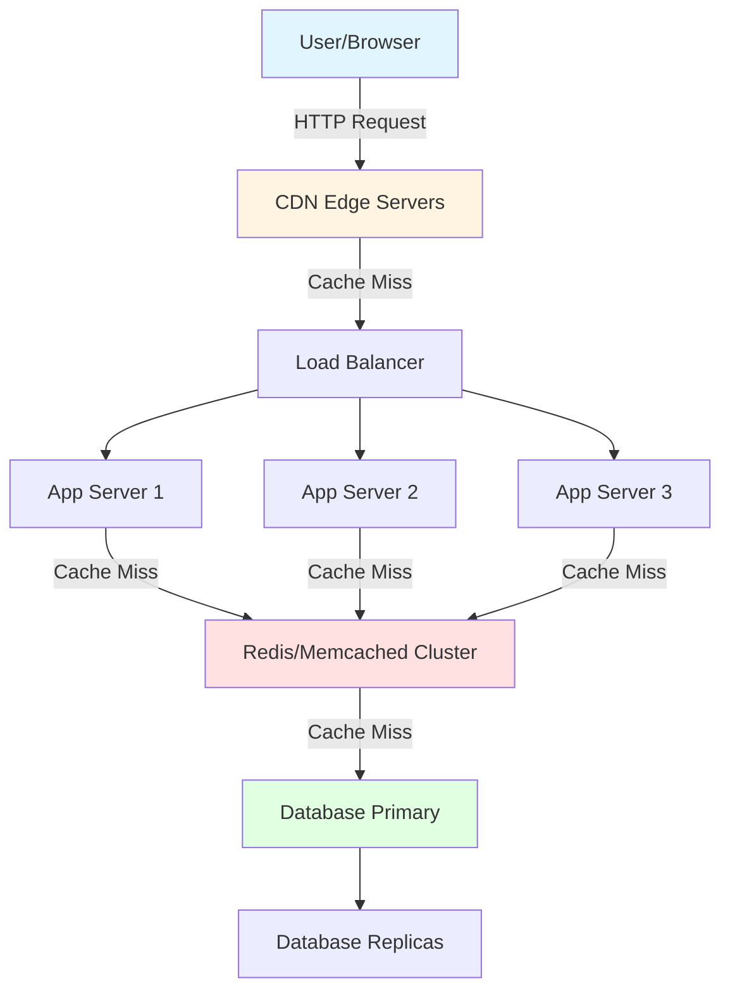
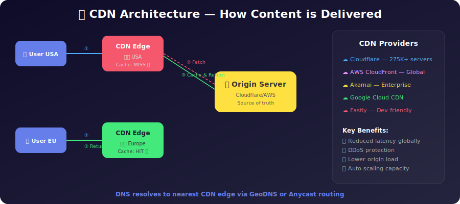
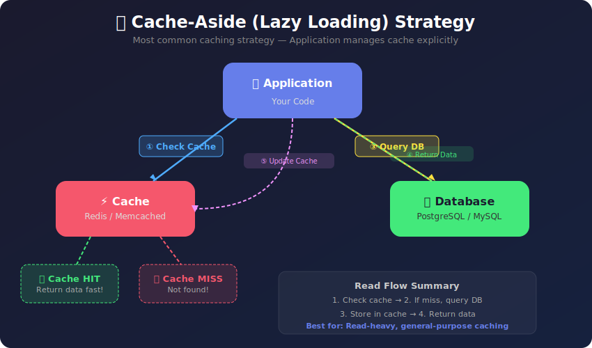
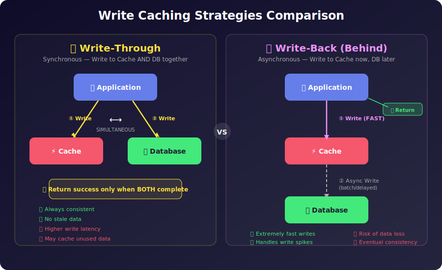
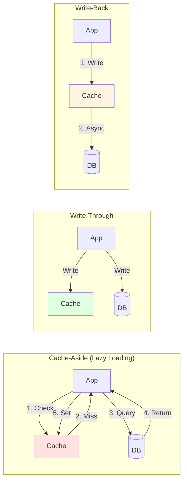
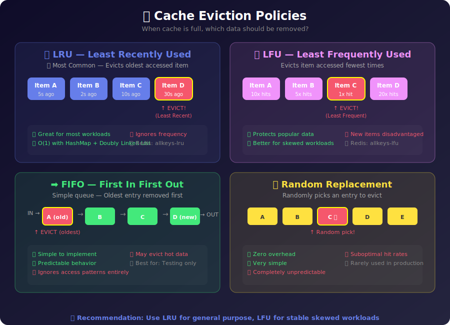
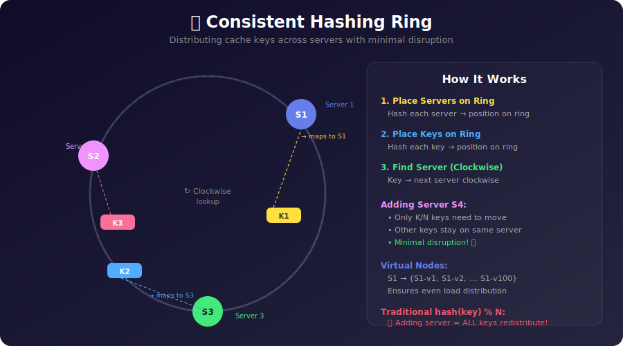
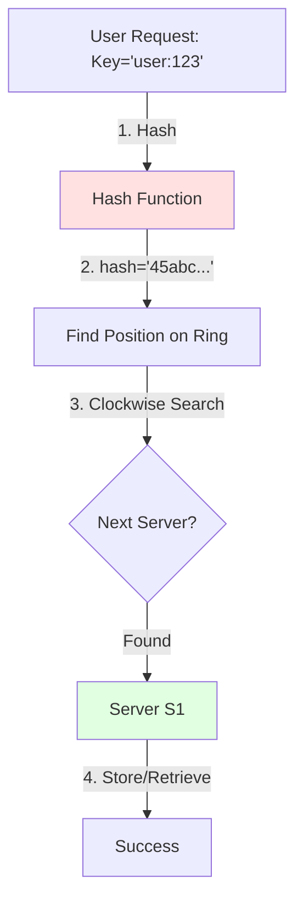
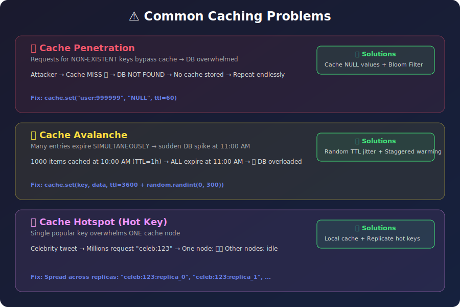
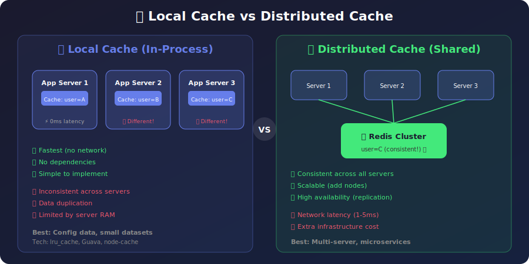

# 🚀 Caching — The Ultimate System Design Guide

> **Last Updated:** February 19, 2026
> **Author:** System Design Study Notes
> **Topics:** Caching Layers, Strategies (Cache-Aside, Write-Through, Write-Back, Write-Around), Invalidation, Eviction, Redis Deep Dive, Distributed Caching, Consistent Hashing, Real-World Case Studies, Practice Exercises

---

## 📋 Table of Contents

### Part 1: Core Concepts
1. [Introduction to Caching](#-introduction-to-caching)
2. [Why Caching Matters](#-why-caching-matters)
3. [Types of Caching (Multiple Layers)](#%EF%B8%8F-types-of-caching-multiple-layers)
4. [Caching Strategies](#-caching-strategies)
   - Cache-Aside | Read-Through | Write-Through | Write-Back | Write-Around ⚪ (Push vs Pull)

### Part 2: Management & Distribution
5. [Cache Invalidation](#-cache-invalidation)
6. [Cache Eviction Policies](#%EF%B8%8F-cache-eviction-policies)
7. [Distributed Caching](#-distributed-caching)
8. [Consistent Hashing](#-consistent-hashing)

### Part 3: Problems & Solutions
9. [Common Caching Problems and Solutions](#%EF%B8%8F-common-caching-problems-and-solutions)
10. [Local vs Global Cache](#-local-vs-global-cache)
11. [CDN and Content Delivery](#-cdn-deep-dive)

### Part 4: Practical Application
12. [Real-World Use Cases](#-real-world-use-cases)
    - 🏆 Contest Leaderboard (Scaler Case Study)
    - 📰 Facebook Newsfeed — Fan-Out Problem & 80-20-1 Principle
    - 🛒 E-Commerce, Session Storage, API Rate Limiting
13. [Best Practices](#-best-practices)
14. [Technologies Comparison — Redis Deep Dive + Redis vs Memcached](#-technologies-comparison)

### Part 5: Quick Reference & Exercises
15. [Quick Reference Cheatsheet](#-quick-reference-cheatsheet)
16. [Practice Exercises & Interview Questions](#-practice-exercises--interview-questions)
17. [Solutions](#-solutions)
18. [References and Resources](#-references-and-resources)

---

# PART 1: CORE CONCEPTS

---

## 🎯 Introduction to Caching

**Caching** is a technique used to temporarily store frequently accessed data in fast-access storage layers (typically in-memory) to reduce latency, improve performance, and decrease load on primary data sources like databases.

### The Tea Analogy 🍵

Think of caching like making tea:

- **Supermarket (Database)**: Slow access, wide selection of ingredients, always has fresh items
- **Fridge (Cache)**: Fast access, limited space, stores frequently used items, items can go stale

Just like you store tea leaves, sugar, and milk in your fridge instead of going to the supermarket every time, we cache frequently accessed data in fast storage instead of querying the database repeatedly.

```
┌─────────────────────────┐          ┌─────────────────────────┐
│   SUPERMARKET 🏪        │          │      FRIDGE ❄️          │
│  (Database)             │          │     (Cache)             │
├─────────────────────────┤          ├─────────────────────────┤
│ • Slow access           │          │ • Fast access           │
│ • Wide selection        │   VS     │ • Limited space         │
│ • Always fresh          │          │ • Frequently used items │
│ • Source of truth       │          │ • Can go stale          │
└─────────────────────────┘          └─────────────────────────┘
        ↓                                      ↑
   (Slow trip)                          (Quick grab)
        └──────────────┬──────────────────────┘
                 Making Tea 🍵
```

### Multiple Levels of Cache

Modern systems implement caching at multiple levels, similar to how CPUs use L1, L2, L3 cache hierarchy:

- **CPU/Register Level** — Fastest, smallest
- **L1, L2, L3 Cache** — Progressively slower but larger
- **RAM** — Fast main memory
- **HDD/SSD** — Persistent storage

---

## ⚡ Why Caching Matters

### Performance Metrics

| Metric | Without Cache | With Cache | Improvement |
|--------|--------------|------------|-------------|
| Response Time | 500-1000ms | 5-50ms | **10-100x faster** |
| Database Load | 100% | 10-30% | **70-90% reduction** |
| Throughput | 1000 req/s | 10000+ req/s | **10x increase** |
| Cost | High (DB scaling) | Lower (cheaper RAM) | **Significant savings** |

### Key Benefits

1. ⚡ **Reduced Latency** — Data served from memory (RAM) vs disk (database)
2. 💰 **Lower Costs** — Reduced database queries means less expensive database infrastructure
3. 📈 **Higher Scalability** — Handle more concurrent users with same resources
4. 🛡️ **Better Availability** — Cache can serve data even if database is temporarily unavailable
5. 🔄 **Improved User Experience** — Faster page loads and API responses

---

## 🏗️ Types of Caching (Multiple Layers)

Caching can be implemented at various architectural layers. Each layer serves a specific purpose and has different characteristics.

### 📸 Multi-Layer Caching Architecture Diagram




```
┌──────────────────────────────────────────────────────────────┐
│                    CACHING LAYERS                            │
├──────────────────────────────────────────────────────────────┤
│                                                              │
│  🌐 Layer 1: Browser Cache (Client-Side)                   │
│     └─ HTML, CSS, JS, Images  │  Latency: ~0ms             │
│                                                              │
│  🌍 Layer 2: CDN (Edge)                                     │
│     └─ Static Assets, API     │  Latency: 10-50ms          │
│                                                              │
│  ⚖️  Layer 3: Load Balancer                                 │
│     └─ Session routing        │  Latency: 1-5ms            │
│                                                              │
│  🔧 Layer 4: Application Cache (Redis/Memcached)           │
│     └─ Query results, objects │  Latency: 1-5ms            │
│                                                              │
│  💾 Layer 5: Database Cache                                 │
│     └─ Query cache, buffers   │  Latency: 10-100ms         │
│                                                              │
└──────────────────────────────────────────────────────────────┘
```

### 1. **Client-Side Cache (Browser Cache)**

**Location:** User's browser
**What it caches:** HTML, CSS, JavaScript, Images, Videos, Static resources

#### Examples:
- **DNS Cache**: Stores IP addresses for domain names
- **Static Media**: CSS, JS, images via cache-control headers
- **Cookies/Local Storage**: Session data, user preferences
- **IndexedDB**: Large structured data in browser

#### Cache Headers:
```http
Cache-Control: public, max-age=31536000, immutable
ETag: "33a64df551425fcc55e4d42a148795d9f25f89d4"
```

#### Benefits:
✅ No network calls after first load
✅ Instant page rendering
✅ Works offline (with service workers)

#### Challenges:
❌ Cache invalidation complexity
❌ Different users have different cache states
❌ Limited storage space

---

### 2. **CDN (Content Delivery Network)**

**Location:** Edge servers distributed globally
**What it caches:** Static content, sometimes dynamic responses

### 📸 CDN Architecture Diagram



```
                    🌍 CDN ARCHITECTURE 🌍
                    
┌─────────────┐                          ┌─────────────┐
│   User in   │                          │  User in    │
│     USA     │                          │   Europe    │
└──────┬──────┘                          └──────┬──────┘
       │                                        │
       │ ① Request                              │ ① Request
       ├──────────┐                    ┌────────┤
       ↓          │                    │        ↓
 ┌──────────┐    │                    │  ┌──────────┐
 │ CDN Edge │    │                    │  │ CDN Edge │
 │ (USA)    │    │                    │  │ (EU)     │
 └────┬─────┘    │                    │  └────┬─────┘
      │          │                    │       │
      │ ② Cache  │                    │       │ ② Cache
      │   Miss   │                    │       │   Hit!
      ↓          │                    │       ↓
 ┌──────────────┴────────────────────┴────────────┐
 │         Origin Server (Cloudflare)             │
 │       cdn.cloudflare.com/scaler/logo.png       │
 └──────────────┬────────────────────┬────────────┘
                │                    │
       ③ Fetch  │                    │ ✅ Return
       & Cache  │                    │    Cached
                ↓                    ↓
```

#### How CDN Gets Data:

1. **User's Server** → Request with ``
2. **CDN Check** → If cached at edge location, serve immediately
3. **Origin Pull** → If not cached, CDN fetches from origin server
4. **Cache & Serve** → CDN caches and serves to user

#### Popular CDN Providers:
- **Google Cloud CDN** — USA (global presence)
- **Cloudflare** — 275,000+ servers worldwide
- **Akamai** — Enterprise focused
- **Amazon CloudFront** — AWS integrated
- **Fastly** — Developer-friendly

#### DNS Resolution for Nearest CDN:
1. **Geo DNS** (location-based routing)
2. **Anycast** (route to closest server automatically)

**References:**
- [Cloudflare: What is a CDN?](https://www.cloudflare.com/learning/cdn/what-is-a-cdn/)
- [Anycast vs GeoDNS](https://www.cloudflare.com/en-gb/learning/cdn/glossary/anycast-network/)

---

### 3. **Load Balancer Cache**

**Location:** Between clients and application servers
**What it caches:** API responses, session data

#### Use Cases:
- Cache responses for identical requests
- Sticky sessions (route same user to same server)
- SSL/TLS session caching

---

### 4. **Application Server Cache (In-Memory)**

**Location:** Within application server process
**What it caches:** Query results, computed data, session objects

#### Technologies:
- **Redis** — In-memory data structure store
- **Memcached** — High-performance distributed cache
- **In-process cache** — Application-level (e.g., `@lru_cache` in Python)

#### Architecture Considerations:

**Stateful Servers (with cache):**
- ❌ Complex scaling
- ❌ Session affinity required
- ❌ Cache becomes unavailable during deployments

**Solution: External Cache Layer**
- ✅ Stateless application servers
- ✅ Easy horizontal scaling
- ✅ Shared cache across all servers

---

### 5. **Database Cache**

**Location:** Inside database engine
**What it caches:** Query results, frequently accessed rows, execution plans

#### Examples:
- **MySQL Query Cache** — Caches SELECT query results
- **PostgreSQL Buffer Pool** — Caches table pages in memory
- **Redis as DB Cache** — External cache layer for database queries

---

## 🔄 Caching Strategies

Different strategies for reading and writing data between application, cache, and database.

### 📸 Cache-Aside Strategy Diagram



### 📸 Write Strategies Comparison Diagram





### 1. **Cache-Aside (Lazy Loading)** 🔵

**Most Common Strategy** — Application manages cache explicitly

#### Read Flow:
```
1. Application checks cache
2. IF cache HIT → return data
3. IF cache MISS:
   a. Query database
   b. Store result in cache (with TTL)
   c. Return data
```

#### Write Flow:
```
1. Application writes to database
2. Application invalidates/updates cache
```

#### Code Example (Python):
```python
def get_user(user_id):
    # Try cache first
    user = cache.get(f"user:{user_id}")
    
    if user is not None:
        return user  # Cache HIT
    
    # Cache MISS - fetch from DB
    user = db.query("SELECT * FROM users WHERE id = ?", user_id)
    
    # Store in cache for 1 hour
    cache.set(f"user:{user_id}", user, ttl=3600)
    
    return user
```

#### Pros:
✅ Simple to implement
✅ Cache only what's needed (lazy)
✅ Cache failures don't break the application

#### Cons:
❌ Initial requests always hit database (cold start)
❌ Cache can become stale if not invalidated properly
❌ Additional latency on cache miss (3 operations)

#### Best For:
- Read-heavy workloads
- General-purpose caching
- When cache misses are acceptable

---

### 2. **Read-Through Cache** 🟢

Cache sits between application and database, handles fetching automatically

#### Read Flow:
```
1. Application asks cache for data
2. IF cache HIT → return data
3. IF cache MISS:
   a. Cache fetches from database (not application)
   b. Cache stores the data
   c. Return to application
```

#### Pros:
✅ Application code is simpler (cache is abstraction)
✅ Consistent caching logic

#### Cons:
❌ More complex cache implementation
❌ Cold start penalty still exists

#### Best For:
- Microservices with dedicated cache service
- When you want to abstract caching logic

---

### 3. **Write-Through Cache** 🟡

**Synchronous writes** — Data written to cache and database simultaneously

#### Write Flow:
```
1. Application writes data
2. SIMULTANEOUSLY:
   a. Write to cache
   b. Write to database
3. Return success only when both complete
```

#### Pros:
✅ Cache is always consistent with database
✅ No stale data
✅ Good for read-heavy scenarios

#### Cons:
❌ Higher write latency (two writes instead of one)
❌ Wasted cache space (writing data that's never read)

#### Best For:
- When data consistency is critical
- Financial applications, inventory systems

---

### 4. **Write-Back (Write-Behind) Cache** 🟠

**Asynchronous writes** — Write to cache immediately, database later

#### Write Flow:
```
1. Application writes to cache (FAST)
2. Return success immediately
3. Cache asynchronously writes to database (batch or delayed)
```

#### Pros:
✅ Extremely fast writes
✅ Can batch multiple writes (performance)
✅ Handles write spikes well

#### Cons:
❌ **Risk of data loss** if cache crashes before DB write
❌ More complex to implement
❌ Eventual consistency only

#### Best For:
- Write-heavy applications
- Logging, analytics, metrics collection
- Social media interactions (likes, views)

---

### 5. **Write-Around Cache** ⚪

**Bypass cache for writes** — Force-write to the database; a background job (cron) periodically syncs the updated data into the cache.

> Write-Around is essentially the **push-based** equivalent of TTL. In TTL (pull-based), the cache serves data until it expires, then the app server fetches fresh data from the DB. In Write-Around (push-based), a cron job pushes fresh data from the DB to the cache on a schedule.

#### Write Flow:
```
1. Application writes directly to database
2. A background cron job runs periodically (e.g., every 10 minutes)
3. Cron job pushes updated data FROM database TO cache
4. Cache does not have a TTL field — data in cache is treated as valid
```

#### TTL (Pull) vs Write-Around (Push):

| | TTL (Pull-Based) | Write-Around (Push-Based) |
|---|---|---|
| Who fetches fresh data? | App server (on expiry) | Background cron job |
| Cache controls refresh? | ✅ Yes | ❌ No (cron job does) |
| Database hits per refresh? | 1 per app server | 1 total (cron sends to all) |
| Consistency | Eventual | Eventual |

#### Pros:
✅ Prevents thundering herd on TTL expiry (only one DB read per cycle)
✅ Cache data doesn't "expire" — just gets pushed fresh data
✅ Good for large, shared, infrequently-changing data

#### Cons:
❌ More complex (requires cron job infrastructure)
❌ Still eventual consistency

#### Best For:
- Leaderboards, rank lists (updated every N minutes)
- Shared configuration or reference data updated periodically
- Scenarios where you want one DB recomputation, not one per app server

---

### Strategy Comparison Table

| Strategy | Read Perf | Write Perf | Consistency | Complexity | Data Loss Risk |
|----------|-----------|------------|-------------|------------|----------------|
| **Cache-Aside** | Good (on hit) | Good | Eventual | Low | Low |
| **Read-Through** | Good (on hit) | Good | Eventual | Medium | Low |
| **Write-Through** | Excellent | Slower | Strong | Medium | None |
| **Write-Back** | Excellent | Excellent | Eventual | High | **Medium-High** |
| **Write-Around** | Good (on hit) | Good | Eventual | Medium | Low |

---

# PART 2: MANAGEMENT & DISTRIBUTION

---

## 🔄 Cache Invalidation

> *"There are only two hard things in Computer Science: cache invalidation and naming things."* — Phil Karlton

Cache invalidation ensures that stale data doesn't persist in the cache when the source data changes.

### 1. **TTL (Time To Live)** ⏰

Set an expiration time on cached data

```python
# Cache for 5 minutes
cache.set("user:123", user_data, ttl=300)
```

**Pros:** Simple, automatic cleanup
**Cons:** Data can be stale until expiration, arbitrary expiration times

---

### 2. **Manual Invalidation** 🔧

Explicitly delete/update cache when data changes

```python
def update_user(user_id, new_data):
    # Update database
    db.update("users", user_id, new_data)
    
    # Invalidate cache
    cache.delete(f"user:{user_id}")
```

**Pros:** Precise control
**Cons:** Easy to forget, requires discipline

---

### 3. **Event-Based Invalidation** 📡

Use pub/sub or message queues to propagate invalidation

```python
# When user updates
publish("user.updated", {"user_id": 123})

# Cache listener
subscribe("user.updated", lambda event: cache.delete(f"user:{event['user_id']}"))
```

**Pros:** Decoupled, works across distributed systems
**Cons:** More complex infrastructure

---

### 4. **Write-Through/Write-Behind**

Cache automatically stays in sync (see strategies above)

---

## 🗑️ Cache Eviction Policies

When cache is full, which data should be removed?

### 📸 Eviction Policies Comparison Diagram



```
┌──────────────────────────────────────────────────────────────┐
│              CACHE EVICTION POLICIES                         │
├──────────────────────────────────────────────────────────────┤
│                                                              │
│  🔄 LRU (Least Recently Used)                               │
│  ┌────────────────────────────────────────────┐             │
│  │ A(5s) → B(2s) → C(10s) → D(1s) → E(7s)   │             │
│  │                          ↑                 │             │
│  │                     Evict D!              │             │
│  └────────────────────────────────────────────┘             │
│                                                              │
│  📊 LFU (Least Frequently Used)                             │
│  ┌────────────────────────────────────────────┐             │
│  │ A[10x] B[5x] C[20x] D[2x] E[15x]         │             │
│  │                     ↑                      │             │
│  │                  Evict D!                 │             │
│  └────────────────────────────────────────────┘             │
│                                                              │
│  ➡️  FIFO (First In First Out)                              │
│  ┌────────────────────────────────────────────┐             │
│  │ [A] → [B] → [C] → [D] → [E]               │             │
│  │  ↑                                         │             │
│  │ Evict A (oldest)                          │             │
│  └────────────────────────────────────────────┘             │
│                                                              │
│  🎲 Random                                                   │
│  ┌────────────────────────────────────────────┐             │
│  │ [A] [B] [C] [D] [E]  → Evict... C? 🎲    │             │
│  └────────────────────────────────────────────┘             │
│                                                              │
└──────────────────────────────────────────────────────────────┘
```

### 1. **LRU (Least Recently Used)** ⭐ Most Common

Removes the data that hasn't been accessed for the longest time

#### How it Works:
- Maintains access time for each entry (using HashMap + Doubly Linked List)
- On access, move entry to the head
- On eviction, remove from tail

#### Implementation (Redis):
```
maxmemory-policy allkeys-lru
```

**Pros:** ✅ Works well for most workloads, good balance of simplicity and effectiveness
**Cons:** ❌ Doesn't consider frequency, can evict important infrequent data
**Best For:** General-purpose caching

---

### 2. **LFU (Least Frequently Used)**

Removes data accessed least often

#### How it Works:
- Track access count for each entry
- Evict entry with lowest count
- May use time decay to handle changing patterns

**Pros:** ✅ Protects frequently accessed data, better for skewed access patterns
**Cons:** ❌ New items disadvantaged, old popular items may stay forever
**Best For:** Workloads with stable, repeating access patterns

---

### 3. **FIFO (First In First Out)**

Removes oldest entries regardless of access

**Pros:** ✅ Simple to implement, predictable
**Cons:** ❌ Ignores access patterns, may evict frequently used data
**Best For:** Simple scenarios, testing

---

### 4. **MRU (Most Recently Used)**

Removes the data that was **most recently accessed** — the opposite of LRU

#### How it Works:
- Assumes that recently accessed data is **less likely** to be accessed again soon
- On eviction, removes the item at the **head** (most recently used)

#### When is MRU Useful?:
```
Example: Video streaming — once a user finishes watching a movie,
they are unlikely to watch it again immediately.
→ Evicting the most recently watched (MRU) makes space for new content
   without hurting items that users are still browsing.

Example: Database buffer pools — once a full table scan completes,
those pages won't be needed again soon. Evicting them (MRU) is smarter
than throwing away pages that are being actively updated.
```

**Pros:** ✅ Optimal for one-time-access patterns (streaming, full table scans)
**Cons:** ❌ Counter-intuitive, rarely the right choice for general workloads
**Best For:** Streaming services, sequential scan workloads

---

### 5. **Random Replacement**

Randomly selects entry to evict

**Pros:** Simple, no overhead
**Cons:** Unpredictable, suboptimal

---

### Eviction Policy Comparison

| Policy | Hit Rate | Complexity | Memory Overhead | Best Use Case |
|--------|----------|------------|-----------------|---------------|
| **LRU** | High | Medium | Medium (HashMap+DLL) | General purpose |
| **LFU** | Very High | High | High (counters) | Stable workloads |
| **FIFO** | Low | Low | Low (queue) | Simple caching |
| **MRU** | Situational | Medium | Medium | Streaming, table scans |
| **Random** | Low | Very Low | Very Low | Testing |

---

## 🌐 Distributed Caching

Scaling cache across multiple nodes for high availability and capacity

```
PROBLEM: Multiple App Servers with Local Cache

┌──────────┐  ┌──────────┐  ┌──────────┐
│  App     │  │  App     │  │  App     │
│ Server 1 │  │ Server 2 │  │ Server 3 │
├──────────┤  ├──────────┤  ├──────────┤
│ Cache    │  │ Cache    │  │ Cache    │
│ user:1=A │  │ user:1=B │  │ user:1=C │  ❌ INCONSISTENT!
└──────────┘  └──────────┘  └──────────┘
       ↓             ↓            ↓
    ┌─────────────────────────────────┐
    │        Database                 │
    │        user:1 = C               │
    └─────────────────────────────────┘


SOLUTION: Distributed Cache (Redis Cluster)

┌──────────┐  ┌──────────┐  ┌──────────┐
│  App     │  │  App     │  │  App     │
│ Server 1 │  │ Server 2 │  │ Server 3 │
│(Stateless│  │(Stateless│  │(Stateless│
└────┬─────┘  └────┬─────┘  └────┬─────┘
     │             │             │
     └─────────────┼─────────────┘
                   ↓
        ┌──────────────────────┐
        │   Redis Cluster      │
        │  ┌────────────────┐  │
        │  │ user:1 = C     │  │  ✅ CONSISTENT!
        │  │ Replicated 3x  │  │
        │  └────────────────┘  │
        └──────────────────────┘
                   ↓
              [Database]
```

### Challenges:

1. **Multiple App Servers, Data Sharded** — Cache miss on different servers, data duplication
2. **Which Server Gets Which Request?** — Solution: Consistent hashing
3. **Maintaining Consistency** — Use external cache (Redis cluster), cache invalidation across nodes

---

## 🔄 Consistent Hashing

**Problem:** How to distribute cache keys across multiple servers efficiently?

Traditional hashing: `server = hash(key) % num_servers`
**Issue:** Adding/removing servers invalidates most cache entries!

### 📸 Consistent Hashing Ring Diagram





### How Consistent Hashing Works:

1. **Hash Ring:** Imagine a circle with positions 0 to 2^32-1
2. **Server Placement:** Hash each server → place on ring
3. **Key Placement:** Hash each key → place on ring
4. **Lookup:** Move clockwise from key to find first server

### Example:

```
Servers: S1, S2, S3
Hash(S1) = 97, Hash(S2) = 38, Hash(S3) = 12

Users:
Hash(U1) = 97 → Server S2
Hash(U2) = 38 → Server S1
Hash(U3) = 12 → Server S4
```

### Benefits:
✅ **Minimal Redistribution:** Only K/N keys move when adding/removing servers
✅ **Scalability:** Easy to add/remove nodes
✅ **Load Distribution:** Even distribution with virtual nodes

### Virtual Nodes:

To handle uneven load distribution, each physical server gets multiple virtual nodes:

```
S1 → S1-1, S1-2, S1-3, ... S1-100
S2 → S2-1, S2-2, S2-3, ... S2-100
```

**Result:** More even distribution, better load balancing

### Implementation (Redis Cluster):

Redis Cluster uses hash slots (16384 slots) instead of a continuous ring:

```
HASH_SLOT = CRC16(key) mod 16384
```

---

# PART 3: PROBLEMS & SOLUTIONS

---

## ⚠️ Common Caching Problems and Solutions

### 📸 Caching Problems Overview Diagram



### 1. **Cache Penetration** 🔴

**Problem:** Requests for non-existent keys bypass cache and hit database repeatedly

**Example:**
Attacker queries `user_id = 999999` (doesn't exist)
→ Cache miss → Database query → No result → No cache
→ Repeat → Database overwhelmed

#### Solutions:

**A. Cache Null/Empty Values**
```python
user = db.get_user(user_id)
if user is None:
    cache.set(f"user:{user_id}", "NULL", ttl=60)  # Short TTL
    return None
```

**B. Bloom Filter**
```python
if not bloom_filter.might_contain(user_id):
    return None  # Definitely doesn't exist
    
# Check cache/database as normal
```

---

### 2. **Cache Avalanche** 🔴

**Problem:** Many cache entries expire simultaneously → sudden database spike

**Example:**
1000 popular products cached with TTL=3600s (1 hour)
All loaded at 10:00 AM
All expire at 11:00 AM → Database hit with 1000 queries instantly

#### Solutions:

**A. Random TTL Jitter**
```python
import random

base_ttl = 3600
jitter = random.randint(0, 300)  # 0-5 minutes
cache.set(key, value, ttl=base_ttl + jitter)
```

**B. Never Expire Critical Data**
```python
cache.set(key, value, ttl=None)  # No expiration
# Use background job to refresh periodically
```

**C. Hierarchical Expiration**
```python
cache.set("hot_data", value, ttl=300)     # 5 min
cache.set("warm_data", value, ttl=3600)   # 1 hour
cache.set("cold_data", value, ttl=86400)  # 24 hours
```

---

### 3. **Cache Hotspot (Hot Key Problem)** 🔴

**Problem:** Single popular key overwhelms one cache node

**Example:**
Celebrity posts tweet → Millions access same key
In distributed cache, one node handles this key → Bottleneck

#### Solutions:

**A. Local Cache + Global Cache**
```python
data = local_cache.get(key)
if data:
    return data

data = redis_cache.get(key)
if data:
    local_cache.set(key, data, ttl=60)
    return data
```

**B. Replicate Hot Keys**
```python
replica_id = hash(request_id) % num_replicas
key = f"celebrity:123:replica_{replica_id}"
```

---

### 4. **Cache Stampede (Thundering Herd)** 🔴

**Problem:** When cache expires, multiple requests simultaneously try to rebuild it

#### Solutions:

**A. Locking**
```python
def get_with_lock(key):
    data = cache.get(key)
    if data:
        return data
    
    if cache.set_if_not_exists(f"lock:{key}", "1", ttl=10):
        data = db.query()
        cache.set(key, data, ttl=3600)
        cache.delete(f"lock:{key}")
        return data
    else:
        time.sleep(0.1)
        return get_with_lock(key)
```

**B. Probabilistic Early Expiration**
```python
time_to_expire = cache.ttl(key)
if time_to_expire < 60 and random.random() < 0.1:
    background_refresh(key)
```

---

## 📦 Local vs Global Cache

### 📸 Local vs Distributed Cache Diagram



### Local Cache (In-Process)

**Definition:** Cache stored in application server's memory

#### Technologies:
- Python: `lru_cache`, `cachetools`
- Java: `Guava Cache`, `Caffeine`
- Node.js: `node-cache`, `memory-cache`

✅ Extremely fast (no network calls)
✅ No external dependencies
✅ Simple to implement
❌ Limited to single server
❌ Cache duplication across servers
❌ Inconsistency between servers

**When to Use:** Small datasets, configuration data, read-only reference data, single-server apps

---

### Global/Distributed Cache

**Definition:** Cache shared across multiple application servers

#### Technologies:
- **Redis** — Feature-rich, supports complex data structures
- **Memcached** — Simple, fast, key-value only
- **Hazelcast** — Java-focused distributed cache
- **Apache Ignite** — Enterprise distributed cache

✅ Shared across all servers (consistency)
✅ Scalable (add more cache nodes)
✅ High availability (replication)
❌ Network latency (1-5ms)
❌ Additional infrastructure

**When to Use:** Multi-server deployments, large datasets, microservices architecture

---

# PART 4: PRACTICAL APPLICATION

---

## 🎓 Real-World Use Cases

### 1. **Contest Leaderboard (Scaler Case Study)** 🏆

**Problem:** An online coding contest with 30,000+ simultaneous users. Submissions come in hundreds per minute. How do you maintain an accurate, fast leaderboard (rank list)?

#### Challenges:
- High submission traffic → rank list changes constantly
- Computing rank list requires joining 4+ large tables → very expensive query (~5 seconds)
- Immediate consistency is **not required** (Scaler updates every 10-15 minutes)

#### Option A: Local Cache + TTL (Pull-Based)
```
✅ App Server 1 has local cache: Rank List (expires in 1 min)
✅ App Server 2 has local cache: Rank List (expires in 1 min)
✅ App Server 3 has local cache: Rank List (expires in 1 min)

Problem: When TTL fires on ALL servers → ALL 100 app servers hit
the database and recompute the rank list simultaneously!
→ 100 expensive queries/minute to the DB ❌
```

#### Option B: Write-Around Cache with Local Cache (Push-Based)
```
✅ One cron job runs every minute
✅ Cron job computes the rank list ONCE from the database
✅ Cron pushes the updated rank list to all 100 app servers

Better: Only 1 expensive DB query per minute ✅
Downside: 100 network pushes (each ~3-10 MB) every minute
```

#### Option C: Global Cache ✅ (Best Solution — What Scaler Uses)
```
✅ One cron job runs every 10-15 minutes
✅ Cron job computes the rank list ONCE from the database
✅ Cron pushes rank list to the GLOBAL CACHE (e.g., Redis) only
✅ All app servers query Global Cache (paginated queries)

Best: Only 1 DB query per cycle, 1 push to cache, reads are paginated (small responses)
```

#### Why Global Cache Wins Over Write-Around (Local) Cache:

| | Write-Around (Local) | Global Cache |
|---|---|---|
| DB recomputation | 1x per minute | 1x per cycle |
| Data pushed to | All 100 app servers (~10 MB × 100) | Single cache node (~10 MB × 1) |
| Reads paginated? | Yes, but full list must be stored locally | Yes, only small pages fetched |
| Consistency | Eventual | Eventual |

#### Redis for Leaderboard:
Redis Sorted Sets are the perfect data structure here:
```python
# Store: contest_id → user_handle → score
redis.zadd(f"leaderboard:{contest_id}", {user_handle: score})

# Paginated read: Get ranks 2000-2020 (page 100)
ranking = redis.zrevrange(f"leaderboard:{contest_id}", 2000, 2020, withscores=True)

# Find my rank
my_rank = redis.zrevrank(f"leaderboard:{contest_id}", my_handle)
```

> 🔑 **Key Insight:** Redis Sorted Sets store elements sorted by score. You can jump directly to any rank position (no full scan), making paginated leaderboard queries O(log N).

#### Rank List Size Estimate:
```
User handle:  32 bytes (string)
Rank:          4 bytes (integer)
Entry total:  36 bytes

100,000 users × 36 bytes = 3.6 MB per rank list
(With additional fields: score, profile info → ~10-20 MB)
```

---

### 2. **Facebook Newsfeed (Case Study)** 📰

**Problem:** Design a caching strategy for Facebook's newsfeed for 1 billion+ users.

#### 80-20-1 Principle in Social Media:

This is key for estimating traffic and designing caches:

```
80% of users → Passive observers (read only, no interaction)
20% of users → Active consumers (like, comment, share)
 1% of users → Content creators (post new content)
```

**Daily Active Users (DAU):** ~800 million
**Daily post creators:** 800M × 1% = **8 million users**
**Posts per creator per day:** ~10 posts
**Total posts per day:** ~80 million posts

#### Estimating Post Storage:
```
Field          |  Size
---------------|-------
post_id        |  8 bytes
user_id        |  8 bytes
content        | ~250 bytes
location_id    |  8 bytes
media_path     | ~250 bytes
timestamp      |  8 bytes
               | ≈ 1 KB per post (rough)

80M posts/day × 1 KB = 80 GB/day
80 GB × 30 days = 2.4 TB/month ← fits on one server!
```

> 🔑 **Key Insight:** Newsfeed only shows recent data (last ~1 month). Only 1 month of post data is needed to serve any newsfeed. This makes the problem tractable.

#### Data Model:
```sql
-- Core tables
users           (user_id, name, email, ...)
posts           (post_id, user_id, content, timestamp, ...)
user_friends    (user_id, friend_id)   ← friendship graph
```

#### Newsfeed Query (Naive — Very Expensive):
```sql
SELECT posts.*
FROM posts
JOIN user_friends ON posts.user_id = user_friends.friend_id
JOIN users ON posts.user_id = users.user_id
WHERE user_friends.user_id = :my_user_id
ORDER BY posts.timestamp DESC
LIMIT 20 OFFSET :offset;
```
This joins 3-4 large tables and touches **many database shards** → extremely slow.

#### Sharding Strategy — Shard by User ID:

Facebook shards their database by user ID (they call these **UDBs — User Databases**). Each shard holds data for many users whose IDs hash to that shard.

```
Shard 0: users U1, U2, U3 ... (and ALL their posts)
Shard 1: users U4, U5, U6 ... (and ALL their posts)
...

Profile Page Query → hits ONLY ONE shard ✅ (fast!)
Newsfeed Query    → hits MANY shards ❌ (slow, each friend may be on a different shard)
```

**Why sharding by user_id is great for profiles but bad for newsfeeds:**
> If I have 5,000 friends spread across 1,000 shards, fetching my newsfeed touches 1,000 database servers. That multiplies database load by 1,000!

#### The Fan-Out Write Problem:

When a user makes a post, that post must appear in every friend's newsfeed.

```
Bishwajit makes 1 post
→ Bishwajit has 1,000 friends
→ That 1 post must be written to 1,000 newsfeeds!

This is called FAN-OUT: 1 write → N copies
```

**Two approaches and their trade-offs:**

| Approach | What's stored in cache? | Problem |
|----------|------------------------|----------|
| **Option A** — Store post IDs only | `user_id → [post_id_1, post_id_2, ...]` | To render, must fetch each post from different shards → slow reads |
| **Option B** — Store full post content | `user_id → [full_post_1, full_post_2, ...]` | 1 post replicated 1,000x → huge storage, fan-out writes expensive |

**Option B gets very expensive:**
```
80M posts/day × avg 1,000 friends = 80 BILLION write operations/day
→ Data size multiplied by 1,000× due to fan-out
→ Any algorithm change = recompute ALL 1B+ newsfeeds from scratch
```

#### What Doesn't Work:
❌ **Caching user_id → full_newsfeed** — Storage is too large, fan-out writes are too expensive, algorithm changes require full recompute
❌ **TTL on each app server** — With 100 app servers, each computing the newsfeed independently = 100× DB load
❌ **Write-Through with local cache** — When data changes, must invalidate/update all app servers

#### What Facebook Actually Does (Simplified):
1. **Pre-computed feed stored in global cache (Redis)** — But NOT the full content
2. **Shard post data by user_id** — Each user's posts on one shard
3. **Use push model** for active users, **pull model** for passive users
4. **Paginated reads** — The app never fetches the full newsfeed at once, only the current page
5. **Eventual consistency is acceptable** — Posts may appear in friend's feeds with a delay

**Result:** Sub-second newsfeed loads for billions of users

---

### 3. **E-Commerce Product Catalog**

**Solution:**
- Cache-Aside strategy
- Cache product details for 24 hours
- Invalidate on product update
- CDN for product images

**Result:** 95%+ cache hit rate, 10x faster page loads

### 4. **Session Storage**

**Solution:**
- Store sessions in Redis (global cache)
- Use Write-Through for session updates
- TTL = session timeout (30 min of inactivity)

**Result:** Stateless app servers, easy horizontal scaling

### 5. **API Rate Limiting**

```python
key = f"rate_limit:{user_id}:{current_minute}"
count = redis.incr(key)
redis.expire(key, 60)

if count > 100:
    return "Rate limit exceeded"
```

### 6. **Leaderboard / Rankings (Redis Sorted Sets)**

```python
# Add player score
redis.zadd("leaderboard", {player_id: score})

# Get top 10
top_10 = redis.zrevrange("leaderboard", 0, 9, withscores=True)

# Get rank of specific player
rank = redis.zrevrank("leaderboard", player_id)

# Get players ranked 100-120 (paginated)
page_data = redis.zrevrange("leaderboard", 100, 120, withscores=True)
```

---

## 📚 Best Practices

### 1. **Choose the Right TTL**
- Hot data: 5-15 minutes
- Warm data: 1-6 hours
- Cold data: 24+ hours
- Static data: Infinite (manual invalidation)

### 2. **Monitor Cache Performance**
- **Hit Rate:** `hits / (hits + misses)` — Aim for >80%
- **Eviction Rate:** How often items are evicted
- **Memory Usage:** Stay below 80% capacity
- **Latency:** p50, p95, p99 response times

### 3. **Fail Gracefully**
```python
def get_user(user_id):
    try:
        user = cache.get(f"user:{user_id}")
        if user:
            return user
    except CacheConnectionError:
        logger.warning("Cache unavailable, falling back to DB")
    
    return db.get_user(user_id)
```

### 4. **Use Namespaces/Prefixes**
```python
# Good
keys = ["user:123", "product:456", "session:789"]

# Bad
keys = ["123", "456", "789"]  # Collision risk!
```

### 5. **Consider Data Size**
- Don't cache huge objects (>1MB)
- Compress large values
- Cache computed results, not raw data

### 6. **Security**
- Encrypt sensitive cached data
- Use access controls (Redis AUTH, ACLs)
- Don't cache PII long-term

### 7. **Versioning**
```python
cache_key = f"user:{user_id}:v2"
```

### 8. **Warming the Cache**
```python
def warm_cache():
    popular_items = get_popular_products()
    for product in popular_items:
        cache.set(f"product:{product.id}", product, ttl=3600)
```

---

## 🔧 Technologies Comparison

### Redis Deep Dive 🔴

Redis (**RE**mote **DI**ctionary **S**erver) is the most popular in-memory cache. Written in **C**, it is:

- **Single-threaded** — All commands execute sequentially, no locks needed, extremely fast
- **In-memory** — All data stored in RAM (optional disk persistence with RDB/AOF)
- **Key-Value store** — With rich data type support

> 💡 **Why single-threaded?** Single-threading avoids lock contention on writes, making individual operations extremely fast. Redis can handle 100,000+ operations/second despite being single-threaded. (Also: implementing async concurrent code in C is complex — Redis chose simplicity.)

#### Redis Data Types:

| Type | Description | Example Use Case |
|------|-------------|------------------|
| **String** | Text, numbers, binary | Simple key-value cache |
| **List** | Ordered list (linked list) | Message queues, recent activity |
| **Set** | Unordered unique elements | Tags, unique visitors |
| **Hash** | Field-value pairs (like a dict) | User profile objects |
| **Sorted Set (ZSET)** | Set scored + sorted by value | Leaderboards, ranked data |

#### Sorted Set — The Leaderboard Superpower:

```python
# Sorted Set: key → {member: score}
# Redis keeps members sorted by score automatically

# Write: O(log N)
redis.zadd("contest:123:leaderboard", {"user_handle": score})

# Read: Jump directly to any position O(log N + K)
# Get ranks 2000-2020 (page 100, 20 results per page)
redis.zrevrange("contest:123:leaderboard", 2000, 2020, withscores=True)

# Find user's rank O(log N)
redis.zrevrank("contest:123:leaderboard", "my_handle")
```

Sorted Sets use a **skip list** + **hash map** internally — reads and writes are O(log N).

#### Try Redis: [try.redis.io](https://try.redis.io)

---

### Redis vs Memcached

| Feature | Redis | Memcached |
|---------|-------|-----------|
| Data Structures | Rich (Strings, Lists, Sets, Hashes, Sorted Sets) | Key-Value only |
| Persistence | Optional (RDB, AOF) | No |
| Replication | Built-in master-slave | No (client-side) |
| Clustering | Redis Cluster | Client-side sharding |
| Max Value Size | 512MB | 1MB |
| Threading | Single-threaded | Multi-threaded |
| Performance | Excellent | Slightly faster (simple ops) |
| Use Case | Complex caching, pub/sub, queues | Simple key-value cache |

**Choose Redis:** Need persistence, complex data types (sorted sets for leaderboards), pub/sub, clustering
**Choose Memcached:** Simple key-value only, multi-threaded performance, maximum horizontal scaling

---

# PART 5: QUICK REFERENCE & EXERCISES

---

## ⚡ Quick Reference Cheatsheet

### 🎯 When to Use Caching

✅ **DO Cache:** Frequently read data, computation-heavy results, DB query results, API responses, session data, static content, config data

❌ **DON'T Cache:** Highly personalized data, sensitive info (passwords, credit cards), frequently changing data, large objects (>1MB), real-time data

### 📊 Quick Strategy Selector

```
Read-Heavy + Eventually Consistent → Cache-Aside (Lazy Loading)
Read-Heavy + Need Consistency     → Write-Through
Write-Heavy + Can tolerate loss   → Write-Back
General Purpose                   → Cache-Aside
```

### 🔄 Strategies Cheatsheet

```python
# Cache-Aside (90% of cases)
data = cache.get(key)
if not data:
    data = db.query(key)
    cache.set(key, data, ttl=3600)
return data

# Write-Through (consistency matters)
def update(key, data):
    cache.set(key, data)
    db.update(key, data)

# Write-Back (write-heavy workloads)
def update(key, data):
    cache.set(key, data)
    queue.enqueue('db_update', key, data)
```

### 🗑️ Eviction Policies Quick Guide

| Policy | Best For | Avoid For |
|--------|----------|-----------|
| **LRU** | General purpose | Time-sensitive data |
| **LFU** | Stable workloads | Dynamic patterns |
| **FIFO** | Simple caching | Production systems |
| **TTL** | Time-sensitive data | Data that doesn't expire |

### Redis Configuration:
```
maxmemory-policy allkeys-lru    # Most common
maxmemory-policy allkeys-lfu    # Frequency-based
maxmemory-policy volatile-lru   # Only evict keys with TTL
```

### ⏰ TTL Quick Reference

```python
cache.set(key, data, ttl=300)       # Hot: 5 minutes
cache.set(key, data, ttl=3600)      # Warm: 1 hour
cache.set(key, data, ttl=86400)     # Cold: 24 hours
cache.set(key, data, ttl=604800)    # Static: 1 week
cache.set(key, data, ttl=None)      # No expiration
```

### 🚨 Problem-Solution Matrix

| Problem | Quick Solution |
|---------|----------------|
| **Cache Penetration** | Cache null values + Bloom filter |
| **Cache Avalanche** | Random TTL jitter |
| **Hot Key** | Local cache + Replication |
| **Stampede** | Locking + Probabilistic refresh |
| **Stale Data** | TTL + Event-based invalidation |

### 📈 Performance Metrics Targets

```
Cache Hit Rate:    >80% ✅  |  60-80% ⚠️  |  <60% ❌
Cache Latency:     <5ms ✅  |  5-20ms ⚠️  |  >20ms ❌
Memory Usage:      <75% ✅  |  75-85% ⚠️  |  >85% ❌
```

### 🔧 Redis Common Commands

```bash
# Basic Operations
SET user:123 "John Doe" EX 3600   # Set with TTL
GET user:123                       # Get
DEL user:123                       # Delete
TTL user:123                       # Check TTL
SETNX lock:resource "locked"      # Set if not exists
INCR counter:pageviews             # Increment

# Data Structures
HSET user:123 name "John" age 30  # Hash
LPUSH queue:jobs "job1"            # List
SADD tags:post:1 "python" "redis" # Set
ZADD leaderboard 100 "player1"    # Sorted Set
```

### 🌐 Cache Layer Selection

```
┌─────────────────────────────────────────────┐
│ Browser Cache (Client)                      │
│ • HTML, CSS, JS, Images  │ Latency: 0ms    │
└─────────────────────────────────────────────┘
                    ↓
┌─────────────────────────────────────────────┐
│ CDN (Edge)                                  │
│ • Static assets, API     │ Latency: 10-50ms│
└─────────────────────────────────────────────┘
                    ↓
┌─────────────────────────────────────────────┐
│ Application Cache (Redis/Memcached)        │
│ • DB queries, computed   │ Latency: 1-5ms  │
└─────────────────────────────────────────────┘
                    ↓
┌─────────────────────────────────────────────┐
│ Database Cache (Query cache)                │
│ • Frequent queries       │ Latency: 10-100ms│
└─────────────────────────────────────────────┘
```

### 🎨 Cache Key Naming Conventions

```python
# ✅ GOOD:
"user:123"
"product:456:details"
"session:abc123"
"leaderboard:daily:2026-02-18"
"api:v1:users:list:page:1"

# ❌ BAD:
"123"                    # No context
"userdata"               # No ID
"cache_temp"             # Unclear

# Pattern: {entity}:{id}:{attribute}:{version}
```

### 🔐 Security Checklist

- [ ] Enable Redis AUTH/ACL
- [ ] Use TLS for cache connections
- [ ] Don't cache PII without encryption
- [ ] Set firewall rules (only app servers can access)
- [ ] Regular security updates
- [ ] Monitor for unusual access patterns

### 💡 Pro Tips

```python
# 1. Cache warming
def warm_cache():
    for item in get_top_100_products():
        cache.set(f"product:{item.id}", item, ttl=3600)

# 2. Graceful degradation
def get_data(key):
    try:
        return cache.get(key) or db.get(key)
    except CacheError:
        return db.get(key)

# 3. Cache versioning
CACHE_VERSION = "v2"
key = f"user:{user_id}:{CACHE_VERSION}"

# 4. Compression for large values
import zlib
compressed = zlib.compress(pickle.dumps(large_data))
cache.set(key, compressed)

# 5. Multi-get optimization
users = cache.mget([f"user:{id}" for id in user_ids])
```

### 📚 One-Liner Definitions

| Term | Definition |
|------|-----------|
| **Cache Hit** | Data found in cache (fast ✅) |
| **Cache Miss** | Data not in cache, fetch from source (slow ❌) |
| **TTL** | How long data stays in cache |
| **Eviction** | Removing data from cache (when full) |
| **Invalidation** | Deleting stale data from cache |
| **Cache Warming** | Pre-loading cache with data |
| **Cache Stampede** | Multiple requests rebuilding cache simultaneously |
| **Hot Key** | Single popular key causing bottleneck |
| **Distributed Cache** | Cache shared across multiple servers |
| **Consistent Hashing** | Efficient key distribution across cache nodes |

### 🚀 Quick Start — Redis Cache Example

```bash
# Docker
docker run -d -p 6379:6379 redis:latest

# Python client
pip install redis
```

```python
import redis
from functools import wraps
import time

cache = redis.Redis(host='localhost', port=6379, db=0)

def cached(ttl=3600):
    def decorator(func):
        @wraps(func)
        def wrapper(*args, **kwargs):
            cache_key = f"{func.__name__}:{str(args)}:{str(kwargs)}"
            cached_value = cache.get(cache_key)
            if cached_value:
                print(f"Cache HIT: {cache_key}")
                return eval(cached_value)
            
            print(f"Cache MISS: {cache_key}")
            result = func(*args, **kwargs)
            cache.setex(cache_key, ttl, str(result))
            return result
        return wrapper
    return decorator

@cached(ttl=300)
def get_user(user_id):
    time.sleep(2)  # Simulate slow DB
    return {"id": user_id, "name": "John Doe"}

user = get_user(123)  # Slow (cache miss)
user = get_user(123)  # Fast (cache hit!)
```

---

## 🎯 Practice Exercises & Interview Questions

### 💭 Conceptual Questions

#### Easy Level

**Q1.** What is caching and why is it important in system design?

**Q2.** Explain the difference between cache hit and cache miss.

**Q3.** What does TTL stand for and why is it important?

**Q4.** Name three different layers where caching can be implemented.

**Q5.** What is the most common cache eviction policy and why?

#### Medium Level

**Q6.** Compare Cache-Aside vs Write-Through strategies. When would you use each?

**Q7.** Explain the cache avalanche problem. How would you prevent it?

**Q8.** What is consistent hashing and why is it better than traditional hashing?

**Q9.** You have a cache with 95% hit rate. Is this good or bad? What factors would you consider?

**Q10.** Explain the difference between local cache and distributed cache.

#### Hard Level

**Q11.** Design a cache invalidation strategy for a multi-region deployment.

**Q12.** Cache memory at 95% with high eviction but low hit rate. What's wrong?

**Q13.** How would you implement a two-level caching system (L1: local, L2: Redis)?

**Q14.** How would you handle the "hot key" problem for a celebrity's viral post?

**Q15.** Design a caching strategy for a real-time leaderboard with millions of players.

---

### 🏗️ System Design Problems

#### Problem 1: E-Commerce Product Catalog
Design a caching layer for 10M products, 100K concurrent users, with seller updates.
- Choose caching architecture, strategy, TTL, invalidation, estimate cache size.

#### Problem 2: Social Media Newsfeed
Design caching for users with 100-5000 friends, 24h posts, high read frequency.
- Handle celebrity accounts, timeline reads vs post writes.

#### Problem 3: API Rate Limiting
100 requests/minute/user across multiple servers. Must be accurate and low-overhead.

#### Problem 4: Session Management
Stateless servers, 30-min timeout, "remember me" for 30 days.

#### Problem 5: Video Streaming CDN
Popular videos watched millions of times, long-tail rarely watched, global audience.

---

### 💻 Coding Exercises

#### Exercise 1: Implement LRU Cache

```python
class LRUCache:
    def __init__(self, capacity: int):
        pass
    def get(self, key: int) -> int:
        pass  # Return value or -1
    def put(self, key: int, value: int) -> None:
        pass  # Evict LRU if full
```

#### Exercise 2: Cache with TTL

```python
class TTLCache:
    def set(self, key, value, ttl_seconds):
        pass
    def get(self, key):
        pass  # Return None if expired
    def cleanup(self):
        pass  # Remove all expired entries
```

#### Exercise 3: Consistent Hashing

```python
class ConsistentHash:
    def __init__(self, num_virtual_nodes=150):
        pass
    def add_server(self, server_id):
        pass
    def remove_server(self, server_id):
        pass
    def get_server(self, key):
        pass  # Find server for key
```

---

### 🔧 Troubleshooting Scenarios

**Scenario 1: Low Cache Hit Rate** — Hit rate dropped from 85% to 45%, DB CPU up, API slow.
Check: TTL values, eviction rate, key patterns, traffic changes.

**Scenario 2: Memory Leak** — Redis memory growing, no hit rate increase.
Check: Missing TTLs, key proliferation, fragmentation.

**Scenario 3: Cache Stampede** — Periodic DB spikes every hour, lock contention.
Check: Synchronized TTLs, missing locking, refresh strategy.

**Scenario 4: Inconsistent Data** — Users seeing old profile pictures randomly.
Check: Race conditions in invalidation, multi-server cache state.

---

## ✅ Solutions

### Conceptual Answers

**Q1.** Caching stores frequently accessed data in fast storage (RAM) to reduce latency and database load. It improves response times by 10-100x and reduces costs.

**Q5.** LRU is most common because it keeps frequently accessed items while evicting the least recently used — works well for most real-world workloads.

**Q7.** Cache avalanche = many entries expire simultaneously → DB spike. Fix: Add random jitter to TTL, use hierarchical expiration, implement cache warming.

### LRU Cache Solution

```python
from collections import OrderedDict

class LRUCache:
    def __init__(self, capacity: int):
        self.cache = OrderedDict()
        self.capacity = capacity
    
    def get(self, key: int) -> int:
        if key not in self.cache:
            return -1
        self.cache.move_to_end(key)
        return self.cache[key]
    
    def put(self, key: int, value: int) -> None:
        if key in self.cache:
            self.cache.move_to_end(key)
        self.cache[key] = value
        if len(self.cache) > self.capacity:
            self.cache.popitem(last=False)

# Test
cache = LRUCache(2)
cache.put(1, 1)
cache.put(2, 2)
assert cache.get(1) == 1
cache.put(3, 3)          # evicts key 2
assert cache.get(2) == -1
print("✅ All tests passed!")
```

### TTL Cache Solution

```python
import time
from typing import Any, Optional

class TTLCache:
    def __init__(self):
        self.cache = {}
    
    def set(self, key: str, value: Any, ttl_seconds: int) -> None:
        self.cache[key] = (value, time.time() + ttl_seconds)
    
    def get(self, key: str) -> Optional[Any]:
        if key not in self.cache:
            return None
        value, expiry = self.cache[key]
        if time.time() > expiry:
            del self.cache[key]
            return None
        return value
    
    def cleanup(self) -> int:
        now = time.time()
        expired = [k for k, (_, exp) in self.cache.items() if now > exp]
        for k in expired:
            del self.cache[k]
        return len(expired)
```

### E-Commerce Catalog Solution

1. **Architecture:** CDN (images, 7d), Redis Cluster (metadata, 1h+jitter), DB query cache
2. **Strategy:** Cache-Aside
3. **TTL:** Images 7d, Details 1h, Inventory 5min, Categories 30min
4. **Invalidation:** Event-based (product update → invalidate key)
5. **Size:** 10M × 5KB = 50GB, with 3x replication = ~200GB

---

## 📖 References and Resources

### Video Resources:
1. [ByteByteGo — Caching System Design](https://www.youtube.com/watch?v=IB0zJR0G5IM)

### Documentation:
1. [Redis Documentation](https://redis.io/documentation)
2. [Memcached Wiki](https://github.com/memcached/memcached/wiki)
3. [Cloudflare CDN Learning](https://www.cloudflare.com/learning/cdn/what-is-a-cdn/)
4. [AWS ElastiCache Best Practices](https://docs.aws.amazon.com/AmazonElastiCache/latest/red-ug/BestPractices.html)

### Articles:
1. [Cloudflare: Anycast Network](https://www.cloudflare.com/en-gb/learning/cdn/glossary/anycast-network/)
2. [Constellix: Anycast vs GeoDNS](https://constellix.com/news/anycast-vs-geodns)
3. [High Scalability: Lessons from Facebook](http://highscalability.com/blog/2010/11/16/facebooks-memcached-multiget-hole-more-machines-more-capacit.html)

### Books:
1. "Designing Data-Intensive Applications" by Martin Kleppmann
2. "System Design Interview" by Alex Xu
3. "Redis in Action" by Josiah Carlson

---

## 📸 Image Diagrams Index

All custom SVG diagrams are in the `images/` folder:

| # | Diagram | File |
|---|---------|------|
| 1 | Multi-Layer Caching Architecture | `images/caching_layers.svg` |
| 2 | Cache-Aside Strategy Flow | `images/cache_aside_strategy.svg` |
| 3 | Write-Through vs Write-Back | `images/write_strategies.svg` |
| 4 | Eviction Policies Comparison | `images/eviction_policies.svg` |
| 5 | Caching Problems & Solutions | `images/cache_problems.svg` |
| 6 | Consistent Hashing Ring | `images/consistent_hashing.svg` |
| 7 | Local vs Distributed Cache | `images/local_vs_distributed.svg` |
| 8 | CDN Architecture | `images/cdn_architecture.svg` |

---

## 🎯 Summary

Caching is a **critical technique** in system design that:

1. ⚡ **Improves Performance** — 10-100x faster responses
2. 💰 **Reduces Costs** — Less database infrastructure needed
3. 📈 **Increases Scalability** — Handle more users with same resources
4. 🔐 **Enhances Reliability** — Fallback when primary data source fails

### Key Takeaways:

✅ Use **multiple caching layers** (browser, CDN, app, database)
✅ Choose the **right strategy** based on your workload (Cache-Aside for most cases)
✅ Know **Write-Around (push-based)** vs **TTL (pull-based)** — they solve different thundering herd scenarios
✅ Implement **proper invalidation** to avoid stale data
✅ Select **appropriate eviction policy** (LRU for general use)
✅ Use **consistent hashing** for distributed caches
✅ Monitor **cache metrics** (hit rate, eviction rate)
✅ Plan for **common problems** (penetration, avalanche, hotspots)
✅ Use **Redis Sorted Sets** for leaderboards — O(log N) reads with direct pagination
✅ Understand **fan-out** and the **80-20-1 principle** when designing social feed caches
✅ Always have a **fallback** to the source of truth

---

**Happy Caching! 🚀**

*Last Updated: February 19, 2026*
*This guide combines: Complete Guide + Quick Reference + Practice Exercises + Real-World Case Studies*
