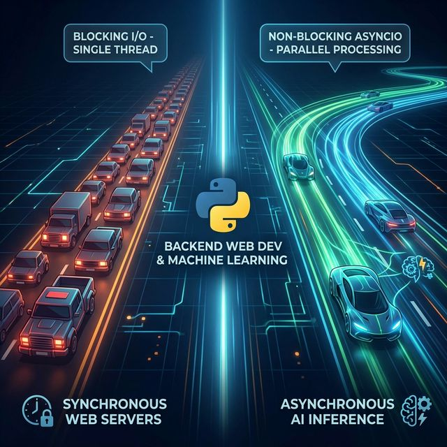

# Serving AI Models: Why FastAPI is Overtaking Django



*An architectural breakdown of synchronous vs. asynchronous Python frameworks for high-load machine learning inference.*

**Tags:** FastAPI | Django | Machine Learning | Web Development | Backend

Transitioning from traditional web apps to AI platforms requires a fundamentally different approach to latency, concurrency, and blocked threads. The framework you choose determines whether your inference endpoint serves 10 users or 10,000.

## Section 1: The WSGI vs. ASGI Problem

Django was built in 2005. It was designed to serve newspaper websites. It runs on WSGI (Web Server Gateway Interface), a synchronous protocol that follows a simple and predictable pattern: one request comes in, one thread handles it, one response goes out. Then the next request gets its turn.

This works beautifully for traditional web applications. A database query takes maybe 5–50 milliseconds. A template renders in single-digit milliseconds. The thread is occupied for a trivially short window of time.

**AI inference is a completely different animal.**

When a user hits your `/predict` endpoint, your server must load tensors into memory, run a forward pass through potentially billions of parameters, and serialize the output. That is not 50 milliseconds. That is 2 to 30 seconds of pure, blocking computation (or waiting on a GPU queue).

Here is what happens under Django's synchronous WSGI model during that window:

```text
Request #1 arrives  →  Thread 1 LOCKED (model inference... 5 seconds)
Request #2 arrives  →  Thread 2 LOCKED (model inference... 5 seconds)
Request #3 arrives  →  Thread 3 LOCKED (model inference... 5 seconds)
Request #4 arrives  →  Thread 4 LOCKED (model inference... 5 seconds)
Request #5 arrives  →  ❌ NO THREADS AVAILABLE → 503 Service Unavailable
```

A typical WSGI server like Gunicorn spawns a fixed number of synchronous workers (commonly 4–8 per CPU core). Each worker handles exactly one request at a time. While that worker waits for your PyTorch model to finish its forward pass, it is completely unavailable. It cannot accept new connections. It cannot serve health checks. It cannot even return a cached response to a different user.

This is the thread-blocking problem, and it creates a brutal bottleneck:

- Throughput collapses under even moderate concurrency.
- Latency spikes cascade as requests queue behind blocked workers.
- Scaling becomes expensive because you must throw more worker processes (and therefore more RAM and CPU) at the problem linearly.

You are not building a newspaper website anymore. You are building an inference server. The architecture must reflect that.

Django has added ASGI support in recent versions (3.0+), and that is worth acknowledging. But ASGI in Django is a bolt-on adaptation, not a foundational design principle. The ORM is synchronous. The middleware stack is synchronous. Most third-party packages assume synchronous execution. You end up wrapping everything in `sync_to_async()` adapters, which adds complexity and overhead without delivering the native async performance you actually need.

## Section 2: The FastAPI Solution

FastAPI was built from the ground up on ASGI (Asynchronous Server Gateway Interface) and Python's native `asyncio` event loop. This is not an incremental improvement. It is an architectural paradigm shift.

Here is the core difference in one sentence:

**Instead of blocking a thread while waiting, FastAPI releases the thread and picks the work back up when the result is ready.**

The same 5 concurrent requests under FastAPI with an ASGI server like Uvicorn look like this:

```text
Request #1 arrives  →  Start inference → await (thread released back to pool)
Request #2 arrives  →  Start inference → await (thread released back to pool)
Request #3 arrives  →  Start inference → await (thread released back to pool)
Request #4 arrives  →  Start inference → await (thread released back to pool)
Request #5 arrives  →  Start inference → await (thread released back to pool)

... model #1 finishes → Response #1 sent
... model #3 finishes → Response #3 sent
... (responses return as they complete, in any order)
```

A single Uvicorn worker can manage thousands of concurrent connections this way because the event loop is never blocked. It is always free to accept the next request, run the next coroutine, or return the next completed response.

### Why This Matters for ML Inference Specifically

Machine learning inference has a unique I/O profile that makes it ideal for async handling:

- **GPU-bound work is offloadable.** The actual matrix multiplications happen on the GPU or in C++ extensions (PyTorch, TensorFlow, ONNX Runtime). The Python thread does not need to babysit them. It submits the work and can `await` the result.
- **Preprocessing and postprocessing are lightweight.** Tokenization, image resizing, and JSON serialization are fast. The expensive part is the model forward pass, which is exactly the part you want to run without blocking.
- **Batching becomes possible.** When your server is not blocked, you can collect multiple incoming requests, batch their inputs into a single tensor, and run one forward pass for many users simultaneously. This is impossible when each request monopolizes a thread.

### Beyond Async: What Else FastAPI Brings

FastAPI is not just fast. It is also developer-friendly in ways that matter for ML teams:

- **Automatic OpenAPI documentation.** Every endpoint you write automatically generates interactive Swagger UI docs. Your data scientists can test the inference API from a browser without writing a single line of client code.
- **Pydantic validation.** Request and response schemas are enforced through Python type hints. If someone sends a malformed input tensor, they get a clear 422 error with details, not a cryptic stack trace from deep inside NumPy.
- **Dependency injection.** Model loading, authentication, and database sessions can be injected cleanly into endpoints without global state or tangled import chains.
- **Native WebSocket support.** For streaming token generation (like ChatGPT-style interfaces), FastAPI handles WebSockets as a first-class citizen.

## Section 3: Implementation

Below is a practical FastAPI endpoint that demonstrates the async inference pattern. This uses a dummy model for clarity, but the structure is identical to what you would use with a real PyTorch, TensorFlow, or ONNX model.

```python
import asyncio
from contextlib import asynccontextmanager

import numpy as np
from fastapi import FastAPI
from pydantic import BaseModel, Field

# ── Pydantic Schemas ──────────────────────────────────────────────
class PredictionRequest(BaseModel):
    features: list[float] = Field(
        ...,
        min_length=1,
        max_length=50,
        description="Input feature vector for the model.",
        json_schema_extra={"example": [0.21, 0.87, 0.45, 0.12]},
    )

class PredictionResponse(BaseModel):
    prediction: float
    label: str
    model_version: str

# ── Dummy Model ───────────────────────────────────────────────────
class DummyModel:
    """Simulates a real ML model with a slow forward pass."""

    def __init__(self) -> None:
        self.weights = np.random.randn(50)
        self.version = "1.0.0"

    async def predict(self, features: list[float]) -> float:
        """Simulate GPU inference with a non-blocking sleep."""
        arr = np.array(features)
        await asyncio.sleep(2)  # ← simulates model thinking time
        score = float(np.dot(arr, self.weights[: len(arr)]))
        return score

# ── Application Lifespan (model loading / cleanup) ────────────────
ml_model: DummyModel | None = None

@asynccontextmanager
async def lifespan(app: FastAPI):
    """Load the model once at startup; release at shutdown."""
    global ml_model
    print("Loading model into memory...")
    ml_model = DummyModel()
    print("Model ready.")
    yield
    print("Shutting down — releasing model resources.")
    ml_model = None

# ── FastAPI App ───────────────────────────────────────────────────
app = FastAPI(
    title="ML Inference API",
    version="1.0.0",
    lifespan=lifespan,
)

@app.get("/health")
async def health_check():
    return {"status": "healthy", "model_loaded": ml_model is not None}

@app.post("/predict", response_model=PredictionResponse)
async def predict(request: PredictionRequest):
    """
    Accepts a feature vector, runs async inference,
    and returns a labeled prediction.
    """
    score = await ml_model.predict(request.features)
    label = "positive" if score >= 0 else "negative"

    return PredictionResponse(
        prediction=round(score, 4),
        label=label,
        model_version=ml_model.version,
    )
```

### What to Notice in This Code

The `await` on line 47 is where the magic happens. During those 2 simulated seconds of model inference, the event loop is free. Uvicorn can accept hundreds of additional requests during that window. None of them are queued. None of them receive a 503. They are all progressing concurrently.

The `lifespan` context manager ensures the model is loaded exactly once when the server starts and cleaned up when it shuts down. This avoids the costly mistake of reloading model weights on every request.

Pydantic models enforce that the incoming feature vector is a list of floats with a length between 1 and 50. If validation fails, FastAPI returns a detailed error response automatically, no `try/except` blocks needed.

### Running It

```bash
pip install fastapi uvicorn numpy
uvicorn main:app --host 0.0.0.0 --port 8000 --workers 4
```

Then open `http://localhost:8000/docs` to access the auto-generated Swagger UI and test the endpoint interactively.

### Swapping in a Real Model

To use an actual model, replace the `DummyModel` class. Here is the pattern for a real PyTorch model using `asyncio.to_thread` to offload blocking CPU/GPU work without freezing the event loop:

```python
import torch
import asyncio

class RealModel:
    def __init__(self, model_path: str):
        self.model = torch.jit.load(model_path)
        self.model.eval()
        self.version = "2.1.0"

    def _blocking_predict(self, features: list[float]) -> float:
        tensor = torch.tensor(features).unsqueeze(0)
        with torch.no_grad():
            output = self.model(tensor)
        return float(output.squeeze())

    async def predict(self, features: list[float]) -> float:
        # Offload blocking inference to a thread pool
        return await asyncio.to_thread(self._blocking_predict, features)
```

The key insight: `asyncio.to_thread()` sends the synchronous, CPU/GPU-bound work to a separate thread while the async event loop remains completely unblocked. This is the standard production pattern for serving models with FastAPI.

## Conclusion

This is not about declaring one framework "better" than the other. It is about choosing the right tool for the problem in front of you.

Django excels at what it was designed for: complex, monolithic web applications with admin panels, ORM-driven data models, user authentication flows, and server-rendered templates. If you are building a content management system, an e-commerce platform, or an internal business tool, Django remains a battle-tested and productive choice.

FastAPI excels at what modern AI infrastructure demands: lightweight, high-concurrency microservices that can handle thousands of simultaneous inference requests without thread starvation. Its async-native architecture, automatic validation, and built-in documentation make it the natural choice for any endpoint where a machine learning model sits behind an HTTP interface.

The industry trajectory is clear. Major ML platforms, inference providers, and AI startups have converged on FastAPI as the standard for serving models. Not because Django is broken, but because the problem has changed.

You are not serving web pages. You are serving predictions. Build accordingly.
