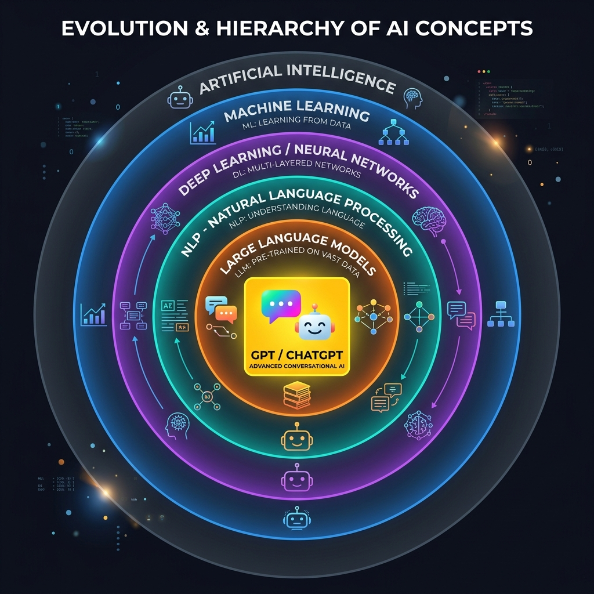
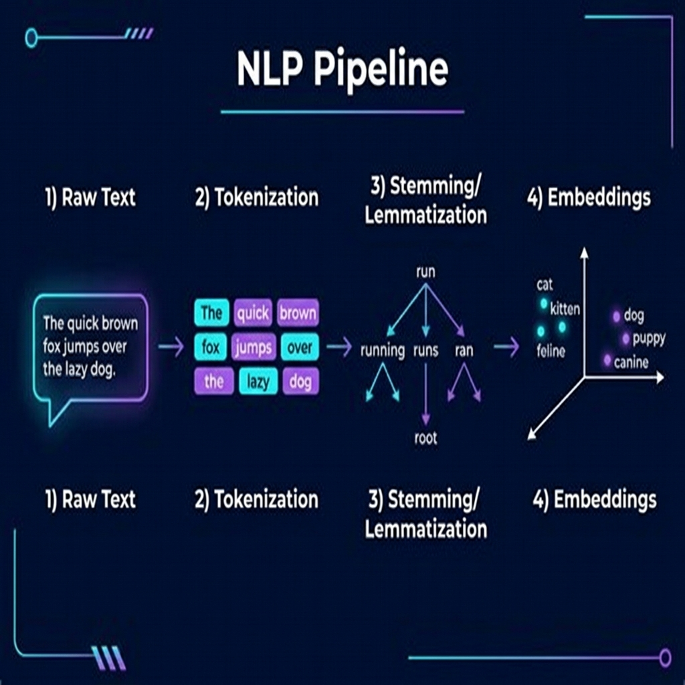
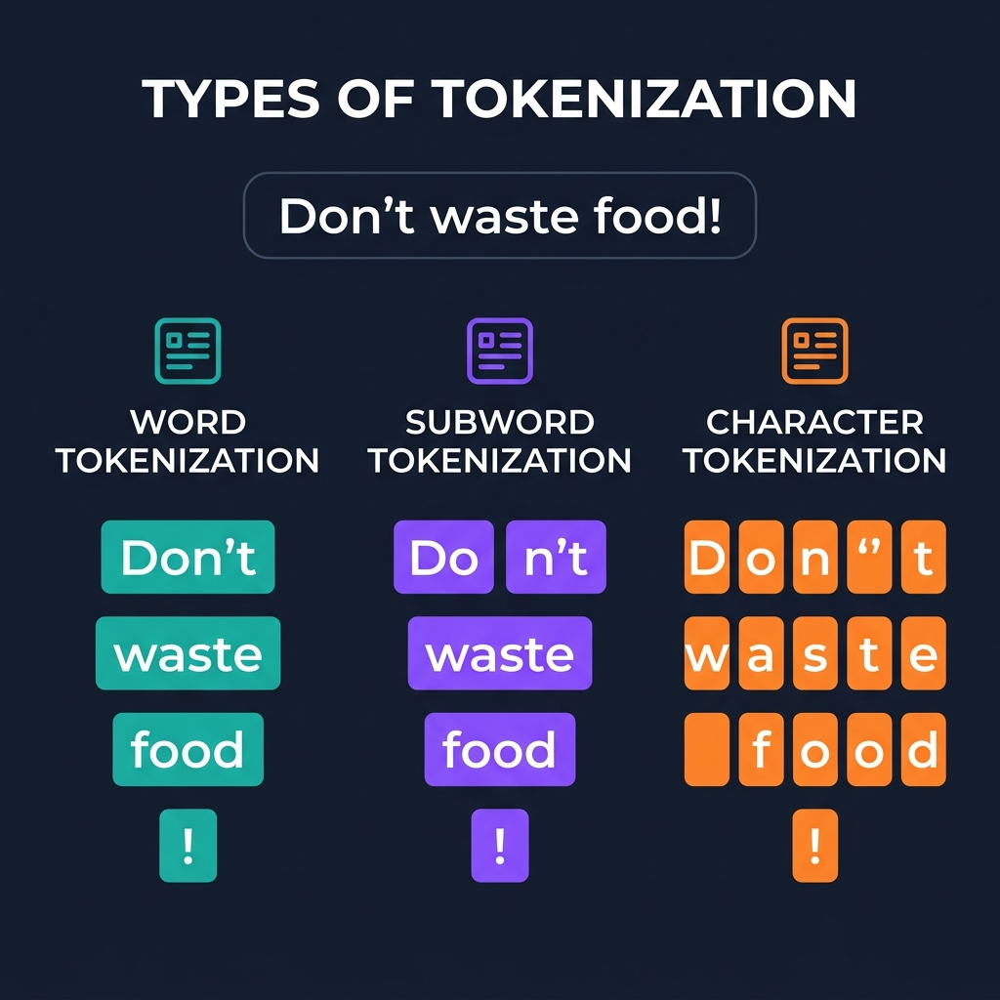
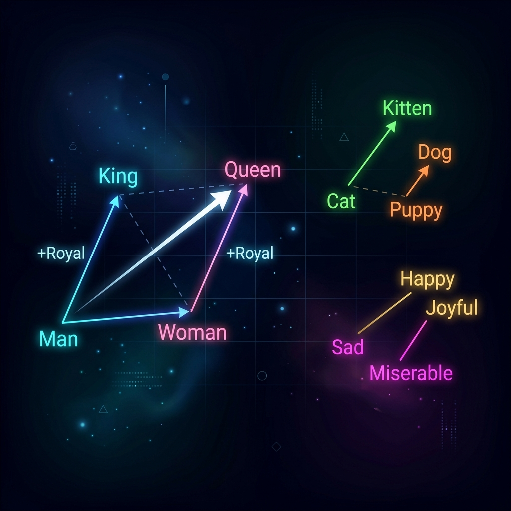
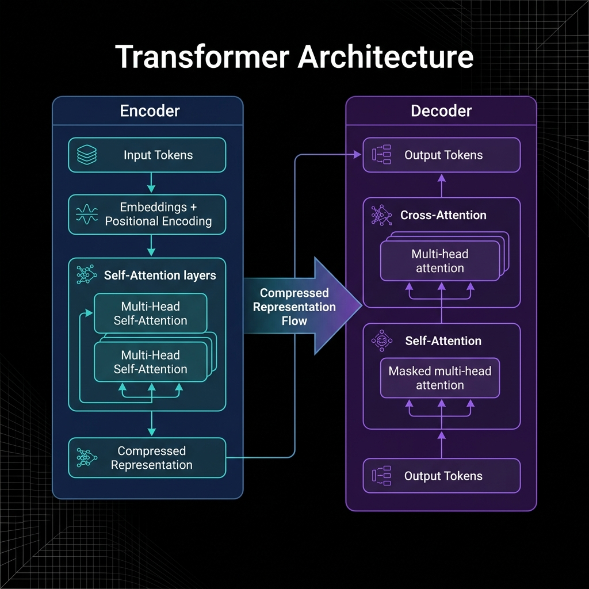
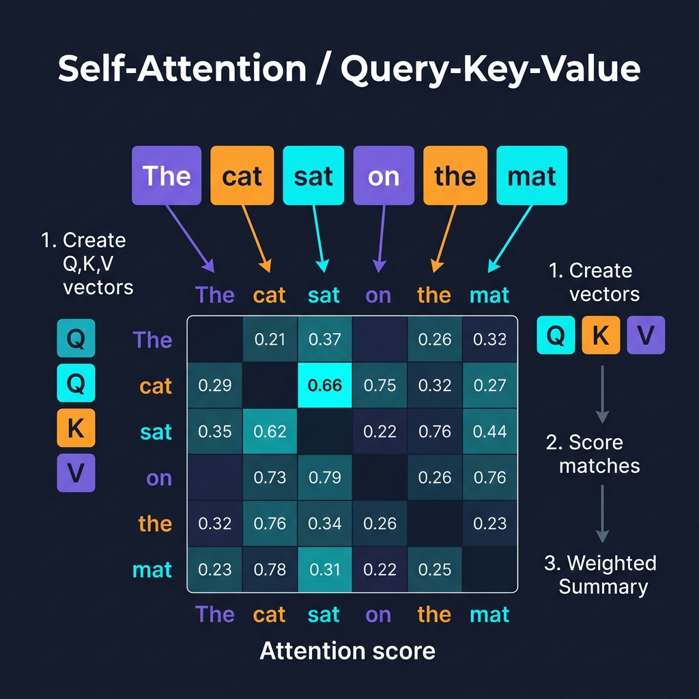

# 🧠 Gateway to Generative AI: A Complete Guide to NLP & LLMs

> **Based on:** Scalar Generative AI Module — Class 1 & 2 Transcripts + Official PDF Notes  
> **Topics:** Generative AI Fundamentals · NLP Pipeline · Transformers · Self-Attention · LLMs

---

## Table of Contents

1. [What is Generative AI?](#1-what-is-generative-ai)
2. [The AI Hierarchy — Where Does GenAI Fit?](#2-the-ai-hierarchy--where-does-genai-fit)
3. [The Iron Man Philosophy](#3-the-iron-man-philosophy)
4. [Types of Generative AI Models](#4-types-of-generative-ai-models)
5. [What is an LLM?](#5-what-is-an-llm)
6. [How Does a Computer Handle Language? — The NLP Pipeline](#6-how-does-a-computer-handle-language--the-nlp-pipeline)
   - [Step 1: Tokenization](#step-1-tokenization)
   - [Step 2: Stemming & Lemmatization](#step-2-stemming--lemmatization)
   - [Step 3: Embeddings](#step-3-embeddings)
7. [From NLP to LLMs — Filling the Gap with Transformers](#7-from-nlp-to-llms--filling-the-gap-with-transformers)
8. [Transformer Architecture: Encoder & Decoder](#8-transformer-architecture-encoder--decoder)
9. [Self-Attention: The Key Innovation](#9-self-attention-the-key-innovation)
10. [Why You Can't Build Your Own LLM](#10-why-you-cant-build-your-own-llm)
11. [RAG, Agents & Fine-Tuning — What's Next?](#11-rag-agents--fine-tuning--whats-next)
12. [Key Concepts Cheat Sheet](#12-key-concepts-cheat-sheet)
13. [Interview Q&A](#13-interview-qa)

---

## 1. What is Generative AI?

Generative AI is often described as **"Intelligence as a Service"** — machines that don't just execute instructions but *learn, think, and generate* new content.

Think about the evolution:

| Era | Machines Did |
|-----|-------------|
| **Early computing** | Execute our explicit instructions (like calculators) |
| **Machine Learning era** | Learned patterns from data to make predictions |
| **Generative AI era** | Understand context, generate creative content, reason, strategize |

> **Simple definition:** Generative AI refers to AI systems that can *generate* new content — text, images, audio, video, code — based on patterns learned from training data.

### The GPT Breakdown

| Letter | Stands For | Meaning |
|--------|-----------|---------|
| **G** | Generative | The model *generates* output |
| **P** | Pre-trained | Trained on massive datasets before you use it |
| **T** | Transformer | The neural architecture that powers it |

---

## 2. The AI Hierarchy — Where Does GenAI Fit?



Understanding where Generative AI sits in the larger AI ecosystem:

```
Artificial Intelligence (AI)
│
├── Machine Learning (ML)
│   │
│   └── Deep Learning / Neural Networks
│       │
│       └── Natural Language Processing (NLP)
│           │
│           └── Large Language Models (LLMs)
│               │
│               └── ChatGPT, Llama, Mistral, Claude...
```

> **Key insight from lectures:** Generative AI is **not** a completely new field — it's a specialized evolution within the existing AI hierarchy, sitting inside NLP, which sits inside Deep Learning.

---

## 3. The Iron Man Philosophy

One of the most important mindsets for working with AI:

> *"There is no Jarvis without Robert Downey Jr."*

- **Can machines work alone?** → No. In isolation, even the smartest model lacks imagination.
- **Can humans work alone?** → No. Without AI tools, humans are prone to replacement and inefficiency.
- **Solution:** Work *in conjunction* with the machine. You provide: 
  - ✅ The right instruction (Prompt Engineering)
  - ✅ Context and domain knowledge
  - ✅ Evaluation of results
  - ✅ Compensation for model weaknesses

### Three Mindsets About AI

| Mindset | Description | Outcome |
|---------|-------------|---------|
| 🚫 **Denial** | "AI can't replace my job" | Ignorance, left behind |
| 😰 **Panic** | "AI will take all jobs" | Fear-driven, paralyzed |
| ✅ **Iron Man** | Work with AI as a partner | More productive, irreplaceable |

---

## 4. Types of Generative AI Models

Generative AI covers far more than just chatbots. Here's the full landscape:

| Input → Output | Example Use Case | Example Tool |
|---------------|-----------------|-------------|
| **Text → Text** | Summarization, Q&A, chatbots | ChatGPT, Llama |
| **Text → Image** | Logo generation, art creation | DALL-E, Midjourney, Getty Edify |
| **Speech → Text** | Transcription, accent analysis | Whisper API |
| **Text → Audio** | Music generation, TTS | Suno, ElevenLabs |
| **Text → Video** | Video generation from description | Sora, RunwayML |
| **Image → Image** | Resolution upscaling, style transfer | Stable Diffusion |
| **Image → Text** | Visual Q&A, equation solving | GPT-4V, Claude |
| **Video → Text** | YouTube transcripts, summaries | Whisper + LLM |

### What is a Multimodal Model?

A model is **multimodal** when it is trained on *multiple types of data* (text + images + audio) **and** can process multiple types of input/output.

```
Text-to-Image only = NOT multimodal (single direction)
Text + Image → Text + Image = MULTIMODAL ✅
```

> **Example:** GPT-4V (Vision) is multimodal — you can give it an image of a physics problem and ask it to solve the equation. It needs to understand both the image AND the mathematical text simultaneously.

---

## 5. What is an LLM?

**A Large Language Model (LLM) is a foundational machine learning model that uses deep learning algorithms to process and understand natural language.**

### Language Model vs. Large Language Model

| Aspect | Basic Language Model | Large Language Model |
|--------|---------------------|---------------------|
| **Prediction scope** | Probability of a single next word | Probability of sentences, paragraphs, entire documents |
| **Example** | Gmail autocomplete | ChatGPT, Llama 3, Claude |
| **Parameters** | Thousands to millions | Billions (70B, 340B, 405B) |
| **Capabilities** | Next-word prediction | Reasoning, coding, legal analysis, strategy |
| **Training data** | Small corpus | Petabytes of text (1 petabyte = 1 million GB) |

### The Probability Engine

At its core, a language model works by **estimating probabilities**:

```
Input: "Once upon a ____"

time      → 49.4%
dream     → 15.2%
reaction  →  3.6%
try       →  2.5%
location  →  2.2%
```

The model picks the highest probability word and generates from there — this is how text generation works.

### How LLMs Are Trained

The training process mirrors how babies learn:

1. **Feed massive data** → Like a baby consuming everything about the world
2. **Back Propagation** → The model learns from mistakes (like a baby touching a hot stove)
3. **RLHF (Reinforcement Learning with Human Feedback)** → Human trainers reward good outputs and penalize bad ones (like parents correcting a child)
4. **Model is frozen** → Once trained, the weights are locked — this gives us the **P** in GPT (*Pre-trained*)

```
Training Data (Petabytes)
        ↓
Neural Network (Billions of Parameters)
        ↓
Back Propagation (learn from mistakes)
        ↓
RLHF (human feedback correction)
        ↓
Frozen Pre-trained Model ← This is your LLM
```

---

## 6. How Does a Computer Handle Language? — The NLP Pipeline



NLP (Natural Language Processing) is the bridge between raw human language and machine-understandable representation. The pipeline has three core steps, with preprocessing applied throughout:

```
Raw Text
   ↓  [Remove Stop Words]
Tokenization
   ↓
Stemming / Lemmatization
   ↓
Embeddings (Numbers)
   ↓
Machine Learning Model
```

> **Stop Words:** Words like *is, am, are, the, a* that carry little semantic meaning and are filtered out early. Example: "Taj Mahal is beautiful" → feed only **["Taj", "Mahal", "beautiful"]**

---

### Step 1: Tokenization



**Tokenization is the process of breaking text into smaller units called tokens.**

Think of it like your brain recognizing individual words before understanding a sentence.

```python
# Example sentence
text = "Hello, how are you?"

# After tokenization:
tokens = ['Hello', ',', 'how', 'are', 'you', '?']
# → 6 tokens
```

#### Three Types of Tokenization

| Type | How It Works | Best For | Example for "Don't waste food" |
|------|-------------|----------|-------------------------------|
| **Word** | Split on spaces/punctuation | English and similar languages | `["Don't", "waste", "food"]` |
| **Subword** | Break unknown/complex words into pieces | Models like GPT, Llama | `["Do", "n't", "waste", "food"]` |
| **Character** | Every single character is a token | Chinese, Japanese, detailed analysis | `["D","o","n","'","t","w","a","s","t","e"...]` |

#### Why Subword Tokenization?

Words like **"generative"** share a root with **"generate"**, **"general"**, **"generation"**. By splitting into subwords (`["gener", "ative"]`), the model can learn shared patterns across related words. This is why GPT breaks up longer words — it's not a bug, it's a feature!

#### Token Limits Matter!

Free API tiers for models have **token limits**. If your model allows 4,096 tokens and your prompt uses 3,800, you only have 296 tokens left for the response. Counting tokens before sending API calls is critical for production applications.

**🔬 Playground to experiment:** https://huggingface.co/spaces/Xenova/the-tokenizer-playground

#### Popular Tokenizer Libraries

| Library | Language | Notes |
|---------|----------|-------|
| **NLTK** | Python | Basic word/sentence tokenizers, great for learning |
| **SpaCy** | Python | Advanced tokenizers, handles multiple languages |
| **Hugging Face Transformers** | Python | Pre-trained tokenizers matched to specific models |

---

### Step 2: Stemming & Lemmatization

Once text is tokenized, the machine needs to understand that **"running"**, **"runner"**, and **"ran"** all mean something related to **"run"**. This is what stemming and lemmatization accomplish.

#### Stemming — The "Chop-It-Off" Approach

Stemming simply **removes suffixes** to get the root of the word:

```
running  →  run    ✅
runner   →  run    ✅
ran      →  ran    ❌ (still "ran", not "run")
playing  →  play   ✅
change   →  chang  ❌ (incorrect root — "chang" isn't a word)
```

**Pros:** Fast, computationally cheap  
**Cons:** Can produce non-words; misses irregular forms

#### Lemmatization — The "Dictionary" Approach

Lemmatization uses a lexical knowledge base called **WordNet** (a giant digital thesaurus) to find the true root form:

```
running  →  run     ✅
runner   →  runner  ✅ (noun, stays as is)
ran      →  run     ✅ (correctly resolves irregular form)
change   →  change  ✅ (proper root)
changing →  change  ✅
```

**Pros:** More accurate, handles irregular words, captures semantic connections  
**Cons:** Computationally more expensive

#### Stemming vs. Lemmatization — Trade-off Summary

```
          STEMMING                    LEMMATIZATION
          --------                    -------------
Speed:    🚀 Fast                     🐢 Slower
Accuracy: ❌ Approximate              ✅ High
Output:   May be non-word             Always a real word
Use when: Speed > accuracy            Accuracy > speed
Library:  NLTK PorterStemmer          NLTK / SpaCy WordNetLemmatizer
```

---

### Step 3: Embeddings



**Embeddings convert words into numerical vectors that capture their semantic meaning and relationships.**

This isn't just assigning random numbers — it's creating a mathematical representation where **similar words get similar numbers**.

#### The Classic Word2Vec Analogy

```
man   → [1.1, 0.2, 0.5, ...]   (vector)
king  → [1.9, 0.1, 0.9, ...]   (vector)
woman → [2.1, 0.9, 0.5, ...]   (vector)
queen → [2.9, 0.8, 0.9, ...]   (vector)

Mathematical relationship:
  king - man + woman ≈ queen  ✅

Why? Because the "royal" attribute vector is:
  king - man = [0.8, -0.1, 0.4] = "royalty offset"
  woman + "royalty offset" ≈ queen
```

This is why embeddings are powerful — they encode relationships, not just labels.

#### Types of Embeddings

| Type | Description | Example |
|------|-------------|---------|
| **Word-level** (Word2Vec, GloVe) | Pre-trained on large corpora, static embeddings | Word2Vec by Google |
| **Contextual** (Transformer-based) | Dynamically change based on context in sentence | BERT, GPT embeddings |

> **Why contextual embeddings matter:** "Bank" in "I sat on the river bank" vs "I went to the bank" should have *different* embeddings. Static models give the same embedding for both — Transformers solve this.

---

## 7. From NLP to LLMs — Filling the Gap with Transformers

Traditional NLP had two major problems:

**Problem 1 — Sequential Processing:**
> Models processed text one word at a time (left to right), missing long-range connections.

**Problem 2 — Limited Context:**
> Models couldn't hold the context of a full paragraph — they'd "forget" what was said earlier.

**The Solution: Transformers** (introduced in the landmark 2017 paper: *"Attention Is All You Need"*)

```
Traditional NLP:  word → word → word → ... (sequential, forgets context)

Transformer NLP:  ALL WORDS SIMULTANEOUSLY, with full context awareness ✅
```

---

## 8. Transformer Architecture: Encoder & Decoder



A Transformer consists of two main blocks:

```
     INPUT TEXT
         ↓
  ┌─────────────┐
  │   ENCODER   │  ← Compresses input into compact representation
  │             │     (like writing lecture notes)
  │  • Token    │
  │    Embed    │
  │  • Position │
  │    Embed    │
  │  • Self-    │
  │    Attention│
  └──────┬──────┘
         │  Compressed Representation (Encodings)
  ┌──────▼──────┐
  │   DECODER   │  ← Generates output from encodings
  │             │     (like expanding notes into full text)
  │  • Self-    │
  │    Attention│
  │  • Cross-   │
  │    Attention│
  │  • Output   │
  │    Layer    │
  └─────────────┘
         ↓
     OUTPUT TEXT
```

#### Positional Encoding — Preserving Word Order

The Transformer processes all words simultaneously (in parallel), which is great for speed but loses word order. **Positional Encoding** solves this by adding position information to each word's embedding:

```
"My   favorite   animal   is   cat"
 ↓     ↓          ↓        ↓    ↓
[2.3] [4.3]      [5.3]    [...]  [...]   ← token embeddings

 +0     +1         +2       +3    +4     ← position added

[2.3] [5.3]      [7.3]    [...]  [...]   ← final input to model
```

#### Learning in a Transformer

**Encoder Learning:**
1. Compresses input information into a compact representation
2. Automatically identifies important features (no manual feature engineering!)
3. Discards irrelevant/redundant information
4. Creates a "condensed summary" — like writing key lecture notes

**Decoder Learning:**
1. Takes the encoder's compact representation
2. Learns patterns and relationships in the data
3. Generates appropriate output sequence, token by token
4. Makes mistakes → loss function corrects it → weights update → repeat

**Scoring Process:**
```
1. Encoder processes input → creates compressed representation
2. Decoder generates output from that representation
3. Output compared to expected output via LOSS FUNCTION
4. Loss score used to update weights (back propagation)
5. Repeat until loss is minimized
```

#### Is a Transformer Supervised or Unsupervised?

> **Answer: Semi-supervised**

- The embeddings it creates itself → **unsupervised** component
- The labels provided for correct output → **supervised** component
- It's neither fully supervised nor fully unsupervised → **semi-supervised**

---

## 9. Self-Attention: The Key Innovation



Self-attention is what makes Transformers revolutionary. It allows each word to "look at" every other word in the sentence and decide how much to pay attention to it.

#### The Bat Problem — Why Context Matters

```
Sentence 1: "I played with the bat."    → bat = sporting equipment 🏏
Sentence 2: "The bat flew in the night." → bat = flying mammal 🦇
```

Without attention, both sentences would process "bat" identically. Self-attention gives the model the ability to shift interpretation based on surrounding words.

#### The Cat & Milk Example

```
Sentence A: "The cat drank the milk because it was hungry."
                                              ↑
                                        it = cat (hungry relates to cat, not milk)

Sentence B: "The cat drank the milk because it was sweet."
                                              ↑
                                        it = milk (sweet relates to milk, not cat)
```

The word **"it"** has a *different referent* in each sentence. Self-attention enables the model to resolve this correctly.

#### Queries, Keys & Values — The Library Analogy

Imagine you're searching for a book in a library:

| Component | Library Analogy | In NLP |
|-----------|----------------|--------|
| **Query (Q)** | The question you're searching for | What each word "asks" of other words |
| **Key (K)** | The labels/catalog on books | Each word's "identifier" for matching |
| **Value (V)** | The actual content of the book | The actual meaning/information of the word |

#### Step-by-Step Self-Attention

Using: **"The cat sat on the mat"**

**Step 1 — Create Q, K, V for every word:**
```
For word "cat":
  Q_cat = [question about what cat is doing / its associations]
  K_cat = [identifier for "cat" as a noun/subject]
  V_cat = [actual meaning: feline animal]
```

**Step 2 — Score all pairs:**
```
  cat ↔ the   → low score (article, no useful info)
  cat ↔ sat   → HIGH SCORE ✅ (cat's action is sitting)
  cat ↔ on    → medium (preposition)
  cat ↔ mat   → low (location, indirect)
```

**Step 3 — Weighted Summary:**
```
  Because cat ↔ sat = highest score,
  "sat" contributes most to cat's final representation.
  → Model learns: in this sentence, cat's primary association = sat (action)
```

This is how the model builds *contextual understanding* of every word.

#### Self-Attention as a Matrix (For the Curious)

```
Attention(Q, K, V) = softmax(QK^T / √d_k) · V
```
- `QK^T` = dot product → gives attention scores for all word pairs
- `√d_k` = scaling factor (prevents extremely large values)
- `softmax` = normalizes scores to probabilities (0 to 1)
- `· V` = weighted combination of value vectors

You don't need to implement this from scratch — the architecture handles it internally.

---

## 10. Why You Can't Build Your Own LLM

Three reasons (from the lecture):

### 1. Data

```
GPT is trained on PETABYTES of data.
1 Petabyte = 1,000,000 GB
1 GB ≈ 178 million words

→ Training data contains hundreds of TRILLIONS of words.
→ You don't have access to this scale of data.
```

### 2. Architecture

Building a Transformer architecture that can:
- Handle billions of parameters
- Process petabytes without memory overflow
- Maintain coherence across long contexts
- Implement efficient attention at scale

...requires years of research, PhD-level expertise, and large teams.

### 3. Training Resources

```
Training a 70B parameter model:
  - Requires thousands of A100 GPUs
  - Takes weeks to months
  - Costs millions of dollars
  - Needs specialized infrastructure (cooling, power, networking)
```

### What You CAN Do

| Approach | What It Does | When to Use |
|----------|-------------|-------------|
| **Prompt Engineering** | Guide model with carefully crafted instructions | Quick solutions, no code needed |
| **RAG** (Retrieval-Augmented Generation) | Train model to reference your own documents | Custom knowledge bases |
| **Fine-Tuning** (LoRA, QLoRA) | Adjust last few layers for your specific task | Domain-specific applications |
| **Agents** | Add tool-use capabilities (calculator, search, SQL) | Complex multi-step tasks |

---

## 11. RAG, Agents & Fine-Tuning — What's Next?

### RAG (Retrieval-Augmented Generation)

RAG allows you to build a chatbot trained on **your own documents** (PDFs, CSVs, HTML, etc.):

```
User Query
    ↓
[Embed Query as Vector]
    ↓
[Search Document Vector Store for Similar Chunks]
    ↓
[Retrieve Top-K Relevant Chunks]
    ↓
[Feed Query + Retrieved Context to LLM]
    ↓
[LLM Generates Grounded Answer]
```

> **Important RAG limitation:** RAG is a *summarizer*, not a calculator. If you ask "how many rows in this CSV?", it won't count — it will guess. Use **Agents** for quantitative/analytical tasks.

### Agents

Agents are **add-on tools** that extend LLM capabilities beyond text:

| Agent Type | What It Adds |
|-----------|-------------|
| **Calculator Agent** | Accurate math (solves LLM hallucination on numbers) |
| **Search Agent** | Real-time Google search integration |
| **DataFrame Agent** | Run actual calculations on pandas DataFrames |
| **SQL Agent** | Query databases with natural language |

### Hallucination & Temperature

```python
temperature = 0.0   # Model sticks strictly to its knowledge, says "I don't know"
                    # if data is unavailable
temperature = 1.0   # Model freely generates, may "hallucinate" plausible-sounding
                    # but incorrect information
```

> Use `temperature = 0` for factual tasks. Use higher temperatures for creative tasks.

### When NOT to Use LLMs

| Task Type | Best Tool |
|-----------|----------|
| Structured data (CSV, SQL tables) | Traditional ML (sklearn, XGBoost) |
| Regression / Classification | Machine Learning |
| Counting rows, exact calculations | Agents + Pandas |
| Time series prediction | LSTM, ARIMA, Prophet |
| Unstructured text/image/audio | LLMs / GenAI ✅ |

---

## 12. Key Concepts Cheat Sheet

```
┌─────────────────────────────────────────────────────────────┐
│                    QUICK REFERENCE                          │
├──────────────────┬──────────────────────────────────────────┤
│ LLM              │ Large Language Model — deep learning      │
│                  │ model trained on massive text data        │
├──────────────────┼──────────────────────────────────────────┤
│ Tokenization     │ Breaking text into tokens (words,        │
│                  │ subwords, or characters)                 │
├──────────────────┼──────────────────────────────────────────┤
│ Stemming         │ Chop-off approach to get root word       │
│                  │ (fast but imprecise)                     │
├──────────────────┼──────────────────────────────────────────┤
│ Lemmatization    │ Dictionary approach to find true root    │
│                  │ (accurate, uses WordNet)                 │
├──────────────────┼──────────────────────────────────────────┤
│ Embeddings       │ Numerical vector representation of words │
│                  │ that captures semantic relationships     │
├──────────────────┼──────────────────────────────────────────┤
│ Transformer      │ Neural architecture that processes       │
│                  │ sequences with encoder + decoder         │
├──────────────────┼──────────────────────────────────────────┤
│ Self-Attention   │ Each word looks at all others to build   │
│                  │ contextual understanding                 │
├──────────────────┼──────────────────────────────────────────┤
│ Q, K, V          │ Query, Key, Value — core of attention    │
│                  │ mechanism                                │
├──────────────────┼──────────────────────────────────────────┤
│ RLHF             │ Reinforcement Learning with Human        │
│                  │ Feedback — trains model on human ratings │
├──────────────────┼──────────────────────────────────────────┤
│ RAG              │ Retrieval-Augmented Generation —         │
│                  │ chatbot trained on custom documents      │
├──────────────────┼──────────────────────────────────────────┤
│ Hallucination    │ Model generates confident but incorrect  │
│                  │ information                              │
├──────────────────┼──────────────────────────────────────────┤
│ Temperature      │ Controls randomness in generation (0=    │
│                  │ deterministic, 1=creative/random)        │
├──────────────────┼──────────────────────────────────────────┤
│ Multimodal       │ Model trained on + generating multiple   │
│                  │ types of data (text, image, audio)       │
└──────────────────┴──────────────────────────────────────────┘
```

---

## 13. Interview Q&A

**Q: What makes an LLM different from a basic language model?**  
> A basic language model predicts the probability of the next *word*. An LLM can predict the probability of full sentences, paragraphs, or even entire documents. LLMs also understand complex contextual nuances, generate coherent text, and reason across topics.

**Q: Is autocomplete an LLM?**  
> No. Autocomplete is a language model — it estimates the probability of the next word — but it lacks the scale and complexity of an LLM. LLMs can write poetry, strategize, code, translate, and reason.

**Q: Is a Transformer supervised or unsupervised?**  
> **Semi-supervised.** The embedding creation is self-supervised (unsupervised component), while the output labels provided during training make it partly supervised.

**Q: When should you use traditional ML instead of GenAI?**  
> For structured data tasks: regression, classification on CSVs/databases. LLMs excel at unstructured data (text, images, audio). "If a knife can do the job, you don't need a sword."

**Q: What is RLHF?**  
> Reinforcement Learning with Human Feedback. During LLM training, human evaluators rate model responses — good responses are rewarded, bad ones are penalized. This shapes the model toward helpful, accurate, and safe behavior (like parents training a child).

**Q: What is hallucination in LLMs?**  
> When a model generates plausible-sounding but factually incorrect information. Caused by high temperature settings or insufficient training data for a specific domain. Mitigated by RAG (grounding responses in real documents) and low temperature settings.

**Q: What is the difference between RAG and Fine-tuning?**  
> **RAG** retrieves relevant passages from external documents at inference time — no model retraining required. **Fine-tuning** actually updates the model weights by training it on new data — more powerful but more expensive and time-consuming.

---

## Resources & Tools

| Resource | URL / Note |
|----------|-----------|
| **Tokenizer Playground** | https://huggingface.co/spaces/Xenova/the-tokenizer-playground |
| **GPT Tokenizer Tool** | https://gptforwork.com/tools/tokenizer |
| **Nvidia API Playground** | https://build.nvidia.com |
| **Hugging Face Models** | https://huggingface.co/models |
| **Attention Is All You Need** | Original Transformer paper (2017, Vaswani et al.) |
| **LangChain** | Framework for building RAG applications |
| **Llama Index** | Alternative RAG framework (built on PyTorch) |
| **Open-Source LLMs** | Llama 3.1, Mistral, Neatron (available on Nvidia) |

---

*Notes compiled from Scalar GenAI Module — Class 1 (Gateway to Generative AI) & Class 2 (Decoding Language: The Mechanics of NLP and LLMs), supplemented with official PDF reference material.*
