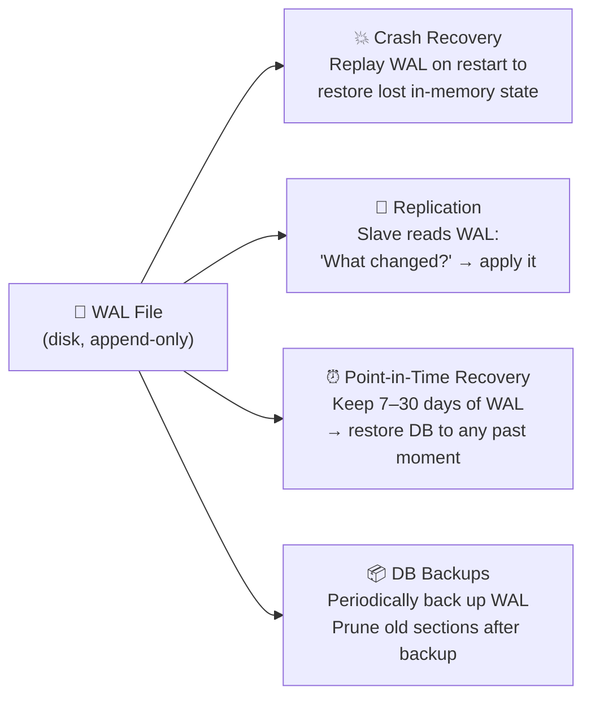
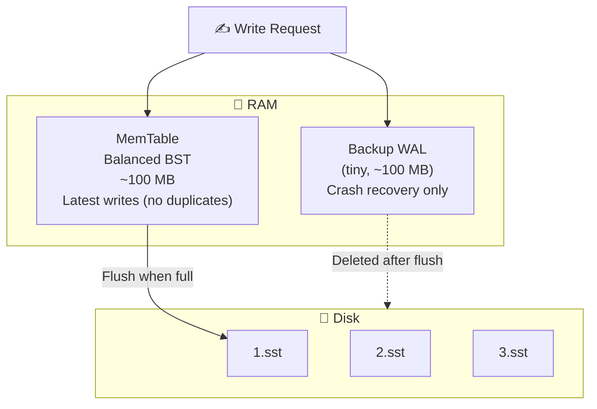
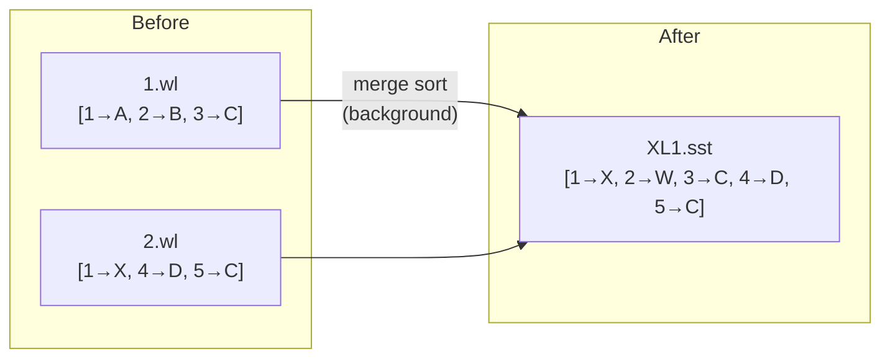
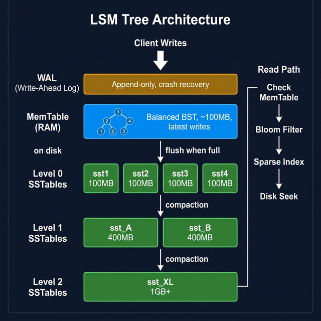
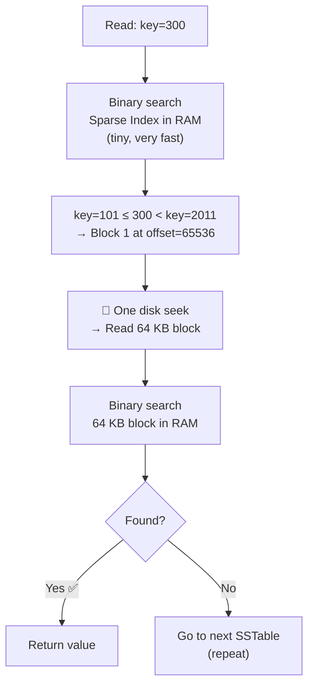
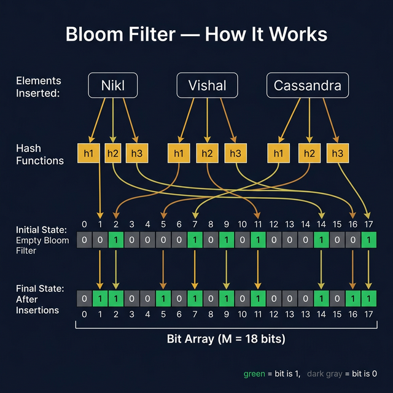
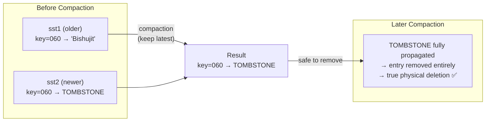
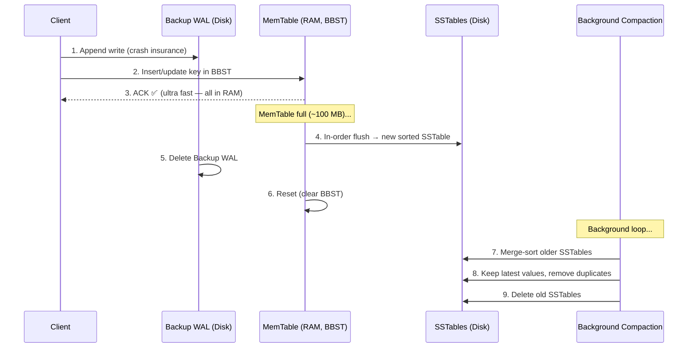
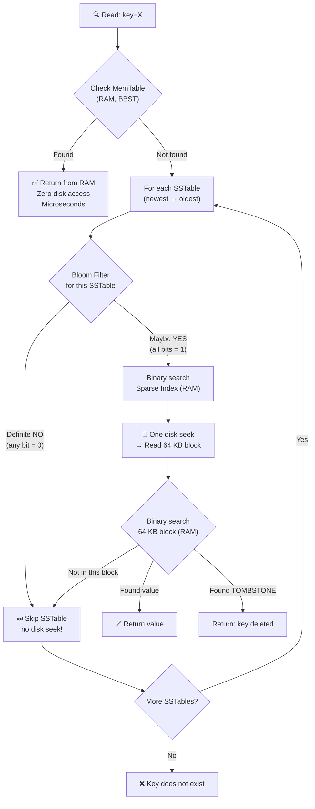

# 🌳 NoSQL Internals: LSM Trees, WAL & Bloom Filters

> **Source:** [HLD Multi Master 11 – YouTube](https://youtu.be/qSMB6nUloNE) by Scaler
> **Additional Resources:** [Bloom Filters by Example](https://llimllib.github.io/bloomfilter-tutorial/) · [Bloom Filter Calculator](https://hur.st/bloomfilter/)
> **Lecture Series:** Scaler HLD — Class 11
> **Last Updated:** March 2026
> **Goal:** Understand exactly how NoSQL databases store, retrieve, and manage data on disk — using the exact examples from the lecture.

---

## 📋 Table of Contents

1. [The Problem: Why SQL's Approach Breaks for NoSQL](#1-the-problem-why-sqls-approach-breaks-for-nosql)
2. [Brute Force: Flat File Storage](#2-brute-force-flat-file-storage)
3. [Write-Ahead Log (WAL)](#3-write-ahead-log-wal)
4. [In-Memory Hashmap: Key → Offset](#4-in-memory-hashmap-key--offset)
5. [MemTable: Latest Chunk in Memory](#5-memtable-latest-chunk-in-memory)
6. [SSTables: Sorted String Tables](#6-sstables-sorted-string-tables)
7. [Full Dry Run: Keys 1–5](#7-full-dry-run-keys-15)
8. [LSM Tree: The Full Architecture](#8-lsm-tree-the-full-architecture)
9. [Sparse Index: Memory-Efficient Lookup](#9-sparse-index-memory-efficient-lookup)
10. [Bloom Filters: Skip Unnecessary Reads](#10-bloom-filters-skip-unnecessary-reads)
11. [Tombstones: How Deletion Works](#11-tombstones-how-deletion-works)
12. [Full Read & Write Flow](#12-full-read--write-flow)
13. [Summary Cheat Sheet](#13-summary-cheat-sheet)

---

## 1. The Problem: Why SQL's Approach Breaks for NoSQL

### SQL: Fixed Schema → Safe In-Place Updates

In SQL, every column has a known **data type** and every table has a **fixed schema**. Because the size of every row is exactly known, you can safely update values in-place.

```
SQL Table: users
  Column: id    → BIGINT  (8 bytes)
  Column: name  → VARCHAR(50)
  Row size = 58 bytes, always.

Row 1:  id=20, name="nikl"        → 58 bytes exactly
Row 2:  id=5,  name="nl"          → 58 bytes exactly

Update: "nikl" → "nikl abra"
  Still fits in VARCHAR(50) → overwrite safely. ✅
  Size does not change.
```

SQL uses **B+ Trees** internally:
- Every node in the B+ tree is exactly **one disk block** in size
- Tree height = `log(N)` → reading/writing = `log(N)` disk seeks
- Safe because row size is fixed — no overflow risk when updating

### NoSQL: Variable-Size Data → In-Place Updates Are Dangerous

In a NoSQL document or key-value store, sizes are completely arbitrary:

```
Key   → any string (variable length)
Value → any string / JSON (variable length)
```

**From the lecture — the exact example:**

```
Disk layout (continuous bytes):
  ┌──────────────────────────────────────────┬───────────────────────────┐
  │ Doc ID=10 │ { "name": "someone" }        │ Doc ID=30 │ { "name":"N" }│
  │  4 bytes  │       100 bytes              │   4 bytes │    80 bytes   │
  └──────────────────────────────────────────┴───────────────────────────┘
  offset=0                                    offset=104

Update Doc ID=10:
  New value: { "name": "someone", "favorite_color": "red" }
  New size  = 140 bytes  >  original 100 bytes

  Blindly overwriting:
  → Extra 40 bytes bleed into Doc ID=30's space ❌
  → Doc ID=30 data is CORRUPTED
```

**Two bad options when data grows:**

| Option | What Happens | Why It's Bad |
|---|---|---|
| Overwrite in-place (carelessly) | New data overwrites adjacent document | **Data corruption** |
| Split document across disk | Doc stored in multiple non-contiguous locations | **Fragmentation → multiple disk seeks** |

> *"The only safe solution for variable-size data: never update in-place. Just append at the end."* — Instructor

**Why disk seeks are so expensive:**

```
Hard Disk Architecture:
  ┌────────────────────────────────────────┐
  │  Read/Write Head (physical arm)        │
  │         ┌──────────────────┐           │
  │         │   Spinning Disk  │ ← 6800 RPM│
  │         │  ●─────────────► │           │
  │         └──────────────────┘           │
  │   Track = one ring = sequential data   │
  └────────────────────────────────────────┘

  Sequential read:  Disk spins, head stays   → FAST  ✅
  Changing track:   Head physically moves    → 100ms+ ❌
  (This physical movement is called a "disk seek")
```

```
Memory Speed Hierarchy (approx):
  RAM           →   100 ns    (baseline)
  SSD random    →   100 µs    (1,000×  slower than RAM)
  HDD seq.      →     1 ms    (10,000× slower)
  HDD seek      →    10 ms    (100,000× slower than RAM)
```

> Even for SSDs — sequential I/O is ~100× faster than random I/O. This holds for any memory model.

**NoSQL Design Goals:**
- Optimise for **heavy write loads** (SQL writes are slow due to B-tree updates)
- Never corrupt adjacent data when values change size
- Minimise disk seeks (avoid fragmentation)

---

## 2. Brute Force: Flat File Storage

**Approach:** Write key-value pairs sequentially to a flat file — the simplest thing possible.

```
file.db (flat file on disk, variable-size entries):
  ──────────────────────────────────────────────────────
  key=001  value="V Prasad"    ← 100 bytes, offset=0
  key=002  value="N"           ← 50 bytes,  offset=100
  key=100  value="Bit"         ← 60 bytes,  offset=150
  key=060  value="Bishujit"    ← 40 bytes,  offset=210
  key=030  value="Shashank"    ← 50 bytes,  offset=250
  ──────────────────────────────────────────────────────
```

| Operation | Performance | Reason |
|---|---|---|
| Read key=060 | O(N) | Must linearly scan the entire file |
| Write/Update key=060 | O(N) + ❌ dangerous | Find it, then new value may overflow next record |

**Adding Append-Only Writes:**

Instead of overwriting, just **append** a new entry at the end. If key=060 → "Bishujit" needs to become "Shashank":

```
file.db (append-only):
  key=001  value="V Prasad"
  key=002  value="N"
  key=100  value="Bit"
  key=060  value="Bishujit"    ← old entry, still here (stale)
  key=030  value="Shashank"
  key=060  value="Shashank"    ← NEW entry appended at the end ✅

  → To read: scan from BOTTOM TO TOP, first hit = most recent value
```

| Operation | Performance | Notes |
|---|---|---|
| Write | **O(1)** | Sequential append, no disk seek ✅ |
| Read  | O(N) | Still a linear scan (bottom to top) ❌ |
| Duplicates | Accumulate | Both "Bishujit" and "Shashank" remain on disk |

---

## 3. Write-Ahead Log (WAL)

Every database — especially NoSQL — maintains a **Write-Ahead Log (WAL)**: a purely **append-only file on disk** that records every change ever made to the database.

```
WAL File (on disk, append-only):
  ────────────────────────────────────────────────────
  SET  key=001  value="V Prasad"
  SET  key=002  value="N"
  SET  key=060  value="Bishujit"
  SET  key=060  value="Shashank"   ← update appended, NOT overwritten
  DEL  key=030
  ────────────────────────────────────────────────────
  ← only appends; existing entries NEVER modified
```

### Why WAL Exists



### WAL Properties

| Property | Detail |
|---|---|
| **Storage** | On disk — survives power failures |
| **Mutability** | Immutable — existing entries never changed; only appends |
| **Purpose** | History of all events (not a snapshot of current state) |
| **Purging** | Safe to prune old WAL sections once backed up/replicated |
| **Used by** | Cassandra, PostgreSQL, SQLite, RocksDB, LevelDB |

> **WAL ≠ Database Snapshot.** The database is the *current state*. The WAL is the *full event history* of every change that built that state.

---

## 4. In-Memory Hashmap: Key → Offset

**Problem:** Reads are still O(N) — scanning the whole WAL to find a key.

**Solution:** Maintain an **in-memory hashmap** mapping every key to its **byte offset** in the WAL file.

```
    WAL File (on disk)                    Hashmap (in RAM)
  ──────────────────────────────────    ──────────────────────────────
  offset=0:   001 → "V Prasad"          001  →  offset 0
  offset=100: 002 → "N"                 002  →  offset 100
  offset=150: 100 → "Bit"               100  →  offset 150
  offset=210: 060 → "Bishujit"          060  →  offset 310  ← updated
  offset=250: 030 → "Shashank"          030  →  offset 250
  offset=310: 060 → "Shashank"     (latest entry for key=060)
  ──────────────────────────────────
```

```python
def read(key):
    offset = hashmap[key]              # O(1) — pure RAM lookup
    buffer = file.read(n, offset)      # One disk seek to exact location
    key, value = parse(buffer)
    return value

def write(key, value):
    offset = wl.current_size           # End of WAL file
    wl.append(key, value)              # O(1) — sequential append, no seek
    hashmap[key] = offset              # O(1) — update RAM hashmap
```

**Why can't we just overwrite in-place?**

```
WAL has:  [060 | "Bishujit" | 40 bytes allocated] [030 | "Shashank"]

Update to: "Shashank" (8 chars, but maybe needs 50 bytes total with metadata)

"Bishujit" slot = 40 bytes. "Shashank" entry needs 50 bytes.
→ Overflow: 10 bytes bleed into "030 | Shashank" ❌
→ Data corruption.

Rule: NEVER overwrite. ALWAYS append.
```

**Performance:**
- Writes: **O(1)** — sequential append + hashmap update
- Reads: **O(1)** — hashmap lookup + one disk seek

### 🚨 Big Problem: Hashmap Gets Too Large

```
1 billion keys × (avg key 50 bytes + offset 8 bytes) ≈ 58 GB hashmap

Typical server RAM: 32–256 GB (shared with everything else)
→ Trillions of keys? Impossible to fit in RAM.
→ Moving hashmap to disk? Makes reads slow again. ❌
```

> *"If you have trillions of keys and you put the hashmap on disk — life becomes slow again."* — Instructor

---

## 5. MemTable: Latest Chunk in Memory

**Big Idea:** Split the WAL into **chunks**. Store the **latest (current) chunk in memory** as a structured buffer — the **MemTable**.



### Why Balanced BST (BBST) — Not a Hashmap?

| Data Structure | Read/Write | When Dumped to Disk | Space Waste |
|---|---|---|---|
| **Hashmap** | O(1) | ❌ Flat unordered file → reads become O(N) | High (empty slots) |
| **Balanced BST** | O(log N) | ✅ In-order traversal = **automatically sorted** | Minimal — just pointers |

> **MemTable = Balanced Binary Search Tree (Red-Black Tree / AVL Tree / Skip List) in RAM.**

```
MemTable (RAM, BBST):

           key=3 (val=Y)
          /              \
     key=1 (val=W)    key=5 (val=C)
          \
       key=2 (val=X)

In-order traversal → [key=1, key=2, key=3, key=5]   ← sorted ✅
Flush to disk       → SSTable is automatically sorted ✅
No duplicates       → each key appears once ✅
```

### MemTable Write Flow

```
Write request: SET key=3, value=X

Step 1: Append to Backup WAL on disk (crash recovery insurance)
        backup.wal: | ... | SET key=3 value=X |

Step 2: Insert/Update key=3 in the BBST (all in memory)
        If key=3 already exists → just update the node. No duplicates.

Step 3: ACK client ✅  (ultra fast — purely in RAM)
```

### MemTable as Read Cache

The MemTable is the **hottest read cache** in the system.

```
Read key=3:
  ① Check MemTable → FOUND (key=3 → X) → return X ✅  (microseconds, zero disk)

Read key=060 (old data, not in MemTable):
  ① Check MemTable → NOT FOUND
  ② Must look in SSTables on disk → (covered in Sections 9 & 10)
```

### When MemTable is Full → Flush to SSTable

```
MemTable FULL (~100 MB reached):
  → Flush in-order traversal → new SSTable file on disk (sorted, immutable)
  → Delete Backup WAL (data safely persisted to disk)
  → Reset (clear) MemTable → begin fresh BBST
  → Start new Backup WAL
```

Because the MemTable was a BBST, its flush is **automatically sorted** — no extra sort step needed.

---

## 6. SSTables: Sorted String Tables

When the MemTable flushes, it creates an **SSTable (Sorted String Table)** — an immutable, sorted file on disk.

```
SSTable File (on disk, immutable):
  ──────────────────────────────────────────────
  key=1  →  value=A
  key=2  →  value=B
  key=3  →  value=C
  ──────────────────────────────────────────────

  ✅  Sorted by key
  ✅  No duplicates within this one file
  ✅  Immutable — never modified after creation
  ✅  Binary search is possible (it's sorted!)
  ❌  Duplicates CAN exist across different SSTable files
```

### Multiple SSTables Over Time

```
Disk (after 3 MemTable flushes + current MemTable in RAM):

  1.wl: [key=1→A, key=2→B, key=3→C]             ← oldest flush
  2.wl: [key=1→X, key=2→W, key=4→D, key=5→C]    ← second flush
  3.wl: [key=1→Y, key=2→W, key=3→X]             ← newest flush

  MemTable (RAM): { key=2→X, key=3→Y, key=1→W } ← latest in-memory

  Key=1 appears in ALL four places → most recent wins.
```

### Background Compaction (Merge Sort)

A background process periodically merges older SSTables:



```
Merge logic (keep latest value for duplicates):
  key=1: in both 1.wl(→A) and 2.wl(→X) → keep 2.wl (newer) → 1→X
  key=2: only in 1.wl                                        → 2→B (wait, 2→W from 2.wl)
  key=3: only in 1.wl                                        → 3→C
  key=4: only in 2.wl                                        → 4→D
  key=5: only in 2.wl                                        → 5→C

XL1.sst: [key=1→X, key=2→W, key=3→C, key=4→D, key=5→C]
Delete 1.wl and 2.wl. ✅
```

> ⚠️ **Tuning Compaction is Critical in Production.**
> When deploying Cassandra or any LSM-based store, poorly tuned compaction directly hurts read **and** write performance.
> Tune: chunk size, compaction frequency, run during lowest traffic (e.g., 3 AM).

---

## 7. Full Dry Run: Keys 1–5

This is the exact step-by-step dry run from the lecture. Chunk size = 3.

**Initial State (disk + RAM):**

```
Disk (SSTables):
  1.wl: [1→A, 2→B, 3→C]        ← oldest
  2.wl: [1→X, 4→D, 5→C]        ← second
  3.wl: [1→Y, 2→W, 3→X]        ← newest

MemTable (RAM, BBST): empty
Backup WAL (disk):    empty

Hashmap (RAM):
  key=1 → "3.wl"   (latest for key=1)
  key=2 → "3.wl"
  key=3 → "3.wl"
  key=4 → "2.wl"
  key=5 → "2.wl"
```

| Step | Operation | MemTable State | Notes |
|---|---|---|---|
| 1 | WRITE key=3 → X | `{3→X}` | Append to backup WAL + update BBST |
| 2 | READ key=1 | `{3→X}` | Not in MemTable → hashmap → 3.wl → binary search → **return Y** |
| 3 | WRITE key=3 → Y | `{3→Y}` | Update existing node in BBST (no duplicate) |
| 4 | WRITE key=2 → X | `{2→X, 3→Y}` | Insert new node |
| 5 | READ key=2 | `{2→X, 3→Y}` | Found in MemTable → **return X** (zero disk access) |
| 6 | WRITE key=1 → W | `{1→W, 2→X, 3→Y}` | **MemTable now FULL** (chunk size = 3) |

**MemTable Full → Flush:**

```
In-order traversal of BBST: [1→W, 2→X, 3→Y]  ← sorted automatically ✅

Flush to disk as 4.wl: [key=1→W, key=2→X, key=3→Y]

Update Hashmap:
  key=1 → "4.wl"   (was "3.wl")
  key=2 → "4.wl"   (was "3.wl")
  key=3 → "4.wl"   (was "3.wl")
  key=4 → "2.wl"   (unchanged)
  key=5 → "2.wl"   (unchanged)

Clear MemTable → empty BBST.  Delete Backup WAL.
```

**Background Compaction: 1.wl + 2.wl + 3.wl → XL1.sst:**

```
Merge-sort all three SSTables, keep latest per key:

  key=1: in 1.wl(→A), 2.wl(→X), 3.wl(→Y) → latest is 3.wl → 1→Y
  key=2: in 1.wl(→B), 3.wl(→W)            → latest is 3.wl → 2→W
  key=3: in 1.wl(→C), 3.wl(→X)            → latest is 3.wl → 3→X
  key=4: only in 2.wl                       → 4→D
  key=5: only in 2.wl                       → 5→C

XL1.sst: [1→Y, 2→W, 3→X, 4→D, 5→C]

Delete 1.wl, 2.wl, 3.wl.

Final disk state:
  XL1.sst: [1→Y, 2→W, 3→X, 4→D, 5→C]  ← compacted (older)
  4.wl:    [1→W, 2→X, 3→Y]             ← newest flush
```

---

## 8. LSM Tree: The Full Architecture

<p align="center">
  
</p>

Multiple levels of SSTables form a **Log-Structured Merge Tree (LSM Tree)**:

```
                    ┌──────────────────────────────────┐
                    │      MemTable  (RAM, BBST)        │  ← ALL writes go here
                    │      ~100 MB, no duplicates       │
                    └─────────────────┬────────────────┘
                                      │ flush when full
                    ┌─────────────────▼────────────────┐
    Level 0         │  sst1  sst2  sst3  sst4          │  ← small, ~100 MB each
    (disk)          │  sorted, may have overlapping keys│
                    └─────────────────┬────────────────┘
                                      │ compaction (merge sort)
                    ┌─────────────────▼────────────────┐
    Level 1         │      sst_A          sst_B        │  ← larger, ~200–500 MB
    (disk)          │      sorted, non-overlapping keys │
                    └─────────────────┬────────────────┘
                                      │ compaction
                    ┌─────────────────▼────────────────┐
    Level 2         │             sst_XL               │  ← 1 GB+, fully merged
    (disk)          │       no duplicates at all        │
                    └──────────────────────────────────┘

    WAL (disk, separate):
                    │ Crash recovery only               │
                    │ Deleted after each MemTable flush │
```

**Complexity:**

| Operation | Complexity | Why |
|---|---|---|
| **Write** | O(1) | Append to backup WAL + BBST update in memory |
| **Read** | O(log N) | MemTable check + scan over O(log N) SSTables |
| **SSTable count** | O(log N) | Compaction continuously merges them down |

> *"The number of SS tables is kept small by the compaction process — it's order log(N)."* — Instructor

---

## 9. Sparse Index: Memory-Efficient Lookup

**Problem:** The hashmap of `key → SSTable name` has one entry per key. Billions of keys = hashmap too big for RAM.

**Solution:** For each SSTable, maintain a **Sparse Index** in memory — store only the **first key of every 64 KB block**.

### Building the Sparse Index

```
SSTable on disk (1 GB, sorted):

  Block 0  (offset=0,       64 KB): key=0    ... key=100
  Block 1  (offset=65536,   64 KB): key=101  ... key=2010
  Block 2  (offset=131072,  64 KB): key=2011 ... key=5000
  ...
  Block 16383 (last, 64 KB):        key=...  ... key=N

Sparse Index (stored in RAM — one entry per block):
  ┌─────────────────────────────────────────┐
  │  key=0    → offset 0                   │
  │  key=101  → offset 65,536              │
  │  key=2011 → offset 131,072             │
  │  ...                                   │
  └─────────────────────────────────────────┘

Total blocks      = 1 GB / 64 KB = 2^14 ≈ 16,000
Average key size  = 64 bytes
Sparse Index size = 16,000 × 64 bytes ≈ 1 MB

vs. full key index for 10M keys → hundreds of MB

→ 1000× reduction in index memory! 🎉
```

> *"If this SS table is 1 GB, this sparse index is only 1 MB — a 1000x reduction!"* — Instructor

### Reading with Sparse Index (2-Step Binary Search)

**Example: Read key=300**

```
Step 1: Binary search the Sparse Index (purely in RAM):
        Entries: key=0(offset=0), key=101(offset=65536), key=2011(offset=131072)

        key=101 ≤ 300 < key=2011
        → key=300 must be in Block 1, starting at offset=65536

Step 2: One disk seek to offset=65536 → read 64 KB block into RAM

Step 3: Binary search within the 64 KB block (in RAM):
        Block 1: [key=101, key=150, key=200, key=300, key=400...]
        → Found: key=300 → return value ✅

Cost: 1 disk seek per SSTable checked.
```

> *"64 KB is exactly the size of one track on a spinning disk — so reading a 64 KB block = exactly one disk seek. As efficient as it gets."*



---

## 10. Bloom Filters: Skip Unnecessary Reads

**Problem:** When a key doesn't exist anywhere, we still check every SSTable's sparse index and do a disk seek per SSTable — only to find nothing.

**Solution:** A **Bloom Filter** — a probabilistic, fixed-size bit array that tells you whether a key was ever inserted.

<p align="center">
  
</p>

### Bloom Filter — Core Idea

> *"A Bloom filter is a data structure designed to tell you, rapidly and memory-efficiently, whether an element is present in a set."*
> — [Bloom Filters by Example](https://llimllib.github.io/bloomfilter-tutorial/)

**Two operations only:**
1. `insert(key)` — mark this key as present
2. `contains(key)` → TRUE (maybe present) or FALSE (definitely absent)

**Guarantees:**

```
If key IS present     → ALWAYS returns TRUE      (zero false negatives) ✅
If key IS NOT present → returns FALSE (usually)  ✅
                        tiny chance of TRUE       (false positive) ⚠️
                        → tunable rate (e.g., 1%)

Size NEVER grows regardless of how many keys are inserted. ← The Magic!
```

> *"In case of a set or hashmap, as you insert more data, the size will grow. In case of a bloom filter, the size does not change at all. That is magic."* — Instructor

### How a Bloom Filter Works — The Exact Lecture Example

**Setup:**

```
Bloom Filter = bit array of size M=12, all zeros:

  Index:  0   1   2   3   4   5   6   7   8   9  10  11
         ┌───┬───┬───┬───┬───┬───┬───┬───┬───┬───┬───┬───┐
  Bits:  │ 0 │ 0 │ 0 │ 0 │ 0 │ 0 │ 0 │ 0 │ 0 │ 0 │ 0 │ 0 │
         └───┴───┴───┴───┴───┴───┴───┴───┴───┴───┴───┴───┘

K = 3 hash functions: h1, h2, h3
```

**INSERT "Nikl"** — pass through all 3 hash functions, set those bits:

```
h1("Nikl") = 2  → bit[2] = 1
h2("Nikl") = 3  → bit[3] = 1
h3("Nikl") = 9  → bit[9] = 1

  Index:  0   1   2   3   4   5   6   7   8   9  10  11
         ┌───┬───┬───┬───┬───┬───┬───┬───┬───┬───┬───┬───┐
  Bits:  │ 0 │ 0 │ 1 │ 1 │ 0 │ 0 │ 0 │ 0 │ 0 │ 1 │ 0 │ 0 │
         └───┴───┴───┴───┴───┴───┴───┴───┴───┴───┴───┴───┘
                  ↑   ↑                   ↑
              "Nikl" bits

Did the size of the filter change? ❌ No. Still M=12 bits.
```

**INSERT "Vishal":**

```
h1("Vishal") = 2  → bit[2] already 1 (no change)
h2("Vishal") = 5  → bit[5] = 1
h3("Vishal") = 11 → bit[11] = 1

  Index:  0   1   2   3   4   5   6   7   8   9  10  11
         ┌───┬───┬───┬───┬───┬───┬───┬───┬───┬───┬───┬───┐
  Bits:  │ 0 │ 0 │ 1 │ 1 │ 0 │ 1 │ 0 │ 0 │ 0 │ 1 │ 0 │ 1 │
         └───┴───┴───┴───┴───┴───┴───┴───┴───┴───┴───┴───┘
```

**CHECK "V Prasad"** (never inserted) — hash → {1, 3, 7}:

```
  bit[1] = 0  ← STOP! Any zero bit = DEFINITE NO ✅

  → "V Prasad" is NOT in this SSTable.
  → Skip this SSTable — no disk seek needed! 🎉
```

**CHECK "Abhishek"** (never inserted) — hash → {3, 9, 11}:

```
  bit[3]  = 1 ✓
  bit[9]  = 1 ✓
  bit[11] = 1 ✓   ← all bits are 1!

  → Bloom Filter says: "MAYBE EXISTS" ⚠️
  → Must search the SSTable on disk
  → Not found → FALSE POSITIVE (rare, tunable)
```

### False Positive Formula

From [llimllib.github.io/bloomfilter-tutorial](https://llimllib.github.io/bloomfilter-tutorial/):

```
P(false positive) ≈ (1 - e^(-k·n/m))^k

Variables:
  k = number of hash functions
  n = number of keys inserted into the filter
  m = number of bits in the filter (= M)

Optimal number of hash functions:
  k_optimal = (m/n) × ln(2)   ← choose this k for minimum false positives
```

**From the lecture's calculator demo ([hur.st/bloomfilter](https://hur.st/bloomfilter/)):**

```
n = 1,000,000,000  (1 billion keys)
p = 0.01           (1% false positive rate — target)
k = 7              (optimal hash functions)
m = 1 GB           (filter size in bits)

→ False positive rate ≈ 1% ✅

vs. storing 1 billion keys in a hashmap:
    1 billion × 100 bytes/key = 100 GB  ← won't fit in RAM ❌
    Bloom filter: just 1 GB             ← trivially fits ✅

Space savings: ~100× 🎉
```

### Choosing the Right Filter Size (from the Tutorial)

To configure a Bloom filter for your application:

1. **Choose `n`** — estimate how many keys you'll insert
2. **Choose `m`** — pick a bit-array size you can afford in memory
3. **Calculate optimal `k`** = `(m/n) × ln(2)`
4. **Calculate false positive rate** = `(1 - e^(-k·n/m))^k`
5. If false positive rate is too high → increase `m` and repeat

> **Key insight:** A larger filter = fewer false positives.
> Time complexity: O(k) for both insert and lookup — always constant regardless of how many elements are stored.

### Real-World Use Cases

**1. CDN (Akamai / Cloudflare) — from the lecture:**

```
Fact: 70% of URLs on the internet are visited only ONCE.
      CDNs cache a URL only after it has been visited TWICE.

Problem:
  Store all seen URLs to detect second-visit:
  Trillion URLs × 500 bytes/URL = 500 TB hashmap ❌

Solution with Bloom Filter:
  First visit  → insert URL into Bloom Filter (don't cache yet)
  Second visit → Bloom Filter says "seen before" → cache it ✅

  Filter size: a few GB (vs 500 TB) — 100,000× smaller!
```

**2. Other real-world uses (from resources):**

| Use Case | How Bloom Filter Helps |
|---|---|
| **NoSQL (Cassandra, RocksDB)** | Check if key exists in SSTable before disk seek |
| **Medium/News sites** | Track articles already read by a user |
| **Bitcoin clients** | SPV clients use BF to filter relevant transactions |
| **Malicious URL detection** | Chrome uses BF to quickly flag dangerous URLs |
| **Cache filtering** | Avoid caching one-hit-wonders (items requested only once) |
| **Database query optimisation** | Skip entire SSTables that cannot contain a key |

**3. Real databases using Bloom Filters (from tutorial):**
- **ScyllaDB** — uses MurmurHash for bloom filters
- **RocksDB** — built-in bloom filter per SSTable
- **Apache Spark** — BloomFilterImpl
- **SQLite** — used internally for query optimization
- **Chromium browser** — detects malicious URLs
- **InfluxDB** — for time-series data lookups

---

## 11. Tombstones: How Deletion Works

**Problem:**
- SSTables are **immutable** — you can't remove an entry from them
- Bloom Filters **never forget** — once bits are set, they cannot be unset

**Solution: Tombstones** — a special sentinel value meaning "this key has been deleted."

### Deletion = Write a Tombstone

```
DELETE key=060

Step 1: Write tombstone to MemTable:
        MemTable: key=060 → TOMBSTONE  (a special marker value)

Step 2: Tombstone flushes to SSTable just like any normal value:
        sst_X: [..., key=060 → TOMBSTONE, ...]

Step 3: On any future read for key=060:
        Value = TOMBSTONE → return "key not found" to client
```

### Why Not Just Delete From the Bloom Filter?

```
Bloom Filter: NO delete operation exists.

"Bloom filter never forgets." — Instructor

When key=060 was first written → some bits (e.g., 3, 9, 11) were set.
Even after the key is deleted:
  → Those bits stay 1.
  → Bloom Filter will ALWAYS say "key=060 maybe exists".

Without a tombstone:
  Every read for deleted key=060:
    ① Bloom filter: "maybe"
    ② Scan ALL SSTables (waste of disk I/O!) ← bad ❌

With a tombstone:
  Every read for deleted key=060:
    ① Bloom filter: "maybe"
    ② Seek into newest SSTable
    ③ Find TOMBSTONE immediately
    ④ Return "not found" — no need to check older SSTables ✅
```

### Tombstone During Compaction



---

## 12. Full Read & Write Flow

### Write Flow



### Read Flow



### Performance Summary

| Operation | Complexity | Detail |
|---|---|---|
| **Write** | **O(1)** | Append to backup WAL + BBST insert in MemTable |
| **Read (hit MemTable)** | O(log N_mem) | BBST lookup — tiny structure, effectively O(1) |
| **Read (hit SSTable)** | O(k) per SSTable × O(log N) SSTables | Bloom filter O(k) + sparse index + 1 disk seek |
| **Read (key absent)** | Near O(1) | Bloom filter eliminates almost all SSTables |
| **Delete** | O(1) | Write tombstone — same as a normal write |
| **Insert + Lookup (Bloom)** | O(k) | Both operations only depend on k hash functions |

---

## 13. Summary Cheat Sheet

```
┌──────────────────────────────────────────────────────────────────────────┐
│          NoSQL Internals — LSM Tree Architecture at a Glance             │
├──────────────────────┬───────────────────────────────────────────────────┤
│ Component            │ Summary                                           │
├──────────────────────┼───────────────────────────────────────────────────┤
│ WAL                  │ Append-only log on disk. Crash recovery,          │
│ (Write-Ahead Log)    │ replication, point-in-time recovery.              │
│                      │ Immutable. Deleted after each MemTable flush.     │
├──────────────────────┼───────────────────────────────────────────────────┤
│ MemTable             │ BBST in RAM. Absorbs ALL writes. Acts as read     │
│                      │ cache. No duplicates. In-order dump = sorted.     │
│                      │ Flushed to SSTable when full (~100 MB).           │
├──────────────────────┼───────────────────────────────────────────────────┤
│ SSTable              │ Sorted String Table. Immutable sorted file on     │
│ (Sorted String Table)│ disk. No duplicates within one file. Created      │
│                      │ from MemTable flush. Never appended to again.     │
├──────────────────────┼───────────────────────────────────────────────────┤
│ LSM Tree             │ Multi-level hierarchy of SSTables. Small at top,  │
│ (Log-Structured      │ large merged files at bottom. Compaction keeps    │
│  Merge Tree)         │ SSTable count at O(log N).                        │
├──────────────────────┼───────────────────────────────────────────────────┤
│ Compaction           │ Background merge of SSTables via merge sort.      │
│                      │ Keeps latest value per key. Removes duplicates.   │
│                      │ Critical to tune in production (timing, size).    │
├──────────────────────┼───────────────────────────────────────────────────┤
│ Sparse Index         │ Per-SSTable in-memory index. One entry per 64 KB  │
│                      │ block. 1 GB SSTable → 1 MB index (1000× smaller).│
│                      │ Enables 2-step binary search into SSTables.       │
├──────────────────────┼───────────────────────────────────────────────────┤
│ Bloom Filter         │ Fixed-size bit array (M bits, K hash functions).  │
│                      │ Zero false negatives. Tunable false positive rate. │
│                      │ 1B keys → 1 GB filter at 1% FP. Size never grows.│
│                      │ Time: O(k) for insert/lookup. Real DBs: RocksDB, │
│                      │ Cassandra, ScyllaDB, SQLite, Chromium, Spark.     │
├──────────────────────┼───────────────────────────────────────────────────┤
│ Tombstone            │ Special delete marker value.                      │
│                      │ DELETE key → write(key, TOMBSTONE).               │
│                      │ Needed because: SSTable is immutable +            │
│                      │ Bloom Filter never forgets.                       │
│                      │ Physically removed during later compaction.       │
└──────────────────────┴──────────────────────────────────────────────────┘
```

### Databases That Use LSM Trees

| Database | LSM Tree | WAL | Bloom Filter | Notes |
|---|---|---|---|---|
| **Apache Cassandra** | ✅ | ✅ | ✅ | Compaction tuning is critical |
| **Amazon DynamoDB** | ✅ | ✅ | ✅ | AWS managed, auto-scaling |
| **RocksDB** | ✅ | ✅ | ✅ | Embedded engine used inside MySQL, etc. |
| **LevelDB** | ✅ | ✅ | ✅ | Google-built open-source library |
| **HBase** | ✅ | ✅ | ✅ | Hadoop ecosystem, BigTable-inspired |
| **ScyllaDB** | ✅ | ✅ | ✅ (MurmurHash) | Cassandra-compatible, C++ rewrite |
| **SQLite** | WAL mode | ✅ | Internal | WAL mode for improved write speed |
| **Apache Spark** | — | — | ✅ | BloomFilterImpl for query optimization |

---

> 📚 **Related Topics:**
> - [SQL vs NoSQL Ultimate Guide](../SQL%20vs%20NoSQL/SQL_vs_NoSQL_Ultimate_Guide.md)
> - **External Resources:**
>   - [Bloom Filters by Example](https://llimllib.github.io/bloomfilter-tutorial/) — interactive tutorial
>   - [Bloom Filter Calculator](https://hur.st/bloomfilter/) — tune n, m, k, p
>   - [Wikipedia — Bloom Filter](https://en.wikipedia.org/wiki/Bloom_filter) — comprehensive reference
> - **Assignment from this class:** Bloom Filter implementation
> - **Next class:** Case Study — Designing a Messaging App

---

*Notes based on Scaler HLD Class 11 — [YouTube: HLD Multi Master 11](https://youtu.be/qSMB6nUloNE)*
*Additional content from: [llimllib.github.io/bloomfilter-tutorial](https://llimllib.github.io/bloomfilter-tutorial/) and [hur.st/bloomfilter](https://hur.st/bloomfilter/)*
