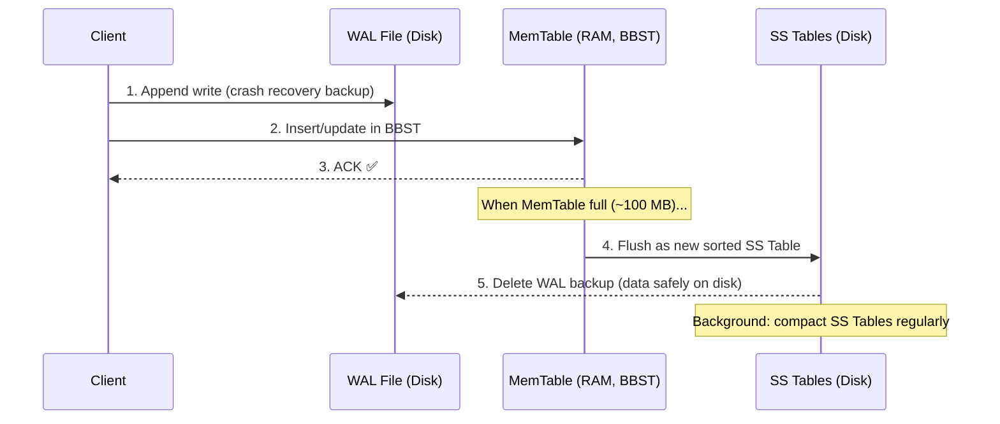

# 🗄️ NoSQL Internals: How Data Is Stored on Disk
## LSM Trees, SS Tables, WAL & Bloom Filters

> **Source:** [HLD Multi Master 11 – YouTube](https://www.youtube.com/watch?v=qSMB6nUloNE)
> **Lecture Series:** Scaler HLD — Class 11
> **Last Updated:** February 2026
> **Goal:** Understand exactly how NoSQL databases store, retrieve, and manage data on disk using WAL, MemTable, SS Tables, LSM Trees, Bloom Filters, and Tombstones.

---

## 📋 Table of Contents

1. [The Problem: Why SQL's Approach Doesn't Work for NoSQL](#1-the-problem-why-sqls-approach-doesnt-work-for-nosql)
2. [Brute Force Approach & Why It Fails](#2-brute-force-approach--why-it-fails)
3. [Write-Ahead Log (WAL)](#3-write-ahead-log-wal)
4. [In-Memory Hashmap (Key → Offset)](#4-in-memory-hashmap-key--offset)
5. [MemTable: The In-Memory BBST](#5-memtable-the-in-memory-bbst)
6. [SS Tables: Sorted String Tables](#6-ss-tables-sorted-string-tables)
7. [LSM Tree: The Full Architecture](#7-lsm-tree-the-full-architecture)
8. [Sparse Index: The Memory-Efficient Index](#8-sparse-index-the-memory-efficient-index)
9. [Bloom Filters: Skipping Unnecessary Reads](#9-bloom-filters-skipping-unnecessary-reads)
10. [Tombstones: How Deletion Works](#10-tombstones-how-deletion-works)
11. [Full Read & Write Flow](#11-full-read--write-flow)
12. [Summary Cheat Sheet](#12-summary-cheat-sheet)

---

## 1. The Problem: Why SQL's Approach Doesn't Work for NoSQL

### SQL: Fixed-Size Rows → Easy Updates

In SQL, every column has a known **data type** and every table has a **fixed schema**. This means you know the **exact size of every row** on disk before writing it.

```
SQL Table: users (id: BIGINT 8 bytes, name: VARCHAR(50))
  Row size = 8 + 50 = 58 bytes exactly

  [row 1: 58 bytes][row 2: 58 bytes][row 3: 58 bytes]...

  Update "Nikl" → "Nikl Abra":
  Still fits in 50 bytes → overwrite in place. ✅ Simple.
```

SQL indexes everything using **B+ Trees**:
- Each node of the B+ tree is exactly one disk block in size
- Height of tree = `log(N)` → every read/write = `log(N)` disk seeks

### NoSQL: Variable-Size Data → In-Place Update Breaks

In NoSQL (key-value stores, document stores), sizes vary:

```
Key   → string of any length
Value → string / JSON of any length

  Doc 10:  { "name": "Someone" }           → 104 bytes
  Doc 30:  { "name": "N" }                 → 84 bytes

  Update Doc 10 to: { "name": "Someone", "favorite_color": "red" }
  New size = 140 bytes > original 104 bytes → OVERFLOW into Doc 30!
```

**Two bad options:**
1. Overwrite the next record → **Data corruption**
2. Split document across disk → **Fragmentation** → multiple disk seeks

> **Disk seeks are brutally expensive** — on rotating disks they can take **100+ milliseconds**, vs sequential reads which are orders of magnitude faster. Even on SSDs, random I/O is ~100x slower than sequential I/O.

**The core problem:**
- NoSQL data has **variable sizes** — in-place updates are not safe
- NoSQL needs to be **optimized for heavy write loads** (unlike SQL)
- We cannot use B+ trees like SQL (writes would be slow + size changes break things)

---

## 2. Brute Force Approach & Why It Fails

**Approach: Just write key-value pairs to a flat file.**

```
file.db:
  [001 → V Prasad]    ← 100 bytes, offset=0
  [002 → N]           ← 50 bytes,  offset=100
  [100 → Bit]         ← 60 bytes,  offset=150
  [060 → Bishujit]    ← 40 bytes,  offset=210
  [030 → Shashank]    ← 40 bytes,  offset=250
```

| Operation | Performance | Why                                       |
|-----------|-------------|-------------------------------------------|
| Write     | O(N)        | Must scan entire file to find & update entry |
| Read      | O(N)        | Must scan entire file linearly            |
| Update    | ❌ Dangerous | New value may be bigger → overflows next entry |

**Key insight from the instructor:**

> *"The only safe solution for variable-size data: never update in-place. Just append at the end."*

**With append-only writes:**

```
  [001 → V Prasad]
  [002 → N]
  [100 → Bit]
  [060 → Bishujit]
  [030 → Shashank]
  [060 → Shashank]    ← New entry for key 060, appended
```

- Write becomes **O(1)** — just append to end (sequential write, no disk seek)
- But reads are still **O(N)** — linear scan from end to start to get latest value
- Duplicate entries pile up

---

## 3. Write-Ahead Log (WAL)

Every database (especially NoSQL) maintains a **Write-Ahead Log** — an **append-only file on disk** that records every change.

```
WAL File (on disk, append-only):
  ─────────────────────────────────────────────────────
  SET key=001 value="V Prasad"
  SET key=002 value="N"
  SET key=060 value="Bishujit"
  SET key=060 value="Shashank"        ← update appended here
  DELETE key=030
  ─────────────────────────────────────────────────────
  ← only appends, never modifies existing entries
```

### Why WAL Exists

| Use Case                  | How WAL Helps                                                  |
|---------------------------|----------------------------------------------------------------|
| **Crash Recovery**        | On restart, replay WAL to restore the latest state            |
| **Replication**           | Slaves ask: "What changed in the WAL?" and apply those changes|
| **Point-in-Time Recovery**| Keep N days of WAL → restore DB to any past moment            |
| **DB Backups**            | Back up WAL snapshots; prune old entries after backup         |

**WAL properties:**
- Stored **on disk** (durable)
- **Immutable** — existing entries never modified; new events appended only
- Can be periodically purged once data is safely persisted
- Used by: Cassandra, PostgreSQL, SQLite, RocksDB, LevelDB

---

## 4. In-Memory Hashmap (Key → Offset)

**Problem with WAL reads:** Still O(N) linear scan to find a key.

**Solution:** Maintain an **in-memory hashmap** that maps every key to its byte offset in the WAL file.

```
            WAL File (disk)                  Hashmap (RAM)
  ─────────────────────────────            ──────────────────────
  offset=0:   001 → V Prasad              001 → offset 0
  offset=100: 002 → N                     002 → offset 100
  offset=150: 100 → Bit                   100 → offset 150
  offset=210: 060 → Bishujit              060 → offset 250   ← updated
  offset=250: 030 → Shashank              030 → offset 250
  offset=310: 060 → Shashank         
```

```python
def read(key):
    offset = hashmap[key]           # O(1) RAM lookup
    buffer = file.read(n, offset)   # One disk seek to exact location
    return parse(buffer)            # Return value

def write(key, value):
    file.append(key, value)         # O(1) sequential write (no disk seek)
    hashmap[key] = file.current_size  # O(1) RAM update
```

- Reads: **O(1)** — hashmap lookup + single disk seek
- Writes: **O(1)** — append to disk + hashmap update

### Problem: Hashmap Gets Too Large

With **billions or trillions of keys**, the hashmap won't fit in RAM. Putting it on disk makes lookups slow again (random disk I/O).

> *"If you have trillions of keys and you put the hashmap on disk — life becomes slow again."*

We need a smarter approach. → Enter the **MemTable**.

---

## 5. MemTable: The In-Memory BBST

**The Big Idea:** Instead of having the entire WAL be one huge file, split the WAL into **chunks**. Store the **latest (current) chunk in memory** rather than on disk.

This in-memory structure is called the **MemTable**.

### Why Not a Hashmap for the MemTable?

| Structure          | Read/Write | When Dumped to Disk        | Space            |
|--------------------|------------|----------------------------|------------------|
| **Hashmap**        | O(1)       | Loses hashmap property → flat linear file (slow reads) | Wastes space (empty slots) |
| **Balanced BST (BBST)** | O(log N) | In-order traversal → **automatically sorted** ✅ | Minimal overhead (just pointers) |

**MemTable = a Balanced Binary Search Tree (Red-Black Tree / Skip List) in memory.**

```
MemTable (in RAM, BBST):
           key=3
          /     \
       key=1   key=5
           \
          key=2

→ In-order traversal = [key=1, key=2, key=3, key=5] → sorted!
```

### MemTable Write Flow

```
Write request: SET key=3 → value=X

Step 1: Append to WAL file on disk (backup for crash recovery)
        WAL: ...| SET 3=X |← small, only for recovery

Step 2: Update MemTable (BBST) in memory
        key=3 → X (update or insert, no duplicates)

Step 3: Acknowledge to client ✅
```

### MemTable as Read Cache

The MemTable acts as an **automatic read cache**:
- Recently written data is also often recently read
- If the key is in MemTable → return from RAM, **no disk access**

```
Read key=3:
  → Check MemTable → FOUND → return X ✅ (RAM speed, ultra fast)

Read key=100 (old data, not in MemTable):
  → Check MemTable → NOT FOUND → look in SS Tables on disk
```

### What Happens When MemTable is Full?

When the MemTable exceeds a configured threshold (e.g., **100 MB**):

```
MemTable full → flush to disk as a new SS Table file
             → clear MemTable
             → delete the WAL backup file (no longer needed)
             → create new empty MemTable
```

Because the MemTable was a BBST, its in-order dump is **already sorted**.

---

## 6. SS Tables: Sorted String Tables

When the MemTable is flushed to disk, it creates a **Sorted String Table (SS Table)**.

> *"We call these files SS Tables — Sorted String Tables — because they store strings and they are sorted."*

### SS Table Properties

```
SS Table File (on disk, immutable, sorted):
  ─────────────────────────────────────────────────────
  key=1 → value=Y
  key=2 → value=W
  key=3 → value=X
  key=5 → value=C
  ─────────────────────────────────────────────────────
  
  ✅ Sorted by key
  ✅ No duplicates within one file
  ✅ Immutable — never updated after creation
  ✅ Binary search possible (sorted!) 
  ❌ Can have duplicates across different SS Table files
```

### Multiple SS Tables Over Time

As more data is written, MemTable fills and flushes repeatedly:

```
Disk:
  1.sst  [key=1→A, key=2→B, key=3→C]               ← older
  2.sst  [key=1→X, key=4→D, key=5→C, key=2→W]      ← newer
  3.sst  [key=1→Y, key=2→W, key=3→X]               ← newest

MemTable (RAM):
  [key=2→X, key=3→Y, key=1→W]                       ← current
```

Observation: key=1 appears in **all three files** — inter-file duplicates exist but are handled by reading newest first.

### Background Compaction Process

A background process periodically merges older SS Tables into larger ones:

- Both files are sorted → use **merge sort** algorithm → result is also sorted
- Eliminate inter-file duplicate keys (keep only the most recent value)
- Result: fewer, larger SS Tables

```
Before compaction:
  1.sst  [1→A, 2→B, 3→C]
  2.sst  [1→X, 4→D, 5→C, 2→W]

After compaction (merge, keep latest):
  XL1.sst [1→X, 2→W, 3→C, 4→D, 5→C]   ← merged, no duplicates
```

> ⚠️ **Compaction is critical to tune in production.** A poorly tuned compaction process directly impacts read and write performance. Tune: chunk size, compaction frequency, time of day (lowest traffic).

---

## 7. LSM Tree: The Full Architecture

Multiple levels of SS Tables, growing in size, form a **Log-Structured Merge Tree (LSM Tree)**.

```
                    ┌─────────────────────────┐
                    │  MemTable (RAM, BBST)   │ ← all writes go here
                    │  ~100 MB, sorted        │
                    └────────────┬────────────┘
                                 │ flush when full
                    ┌────────────▼────────────┐
      Level 0:      │  SST1 SST2 SST3 SST4   │ ← small, ~100 MB each
      (disk)        │  sorted, may overlap    │
                    └────────────┬────────────┘
                                 │ compaction (merge sort)
                    ┌────────────▼────────────┐
      Level 1:      │    SST_A     SST_B      │ ← larger, ~200-400 MB
      (disk)        │    sorted, merged       │
                    └────────────┬────────────┘
                                 │ compaction
                    ┌────────────▼────────────┐
      Level 2:      │         SST_XL          │ ← largest, 1 GB+
      (disk)        │    fully merged         │
                    └─────────────────────────┘

      WAL file (disk, separate):
                    │ backup for MemTable     │
                    │ deleted after each flush│
```

**Write complexity: O(1)** — append to WAL + update MemTable (both sequential/in-memory)

**Read complexity: O(log N)** — check MemTable → linear scan across small number of SS Tables, binary search inside each

> *"The number of SS tables is kept small by the compaction process — it's order log(N)."*

---

## 8. Sparse Index: The Memory-Efficient Index

**Problem:** The hashmap storing every key → SS Table mapping is too large for billions of keys.

**Solution:** For each SS Table, maintain a **sparse index** in memory — store only the **first key of every 64 KB block**, not every key.

```
SS Table on disk (1 GB, sorted):

  Block 0 (0–64 KB):     key=0 ... key=100
  Block 1 (64–128 KB):   key=101 ... key=2010
  Block 2 (128–192 KB):  key=2011 ... key=5000
  ...
  Block 16383 (last):    key=... ... key=N

Sparse Index in memory (for this 1 GB SS Table):
  key=0    → offset=0
  key=101  → offset=65536
  key=2011 → offset=131072
  ...

  Total index entries = 1 GB / 64 KB = 2^14 ≈ 16,000
  If each key is 64 bytes: index size = 16,000 × 64 = 1 MB only!
```

> *"If this SS Table is 1 GB, this sparse index is only 1 MB — a 1000x reduction!"*

### How Reading Works With Sparse Index

```
Read: key=300

1. Binary search the sparse index (in RAM):
   key=0 (offset=0) < key=300 < key=2011 (offset=131072)
   → key=300 is in Block 1 starting at offset=65536

2. Read the 64 KB block from disk (ONE disk seek):
   Block 1: [key=101, key=150, key=200, key=300, ...]

3. Binary search within the 64 KB block (fast, in memory):
   → Found: key=300 → value=...

Total: 1 disk seek per SS Table checked.
```

---

## 9. Bloom Filters: Skipping Unnecessary Reads

**Problem:** If we search for a key that doesn't exist, we scan all SS Tables, check all sparse indexes, do disk seeks — and find nothing. Wasted work.

**Solution:** A **Bloom Filter** — a fixed-size bit array that tells you, *with very high probability*, whether a key was ever inserted.

### Bloom Filter Properties

```
Bloom Filter:
  ✅ If key IS present → guaranteed to return TRUE (no false negatives)
  ✅ If key IS NOT present → returns FALSE with high probability
  ⚠️  May have false positives (says "exists" when it doesn't) — tunable
  ✅ Fixed size — does NOT grow as you insert more keys!
```

> *"In case of a set or hashmap, as you insert more data, the size will grow. In case of a bloom filter, the size does not change at all. That is magic."*

### How a Bloom Filter Works

```
Bloom filter = a bit array of size M, initially all zeros:
  [ 0 0 0 0 0 0 0 0 0 0 0 0 ]
    0 1 2 3 4 5 6 7 8 9 10 11

K = number of hash functions (e.g., K=3)
```

**Insert "Nikl":**
```
  h1("Nikl") = 2  → set bit[2] = 1
  h2("Nikl") = 3  → set bit[3] = 1
  h3("Nikl") = 9  → set bit[9] = 1

  [ 0 0 1 1 0 0 0 0 0 1 0 0 ]
          ↑ ↑           ↑
```

**Insert "Vishal":**
```
  h1("Vishal") = 2  → bit[2] already 1
  h2("Vishal") = 5  → set bit[5] = 1
  h3("Vishal") = 11 → set bit[11] = 1

  [ 0 0 1 1 0 1 0 0 0 1 0 1 ]
```

**Check "V Prasad" (NOT inserted):** h("V Prasad") = {1, 3, 7}
```
  bit[1] = 0 → DEFINITE NO → "V Prasad" does not exist ✅ (no disk read needed!)
```

**Check "Abhishek" (NOT inserted):** h("Abhishek") = {3, 9, 11}
```
  bit[3]=1, bit[9]=1, bit[11]=1 → All bits set!
  Bloom filter says: "MAYBE EXISTS"
  → Have to search SS Tables → not found → false positive ⚠️
```

### Bloom Filter Formula

```
P(false positive) ≈ (1 - e^(-k·n/m))^k

Where:
  k = number of hash functions
  n = number of keys inserted
  m = number of bits in filter

Example: m = 10 MB (80,000,000 bits), n = 1 billion keys, k = 7
  → False positive rate ≈ 1% (very rare)
  
vs. storing 1 billion keys in a hashmap: ~100 GB
    storing in a bloom filter: just 10 MB! (10,000x smaller)
```

### Real-World Use Case: CDN (Akamai / Cloudflare)

> *"70% of URLs on the web are only visited once. So CDNs cache a URL only after it has been visited twice."*

- To know if a URL was seen before → need to store all seen URLs
- 1 trillion URLs × 500 bytes/URL = **500 TB** of data if stored as a hashmap
- With Bloom Filter → a few **GB** with acceptable false positive rate

---

## 10. Tombstones: How Deletion Works

**Problem:** You cannot delete data directly from SS Tables (they're immutable). You cannot delete from a Bloom Filter either (it never forgets).

**Solution: Tombstones** — a special marker value that means "this key has been deleted."

### Deletion as a Write

```
Delete: key=060

Step 1: Write a tombstone to MemTable:
        key=060 → TOMBSTONE

Step 2: This tombstone value is flushed to an SS Table like any other write

Step 3: On read:
        key=060 found → value = TOMBSTONE → return "key not found"
```

### During Compaction

```
SS Table 1 (older):  key=060 → "Bishujit"
SS Table 2 (newer):  key=060 → TOMBSTONE

After compaction (keep latest):
  Result:            key=060 → TOMBSTONE   ← old value removed

After even later compaction:
  If tombstone is old enough and no risk of confusion:
  → tombstone itself is removed → true physical deletion
```

### Why Tombstones Are Needed Even With Bloom Filters

- When key=060 was first written, it was inserted into the Bloom Filter
- The Bloom Filter **cannot delete** — it will always say "key=060 maybe exists"
- Without a tombstone: every read for key=060 would scan all SS Tables (wasted work)
- **With a tombstone**: the scan terminates early when the tombstone is found — efficient!

> *"Bloom filter never forgets. So the tombstone is what tells the system: 'yes the bloom filter says it's here, but it has actually been deleted.'"*

---

## 11. Full Read & Write Flow

### Write Flow



### Read Flow

```mermaid
flowchart TD
    R[Read: key=X] --> M{Check MemTable?\nO(log N) in RAM}
    M -->|Found| RET[✅ Return value\nno disk access]
    M -->|Not found| BF{Check Bloom Filter\nfor each SS Table}
    BF -->|Definite NO| SKIP[Skip this SS Table\nno disk read]
    BF -->|Maybe YES| SI[Binary search Sparse Index\nin memory]
    SI --> BLOCK[One disk seek\n→ 64 KB block]
    BLOCK --> BS{Binary search\nwithin 64 KB block}
    BS -->|Found Tombstone| NULL[Return: key deleted]
    BS -->|Found value| RET
    BS -->|Not in this SST| BF
    SKIP --> BF
    BF -->|All SSTs checked| NOPE[Return: key not found]
```

### Performance Summary

| Operation | Complexity | Notes |
|-----------|-----------|-------|
| **Write** | O(1) | Append to WAL + MemTable insert |
| **Read (in MemTable)** | O(log N_mem) | In-memory BBST, extremely fast |
| **Read (in SS Tables)** | O(log N) | Linear over #SSTables × binary search per SSTable |
| **Read (key absent)** | Near O(log N) | Bloom filter skips most SSTables |

---

## 12. Summary Cheat Sheet

```
┌──────────────────────────────────────────────────────────────────┐
│           NoSQL Storage Architecture — Quick Reference           │
├───────────────────┬──────────────────────────────────────────────┤
│ Component         │ One-Line Summary                             │
├───────────────────┼──────────────────────────────────────────────┤
│ WAL               │ Append-only disk file for crash recovery,    │
│                   │ replication, and point-in-time restore       │
├───────────────────┼──────────────────────────────────────────────┤
│ MemTable          │ Balanced BST in RAM; absorbs all writes;     │
│                   │ acts as automatic read cache; flushed to disk│
│                   │ when full → becomes an SS Table              │
├───────────────────┼──────────────────────────────────────────────┤
│ SS Table          │ Immutable, sorted file on disk; no duplicates│
│                   │ within a file; flushed from MemTable         │
├───────────────────┼──────────────────────────────────────────────┤
│ LSM Tree          │ Multi-level hierarchy of SS Tables; small    │
│                   │ files at top, large merged files at bottom   │
├───────────────────┼──────────────────────────────────────────────┤
│ Compaction        │ Background merge of SS Tables using merge    │
│                   │ sort; removes duplicates, reduces file count │
├───────────────────┼──────────────────────────────────────────────┤
│ Sparse Index      │ In-memory index: one entry per 64 KB block;  │
│                   │ 1000x smaller than full key index; enables   │
│                   │ fast binary search into SS Tables            │
├───────────────────┼──────────────────────────────────────────────┤
│ Bloom Filter      │ Fixed-size bit array; no false negatives;    │
│                   │ skips disk reads for absent keys;            │
│                   │ 10 MB handles 1 billion keys at 1% FP rate  │
├───────────────────┼──────────────────────────────────────────────┤
│ Tombstone         │ Special marker value for deleted keys;       │
│                   │ deletion = write(key, TOMBSTONE);            │
│                   │ physically removed during compaction         │
└───────────────────┴──────────────────────────────────────────────┘
```

### Databases That Use This Architecture

| Database        | LSM Tree | WAL | Bloom Filter | Notes                        |
|-----------------|----------|-----|--------------|------------------------------|
| **Cassandra**   | ✅       | ✅  | ✅           | Compaction tuning is critical|
| **DynamoDB**    | ✅       | ✅  | ✅           | AWS managed                  |
| **RocksDB**     | ✅       | ✅  | ✅           | Used inside many DBs (MySQL) |
| **LevelDB**     | ✅       | ✅  | ✅           | Google-built library         |
| **HBase**       | ✅       | ✅  | ✅           | Hadoop ecosystem             |
| **ScyllaDB**    | ✅       | ✅  | ✅           | Cassandra-compatible         |

---

> 📚 **Related Topics:**
> - [SQL vs NoSQL Ultimate Guide](../SQL%20vs%20NoSQL/SQL_vs_NoSQL_Ultimate_Guide.md)
> - [CAP Theorem & Replication](../CAP%20Theorem%20%26%20Replication/)
> - **Next in Series:** Consensus Algorithms, Distributed Transactions
