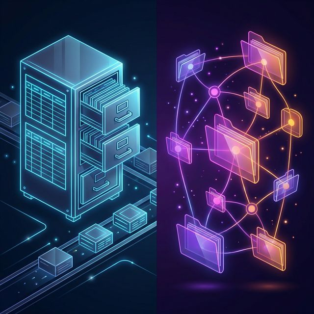
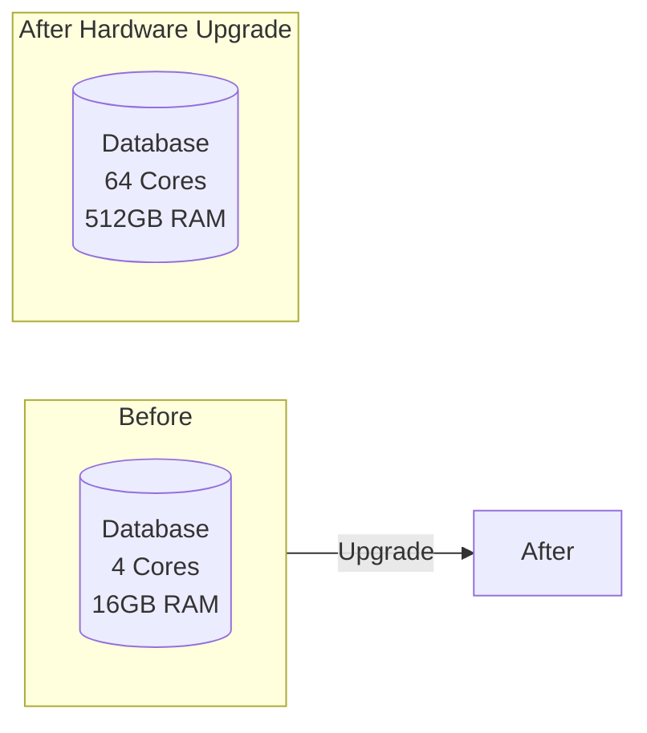
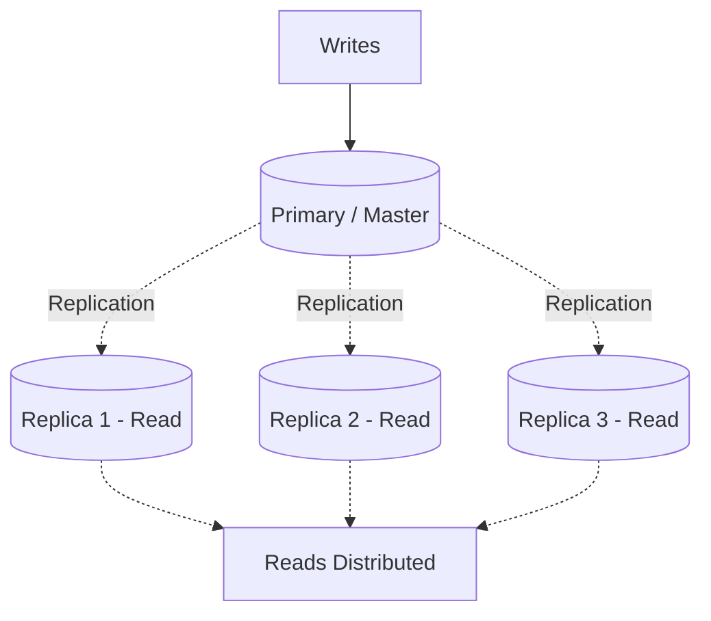
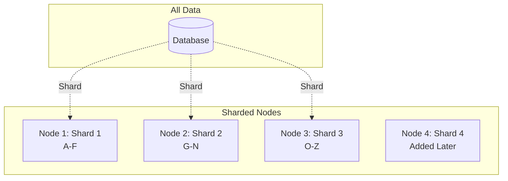
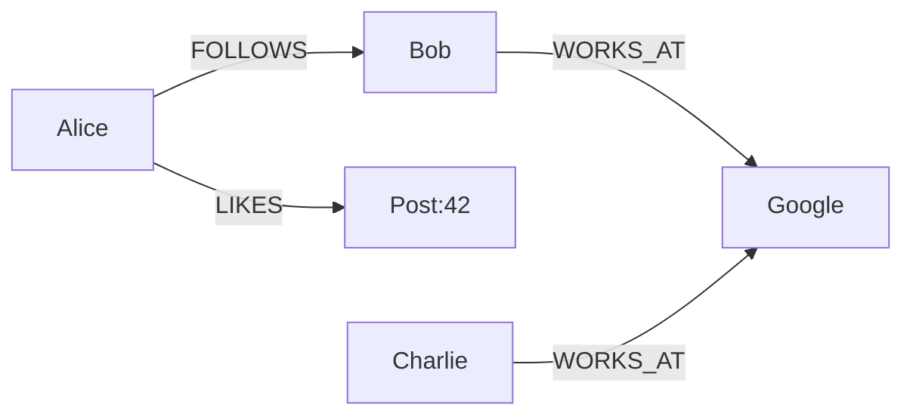
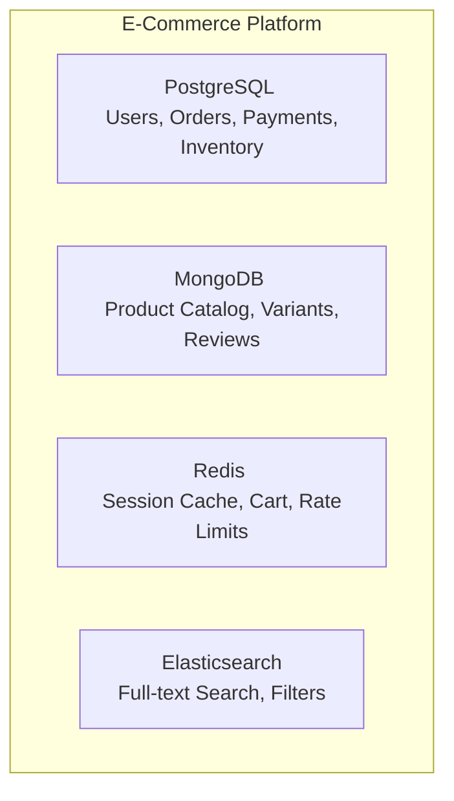
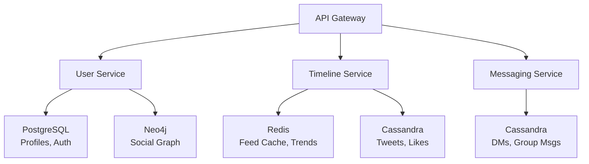
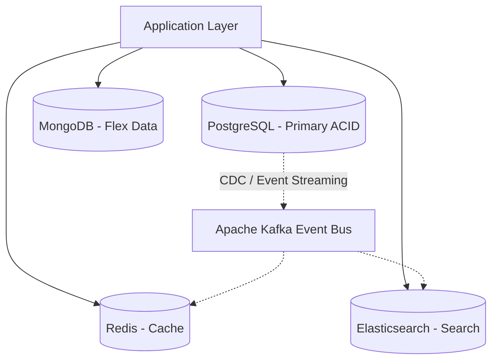
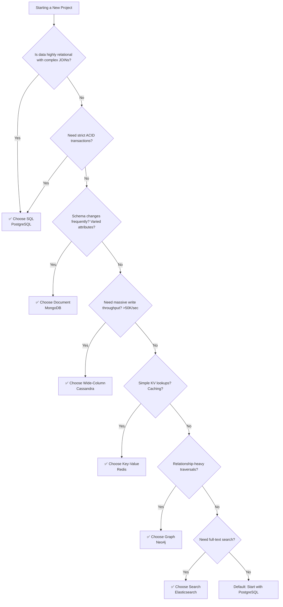
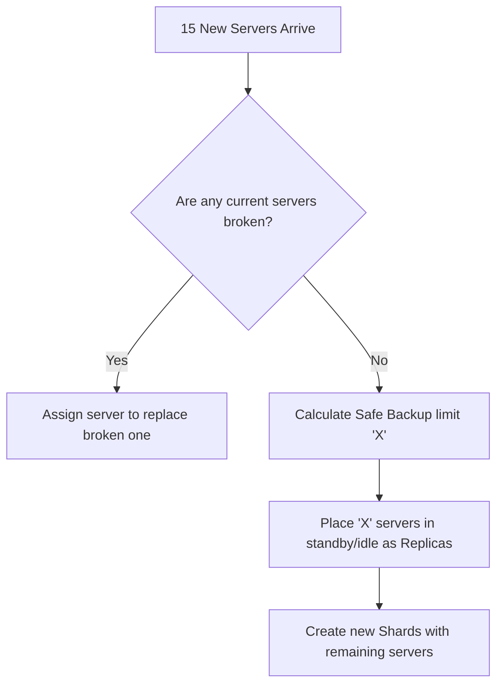

# 🗄️ SQL vs NoSQL: The Simplified System Design Guide

> **Last Updated:** February 2026
> **Author:** System Design Study Notes 
> **Goal:** Understand Databases, Sharding, and Orchestrators easily using analogies, flowcharts (Mermaid), and real-world scenarios.

---

## 🗺️ 1. The Big Picture: SQL vs NoSQL

<p align="center">
  
</p>

Choosing the right database is one of the **most critical decisions** in system design. It affects scalability, performance, consistency, developer productivity, and long-term maintainability.

This guide breaks down **SQL (Relational)** and **NoSQL (Non-Relational)** databases in depth, giving you the knowledge needed for both real-world architecture and system design interviews.

---

## 📋 Table of Contents

1. [What is SQL?](#what-is-sql)
2. [What is NoSQL?](#what-is-nosql)
3. [Core Differences at a Glance](#core-differences-at-a-glance)
4. [Deep Dive: Data Model](#deep-dive-data-model)
5. [Deep Dive: Schema Design](#deep-dive-schema-design)
6. [Deep Dive: Scalability](#deep-dive-scalability)
7. [Deep Dive: ACID vs BASE](#deep-dive-acid-vs-base)
8. [Deep Dive: CAP Theorem](#deep-dive-cap-theorem)
9. [Types of NoSQL Databases](#types-of-nosql-databases)
10. [Query Language & Flexibility](#query-language--flexibility)
11. [Performance Considerations](#performance-considerations)
12. [When to Use SQL](#when-to-use-sql)
13. [When to Use NoSQL](#when-to-use-nosql)
14. [Real-World System Design Examples](#real-world-system-design-examples)
15. [Hybrid Approaches (Polyglot Persistence)](#hybrid-approaches-polyglot-persistence)
16. [Migration Strategies](#migration-strategies)
17. [Decision Framework Flowchart](#decision-framework-flowchart)
18. [Common Interview Questions](#common-interview-questions)
19. [Summary & Cheat Sheet](#summary--cheat-sheet)
20. [Orchestrators & Managing Hardware](#orchestrators--managing-hardware)

---

## What is SQL?

**SQL (Structured Query Language)** databases are **relational databases** that store data in **predefined tables** with **rows and columns**. They enforce a strict schema and use SQL as the query language.

### Key Characteristics

| Feature              | Description                                              |
|----------------------|----------------------------------------------------------|
| **Structure**        | Tables with rows and columns                             |
| **Schema**           | Fixed, predefined schema (schema-on-write)               |
| **Relationships**    | Enforced via foreign keys and JOINs                      |
| **Query Language**   | SQL (Structured Query Language)                          |
| **Transactions**     | Full ACID compliance                                     |
| **Data Integrity**   | Strong — constraints, triggers, cascades                 |

### Popular SQL Databases

| Database         | Best Known For                                    |
|------------------|---------------------------------------------------|
| **PostgreSQL**   | Advanced features, extensibility, JSONB support   |
| **MySQL**        | Web applications, widespread adoption             |
| **Oracle DB**    | Enterprise-grade, financial systems               |
| **SQL Server**   | Microsoft ecosystem integration                   |
| **SQLite**       | Embedded, lightweight, mobile/desktop apps        |
| **CockroachDB**  | Distributed SQL, global consistency               |
| **Amazon Aurora** | Cloud-native, MySQL/PostgreSQL compatible        |

### Example: SQL Table Structure

```sql
-- Users Table
CREATE TABLE users (
    id          SERIAL PRIMARY KEY,
    username    VARCHAR(50) UNIQUE NOT NULL,
    email       VARCHAR(100) UNIQUE NOT NULL,
    created_at  TIMESTAMP DEFAULT CURRENT_TIMESTAMP
);

-- Orders Table (relationship via foreign key)
CREATE TABLE orders (
    id          SERIAL PRIMARY KEY,
    user_id     INTEGER REFERENCES users(id) ON DELETE CASCADE,
    product     VARCHAR(100) NOT NULL,
    amount      DECIMAL(10,2) NOT NULL,
    status      VARCHAR(20) DEFAULT 'pending',
    ordered_at  TIMESTAMP DEFAULT CURRENT_TIMESTAMP
);

-- Query with JOIN
SELECT u.username, o.product, o.amount
FROM users u
JOIN orders o ON u.id = o.user_id
WHERE o.status = 'completed'
ORDER BY o.ordered_at DESC;
```

---

## What is NoSQL?

**NoSQL (Not Only SQL)** databases are non-relational databases designed for flexible schemas, horizontal scalability, and specific data model optimizations. They do not require a fixed table structure.

### Key Characteristics

| Feature              | Description                                              |
|----------------------|----------------------------------------------------------|
| **Structure**        | Documents, key-value, columns, or graphs                 |
| **Schema**           | Dynamic / flexible schema (schema-on-read)               |
| **Relationships**    | Typically denormalized; no native JOINs                  |
| **Query Language**   | Database-specific APIs and query languages               |
| **Transactions**     | Varies — eventual consistency to strong consistency      |
| **Data Integrity**   | Application-level enforcement                            |

### Popular NoSQL Databases

| Database         | Type          | Best Known For                                      |
|------------------|---------------|-----------------------------------------------------|
| **MongoDB**      | Document      | Flexible schema, developer experience               |
| **Redis**        | Key-Value     | In-memory caching, real-time data                   |
| **Cassandra**    | Wide-Column   | Write-heavy, time-series, high availability         |
| **DynamoDB**     | Key-Value/Doc | Serverless, AWS integration, auto-scaling           |
| **Neo4j**        | Graph         | Relationship-heavy data, social networks            |
| **HBase**        | Wide-Column   | Hadoop ecosystem, big data                          |
| **Couchbase**    | Document      | Mobile sync, caching + persistence                  |
| **Elasticsearch**| Search Engine | Full-text search, log analytics                     |

### Example: NoSQL Document (MongoDB)

```json
// Single document in "users" collection
{
    "_id": "ObjectId('64a1b2c3d4e5f6g7h8i9j0k1')",
    "username": "john_doe",
    "email": "john@example.com",
    "created_at": "2024-01-15T10:30:00Z",
    "profile": {
        "first_name": "John",
        "last_name": "Doe",
        "age": 30,
        "interests": ["coding", "hiking", "photography"]
    },
    "orders": [
        {
            "order_id": "ORD-001",
            "product": "Laptop",
            "amount": 999.99,
            "status": "completed",
            "ordered_at": "2024-02-10T14:20:00Z"
        },
        {
            "order_id": "ORD-002",
            "product": "Mouse",
            "amount": 29.99,
            "status": "shipped",
            "ordered_at": "2024-03-05T09:15:00Z"
        }
    ]
}
```

```javascript
// MongoDB Query
db.users.find(
    { "orders.status": "completed" },
    { username: 1, "orders.$": 1 }
).sort({ "orders.ordered_at": -1 });
```

---

## Core Differences at a Glance

| Criteria               | SQL (Relational)                 | NoSQL (Non-Relational)                 |
|------------------------|----------------------------------|----------------------------------------|
| **Data Model**         | Relational (tables)              | Document/KV/Column/Graph               |
| **Schema**             | Rigid, predefined                | Flexible, dynamic                      |
| **Scalability**        | Vertical (scale-up)              | Horizontal (scale-out)                 |
| **Transactions**       | ACID                             | BASE (mostly)                          |
| **Query Language**     | SQL (standardized)               | Varies per database                    |
| **Relationships**      | JOINs, Foreign Keys              | Embedded / Denormalized                |
| **Data Integrity**     | Database-enforced                | Application-enforced                   |
| **Best For**           | Complex queries, transactions    | Big data, real-time, flexible structure|
| **Learning Curve**     | Moderate (SQL standard)          | Varies by type                         |
| **Maturity**           | 40+ years                        | ~15 years                              |
| **Community/Tooling**  | Vast, mature                     | Growing rapidly                        |

---

## Deep Dive: Data Model

### SQL: Normalized Relational Model

Data is broken into separate related tables to minimize redundancy.

```
┌──────────────┐     ┌──────────────────┐     ┌──────────────┐
│   USERS      │     │     ORDERS       │     │   PRODUCTS   │
├──────────────┤     ├──────────────────┤     ├──────────────┤
│ id (PK)      │◄────│ user_id (FK)     │     │ id (PK)      │
│ username     │     │ id (PK)          │     │ name         │
│ email        │     │ product_id (FK)  │────►│ price        │
│ created_at   │     │ quantity         │     │ category     │
└──────────────┘     │ total_amount     │     └──────────────┘
                     │ status           │
                     │ ordered_at       │
                     └──────────────────┘

Normalization Levels:
  1NF → No repeating groups
  2NF → No partial dependencies
  3NF → No transitive dependencies
```

**Advantages of Normalization:**
*   No data duplication
*   Easier updates (update in one place)
*   Data integrity via constraints
*   Storage efficient

**Disadvantages:**
*   Complex JOINs for reads
*   Performance overhead at scale
*   Rigid schema changes

### NoSQL: Denormalized Model

Data is stored together as it's accessed, optimizing for read performance.

**User Document (Embedded Data):**
```
┌─────────────────────────────────────────────────────┐
│                  USER DOCUMENT                       │
├─────────────────────────────────────────────────────┤
│ {                                                    │
│   "_id": "user_123",                                │
│   "username": "john_doe",                           │
│   "email": "john@example.com",                      │
│   "profile": {                                      │
│     "name": "John Doe",                             │
│     "avatar": "https://..."                         │
│   },                                                │
│   "orders": [                    ◄── Embedded       │
│     {                                               │
│       "product": {               ◄── Denormalized   │
│         "name": "Laptop",                           │
│         "price": 999.99                             │
│       },                                            │
│       "quantity": 1,                                │
│       "status": "completed"                         │
│     }                                               │
│   ]                                                 │
│ }                                                   │
└─────────────────────────────────────────────────────┘


  → Single read fetches everything needed
  → No JOINs required
  → Data may be duplicated across documents

```
**Advantages of Denormalization:**
*   Faster reads (single query)
*   Simpler queries
*   Better horizontal scalability
*   Flexible schema evolution

**Disadvantages:**
*   Data duplication
*   Harder updates (update in multiple places)
*   Larger storage footprint
*   Potential inconsistency

---

## Deep Dive: Schema Design

### SQL: Schema-on-Write

The schema is defined before writing data. Every row must conform.

```sql
-- Schema is enforced at write time
CREATE TABLE employees (
    id          SERIAL PRIMARY KEY,
    name        VARCHAR(100) NOT NULL,        -- Required
    department  VARCHAR(50) NOT NULL,         -- Required
    salary      DECIMAL(10,2) CHECK (salary > 0),  -- Constraint
    hire_date   DATE NOT NULL,                -- Required
    manager_id  INTEGER REFERENCES employees(id)  -- Self-referencing FK
);

-- This will FAIL ✗
INSERT INTO employees (id, name) VALUES (1, 'Alice');
-- Error: column "department" violates not-null constraint

-- This will SUCCEED ✓
INSERT INTO employees (name, department, salary, hire_date)
VALUES ('Alice', 'Engineering', 95000.00, '2024-01-15');

-- Schema change requires migration
ALTER TABLE employees ADD COLUMN phone VARCHAR(20);
-- All existing rows get NULL for phone
```

**Implications:**
*   ✅ Data quality guaranteed at DB level
*   ✅ Self-documenting structure
*   ❌ Migrations can be slow on large tables
*   ❌ Downtime risk during schema changes

### NoSQL: Schema-on-Read

No enforced schema. The structure is interpreted when reading data.

```javascript
// Document 1 - Full profile
{
    "_id": "emp_001",
    "name": "Alice",
    "department": "Engineering",
    "salary": 95000,
    "hire_date": "2024-01-15",
    "skills": ["Python", "Go", "Kubernetes"]
}

// Document 2 - Different structure, SAME collection ✓
{
    "_id": "emp_002",
    "name": "Bob",
    "dept": "Marketing",           // Different field name!
    "compensation": {              // Nested object instead of flat field
        "base": 75000,
        "bonus": 10000
    },
    "contract_type": "part-time"   // Field doesn't exist in Doc 1
}

// Both documents coexist in the same collection
// Application code must handle variations
```

**Implications:**
*   ✅ Zero-downtime schema evolution
*   ✅ Each document can have unique fields
*   ✅ Rapid prototyping and iteration
*   ❌ Application must handle missing/varied fields
*   ❌ Data quality is the developer's responsibility
*   ❌ Schema validation must be done in code (or optional DB-level validation)

---

## Deep Dive: Scalability

SQL traditionally relies on **Vertical Scaling**: Upgrading the server's CPU, RAM, or Hard Drive. But you eventually reach a hardware limit—you simply can't buy an infinitely powerful server. When you need **Horizontal Scaling** (buying 10,000 standard servers and distributing the data), SQL's ACID guarantees and complex JOIN operations fall apart across multiple servers because querying across different machines is painfully slow.

<p align="center">
  
</p>

### Vertical Scaling (SQL — Scale Up)



**SQL Read Scaling Options (Replication):**



### Horizontal Scaling (NoSQL — Scale Out)



**Sharding Strategies:**
*   **Hash-Based:** `hash(user_id) % num_shards = shard_id`
*   **Range-Based:** A-F → Shard1, G-N → Shard2, etc.
*   **Geographic:** US → Shard1, EU → Shard2, Asia → Shard3

**Scaling Comparison Summary:**

```
Performance
    ▲
    │         NoSQL (horizontal)
    │        ╱
    │       ╱
    │      ╱         SQL (vertical)
    │     ╱         ╱
    │    ╱         ╱
    │   ╱         ╱  ← Hardware ceiling
    │  ╱         ╱ . . . . . . . . .
    │ ╱         ╱
    │╱         ╱
    └──────────────────────────────────► Scale
           Cost & Complexity
```

**Key Insights:**
- **SQL (Vertical):** Performance hits a hardware ceiling. You can't scale beyond the biggest server available.
- **NoSQL (Horizontal):** Performance scales linearly by adding more commodity servers. No hard ceiling.
- **Cost:** SQL breaks exponential cost curve. NoSQL maintains linear cost scaling.

---

## Deep Dive: ACID vs BASE

### ACID (SQL Databases)

```
┌─────────────────────────────────────────────────────────────┐
│                        ACID Properties                       │
├──────────────┬──────────────────────────────────────────────┤
│              │                                               │
│  Atomicity   │  All operations succeed, or ALL roll back.   │
│              │  "All or Nothing"                             │
│              │                                               │
│              │  BEGIN TRANSACTION;                           │
│              │    UPDATE accounts SET bal = bal - 100        │
│              │      WHERE id = 'Alice';                     │
│              │    UPDATE accounts SET bal = bal + 100        │
│              │      WHERE id = 'Bob';                       │
│              │  COMMIT;   ← Both happen, or neither does    │
│              │                                               │
├──────────────┼──────────────────────────────────────────────┤
│              │                                               │
│  Consistency │  Data moves from one valid state to another. │
│              │  All constraints, triggers, cascades hold.   │
│              │                                               │
│              │  Total money before = Total money after      │
│              │  Foreign keys always point to valid records   │
│              │                                               │
├──────────────┼──────────────────────────────────────────────┤
│              │                                               │
│  Isolation   │  Concurrent transactions don't interfere.    │
│              │  Each transaction sees a consistent snapshot. │
│              │                                               │
│              │  Isolation Levels:                            │
│              │    READ UNCOMMITTED (lowest)                  │
│              │    READ COMMITTED                             │
│              │    REPEATABLE READ                            │
│              │    SERIALIZABLE (highest)                     │
│              │                                               │
├──────────────┼──────────────────────────────────────────────┤
│              │                                               │
│  Durability  │  Once committed, data survives crashes.      │
│              │  Written to disk / WAL (Write-Ahead Log).    │
│              │                                               │
│              │  Power failure after COMMIT? Data is safe. ✓ │
│              │                                               │
└──────────────┴──────────────────────────────────────────────┘
```

### BASE (NoSQL Databases)

```
┌─────────────────────────────────────────────────────────────┐
│                        BASE Properties                       │
├──────────────────┬──────────────────────────────────────────┤
│                  │                                           │
│  Basically       │  The system guarantees availability.     │
│  Available       │  Every request gets a response           │
│                  │  (success or failure), even during        │
│                  │  partial system failures.                │
│                  │                                           │
├──────────────────┼──────────────────────────────────────────┤
│                  │                                           │
│  Soft State      │  The state of the system may change      │
│                  │  over time, even without new input,      │
│                  │  due to eventual consistency.            │
│                  │                                           │
│                  │  Node A: balance = $100  ←─┐             │
│                  │  Node B: balance = $200    │ Converging  │
│                  │  Node C: balance = $200  ──┘             │
│                  │                                           │
├──────────────────┼──────────────────────────────────────────┤
│                  │                                           │
│  Eventually      │  Given enough time and no new updates,  │
│  Consistent      │  all replicas will converge to the      │
│                  │  same value.                             │
│                  │                                           │
│                  │  t=0:  Write "balance=200" to Node A     │
│                  │  t=1:  Node A = 200, B = 100, C = 100   │
│                  │  t=2:  Node A = 200, B = 200, C = 100   │
│                  │  t=3:  Node A = 200, B = 200, C = 200 ✓ │
│                  │                                           │
└──────────────────┴──────────────────────────────────────────┘
```

### ACID vs BASE Comparison

```
                ACID                              BASE
          ┌───────────┐                     ┌───────────┐
          │ Strong    │                     │ Eventual  │
          │Consistency│                     │Consistency│
          │           │                     │           │
          │ ✓ Banking │                     │ ✓ Social  │
          │ ✓ Inventory│                    │   media   │
          │ ✓ Healthcare│                   │ ✓ Analytics│
          │           │                     │ ✓ Caching │
          │ Higher    │                     │ Higher    │
          │ Latency   │                     │ Throughput│
          └───────────┘                     └───────────┘
```

**When to Choose:**
*   **ACID:** Banking, Inventory, Healthcare systems (Higher Latency, guaranteed correctness)
*   **BASE:** Social media, Analytics, Caching systems (Higher Throughput, eventual correctness)

---

## Deep Dive: CAP Theorem

The CAP Theorem states that a distributed database can guarantee only **two out of three** properties simultaneously.

```
                          CAP THEOREM
                      (Choose 2 of 3 Properties)

                              ▲
                             ╱│╲
                            ╱ │ ╲
                           ╱  │  ╲
                          ╱   │   ╲
                         ╱    │    ╲
                        ╱  CP │ AP  ╲
                       ╱      │      ╲
                      ╱       │       ╲
                     ╱========●========╲
                    ╱    MongoDB     Cassandra
                   ╱     HBase      DynamoDB
                  ╱  Redis Cluster    CouchDB
                 ╱                          ╲
                ╱____________________________╲
        Consistency                   Availability
                      Partition Tolerance
                      (Always Present!)

⚠️  In distributed systems, network partitions WILL happen.
    You must choose between:
    
    CP: Sacrifice Availability → Reject writes during partition
    AP: Sacrifice Consistency → Serve stale data during partition
    
    CA: Single-node systems only (NOT viable in practice)
```

**CAP Choices Explained:**

```
┌──────────────────────────────────────────────────────────────┐
│  CP: Consistency + Partition Tolerance                       │
├──────────────────────────────────────────────────────────────┤
│  Examples: MongoDB, HBase, Redis (cluster)                  │
│                                                              │
│  Strategy: When network partition occurs, BLOCK writes      │
│  until partition heals. Ensures consistency.                │
│                                                              │
│  Tradeoff: Lower availability during network issues         │
│  Use Case: Financial systems, banking (↑ consistency)       │
└──────────────────────────────────────────────────────────────┘

┌──────────────────────────────────────────────────────────────┐
│  AP: Availability + Partition Tolerance                      │
├──────────────────────────────────────────────────────────────┤
│  Examples: Cassandra, DynamoDB, CouchDB                     │
│                                                              │
│  Strategy: When network partition occurs, ALLOW writes      │
│  on both sides. Data converges when partition heals.        │
│                                                              │
│  Tradeoff: Temporary inconsistency (eventual consistency)   │
│  Use Case: Social media, analytics (↑ availability)         │
└──────────────────────────────────────────────────────────────┘

┌──────────────────────────────────────────────────────────────┐
│  CA: Consistency + Availability (THEORETICAL)               │
├──────────────────────────────────────────────────────────────┤
│  Examples: Traditional RDBMS (single node), SQLite          │
│                                                              │
│  Reality: These are NOT partition tolerant because they     │
│  either crash or cannot replicate across networks.          │
│                                                              │
│  In modern cloud systems, CA doesn't exist in practice!     │
└──────────────────────────────────────────────────────────────┘
```

**⚠️ Important Insight:**

> In a distributed system, network partitions *will* happen. You cannot avoid the P in CAP. Therefore, the real-world choice is **CP vs AP**, not CA.

---

## Types of NoSQL Databases

### 1. Document Stores

*   **Structure:** JSON/BSON documents in collections
*   **Examples:** MongoDB, CouchDB, Firestore
*   **Best For:** Content management systems, User profiles, Product catalogs with varying attributes, Real-time analytics

```json
{ "_id": 1,
  "name": "iPhone 15",
  "specs": { "storage": "256GB" },
  "tags": ["smartphone", "apple"]
}
```

### 2. Key-Value Stores

*   **Structure:** Simple key → value pairs
*   **Examples:** Redis, DynamoDB, Memcached
*   **Best For:** Caching (sessions), Real-time leaderboards, Message queues, Rate limiting

| Key | Value |
| :--- | :--- |
| "user:1001" | "{name:'Alice', age:30}" |
| "cache:homepage" | "\<html>...\</html>" |

### 3. Wide-Column Stores

*   **Structure:** Rows with dynamic columns, grouped by column families. Optimized for writes.
*   **Examples:** Cassandra, HBase, ScyllaDB
*   **Best For:** Time-series data (IoT, metrics), Write-heavy workloads, Event logging

| Row Key | Column Family: "profile" | Column Family: "metrics" |
| :--- | :--- | :--- |
| user:1001 | name:"Alice", email:"a@ex.com" | logins: 452 |
| user:1002 | name:"Bob" | logins: 120 |

### 4. Graph Databases

*   **Structure:** Nodes (entities) + Edges (relationships)
*   **Examples:** Neo4j, Amazon Neptune
*   **Best For:** Social networks, Fraud detection, Recommendation engines



### NoSQL Types Comparison

| Factor | Document | Key-Value | Wide-Column | Graph |
| :--- | :--- | :--- | :--- | :--- |
| **Complexity** | Medium | Simple | Medium | Complex |
| **Query Power** | Rich | Minimal | Moderate | Very Rich |
| **Read Speed** | Fast | Fastest | Fast | Moderate |
| **Write Speed** | Fast | Fastest | Fastest | Moderate |
| **Scalability** | High | Very High | Very High | Moderate |
| **Flexibility** | Very High | Low | High | High |

---

## Query Language & Flexibility

### SQL: Standardized and Powerful

SQL is excellent for complex analytical queries, window functions, and recursive queries (CTEs).

```sql
SELECT 
    d.department_name,
    COUNT(e.id) AS employee_count,
    AVG(e.salary) AS avg_salary
FROM employees e
JOIN departments d ON e.department_id = d.id
WHERE e.status = 'active'
GROUP BY d.department_name
HAVING COUNT(e.id) > 5;
```

### NoSQL: Database-Specific

**MongoDB (Aggregation Pipeline):**
```javascript
db.orders.aggregate([
    { $match: { status: "completed" } },
    { $lookup: { from: "users", localField: "user_id", foreignField: "_id", as: "user" }},
    { $unwind: "$user" },
    { $group: { _id: "$user.country", totalRevenue: { $sum: "$amount" } }}
]);
```

**Redis (Simple KV & Structures):**
```python
redis.set("user:1001:session", session_token, ex=3600)  # TTL
redis.zadd("leaderboard", {"alice": 2500, "bob": 1800}) # Sorted Set
```

**Neo4j (Cypher for Relationships):**
```cypher
MATCH (user:Person {name: "Alice"})-[:FRIEND*1..3]-(fof:Person)
WHERE NOT (user)-[:FRIEND]-(fof) AND user <> fof
RETURN DISTINCT fof.name AS suggestion
```

---

## Performance Considerations

### Read Performance

| Scenario | SQL | NoSQL |
| :--- | :--- | :--- |
| **Simple Lookup** | ~1-5ms (indexed) | ~0.1-1ms (key-value) |
| **Complex Join / Aggregation** | ~50-500ms+ (Depends on JOINs) | ~10-100ms (Aggregation Pipeline) |
| **Full Table/Collection Scan** | ❌ Very slow | ❌ Very slow |
| **Optimizations** | Indexes, Query Planner, Materialized Views | Indexes, Denormalization, Caching |

### Write Performance

| Scenario | SQL | NoSQL |
| :--- | :--- | :--- |
| **Single Write** | ~1-10ms | ~1-5ms |
| **Batch Write (1000)** | ~50-200ms | ~10-50ms |
| **Bottlenecks** | Lock contention, Index maintenance, Constraints | Network limitations, Replication lag, Consistency overhead |

---

## When to Use SQL

**✅ Choose SQL When:**
1.  **Data Integrity is Critical:** Banking, healthcare, financial transactions (ACID requirements).
2.  **Complex Queries & Reporting:** Business intelligence run aggregations across multiple tables.
3.  **Structured, Predictable Data:** Well-defined entities where schema rarely changes.
4.  **Moderate Scale:** Up to ~10TB or millions of records (not billions).
5.  **Strong Ecosystem Needed:** Mature ORMs, tooling, and huge talent pool.

**Real SQL Use Cases:** E-commerce orders, ERP/CRM, Healthcare records, Accounting.

---

## When to Use NoSQL

**✅ Choose NoSQL When:**
1.  **Massive Scale / High Throughput:** Billions of records, >100K ops/sec, globally distributed.
2.  **Flexible / Evolving Schema:** Rapid prototyping, varied record types in one collection.
3.  **Specific Data Access Patterns:** Time-series logs, graph traversals, simple KV caches.
4.  **High Availability Priority:** 99.999% uptime via partition tolerance over consistency.
5.  **Denormalized Read-Heavy Workloads:** User feeds, CMS, catalogs.

**Real NoSQL Use Cases:** Session management (Redis), IoT sensor data (Cassandra), Chat/messaging (Cassandra), Recommendation graphs (Neo4j).

---

## Real-World System Design Examples

### Example 1: E-Commerce Platform



### Example 2: Social Media Platform (Twitter-like)



### Example 3: Uber-like Ride Sharing

| Component | Database | Why |
| :--- | :--- | :--- |
| User accounts & Payments | PostgreSQL | ACID, relations, compliance |
| Driver locations & Surge | Redis (GeoSets) | Real-time, O(1), highly volatile |
| Trip history & Analytics | Cassandra | Append-only, massive scale big-data |
| Route matching | Neo4j | Graph algorithms (A* routing) |
| Search (places) | Elasticsearch | Geo + text search |

---

## Hybrid Approaches (Polyglot Persistence)

Modern systems rarely use a single database. **Polyglot Persistence** means using the right database for each specific need.



**Common Synchronization Patterns:**
1. **Change Data Capture (CDC):** PostgreSQL → Debezium → Kafka → Elasticsearch / Redis.
2. **Dual Writes:** App writes to PostgreSQL and Redis (Requires caution for consistency).
3. **Event Sourcing:** Event Bus (Kafka) acts as source of truth and pipes read model to SQL/NoSQL.

---

## Migration Strategies

**SQL → NoSQL Migration Phases:**

1.  **Identify Pain Points:** Scaling limits? Complex Schema changes?
2.  **Data Modeling Change:** Shift from Normalized (linking tables) to Denormalized (embedding array of addresses into user document).
3.  **Gradual Rollout:**
    *   Phase 1: Shadow writes (write to both SQL and NoSQL)
    *   Phase 2: Shadow reads (validate NoSQL against SQL)
    *   Phase 3: Switch reads to NoSQL
    *   Phase 4: Stop writes to SQL / Decommission.

---

## Decision Framework Flowchart



---

## Common Interview Questions

**Q1: "How would you choose between SQL and NoSQL for a new project?"**
*   **Understand Data:** Structured vs Semi-structured? Schema evolution?
*   **Understand Access Patterns:** Read vs Write heavy? Simple lookups vs Complex Joins?
*   **Understand Scale:** GBs vs TBs vs PBs? Growth projections?
*   **Understand Constraints:** Consistency (Strong vs Eventual), team expertise.
*   **Default:** Start with PostgreSQL, add Redis for caching. Polyglot Persistence.

**Q2: "Can you use SQL at massive scale?"**
*   **YES**: Read replicas, Connection Pooling (PgBouncer), Partitioning, Sharding (Citus), Caching layers, Denormalization.
*   Examples: Instagram (PostgreSQL for billions of rows), Shopify (MySQL).

**Q3: "What are the drawbacks of NoSQL?"**
*   No standardized query language (steep learning curves).
*   Application-level JOINs equal application complexity.
*   Data integrity is entirely the developer's responsibility.
*   Over-engineering risk (Using NoSQL when PG would suffice).

**Q4: "Design a URL shortener — which database?"**
*   **Primary Store:** PostgreSQL or DynamoDB (if expecting massive global scale).
*   **Caching Layer:** Redis (Top 20% URLs serve 80% traffic).
*   **Analytics:** Cassandra (append-only click logging).

---

## Summary & Cheat Sheet

| Feature | SQL | NoSQL |
| :--- | :--- | :--- |
| **Data Model** | Tables | Doc/KV/Col/Graph |
| **Schema** | Fixed (on-write) | Flexible (on-read) |
| **Consistency** | Strong (ACID) | Eventual (BASE) |
| **Scalability** | Vertical | Horizontal |
| **JOINs** | Native | Application-level |
| **Best For** | Complex relations, integrity | Scale, flexibility |
| **Top Picks** | PostgreSQL ⭐, MySQL | MongoDB, Redis, Cassandra |

**Golden Rules:**
1. *"When in doubt, start with PostgreSQL."* (Handles 80% of use cases).
2. *"Use the right tool for the job."* Polyglot Persistence is the norm.
3. *"Understand your access patterns FIRST."* NoSQL is query-driven; SQL is model-driven.
4. *"Consistency vs. Availability."* Banking? Choose CP/SQL. Social feed? Choose AP/NoSQL.

---

## 🤖 Orchestrators & Managing Hardware

<p align="center">
  
</p>

An **Orchestrator** is the "Manager" of a distributed system. It knows exactly which servers are alive, dead, or idle, and routes traffic accordingly to prevent bottlenecks.

### Replicas vs Hot Copies
*   **Replica:** A backup worker copying data (stateful). If a hard drive crashes, we don't lose user data.
*   **Hot Copy:** A manager-in-training (stateless). Has no hard drive data but perfect memory of the Orchestrator's internal state. If the Orchestrator crashes, the Hot Copy takes over instantly (< 1 second lag).

### Expanding Infrastructure Safely
If the boss says, "I bought 15 new servers!", the Orchestrator follows a strict protocol to ensure database safety:



**Why keep backups?** If you selfishly create new shards using *all* 15 servers, the next time a server's hard drive breaks, you will have **zero** replacements available, leading to immediate data loss. A good orchestrator probabilistically calculates a backup limit based on the frequency of hardware breakdown.


## References & Further Reading

Resource |	Description|
Designing Data-Intensive Applications|	Martin Kleppmann's definitive book
CAP Theorem Explained|	IBM's CAP theorem guide
PostgreSQL Documentation|	Official PostgreSQL docs
MongoDB University|	Free MongoDB courses
Redis University|	Free Redis courses
System Design Primer| Comprehensive system design guide
