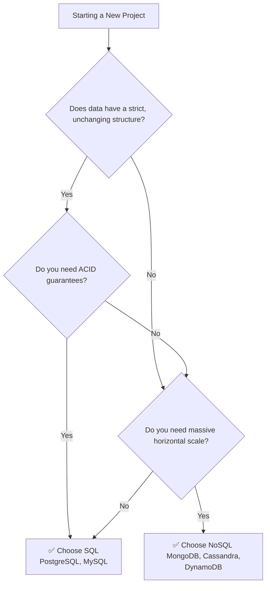
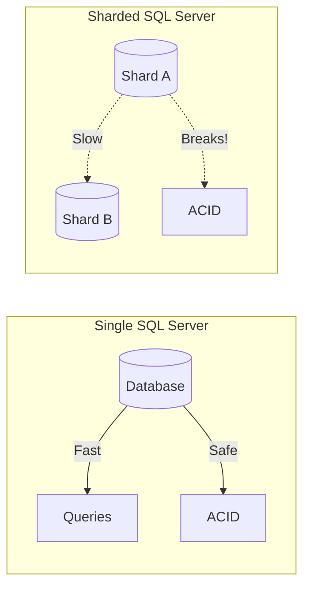
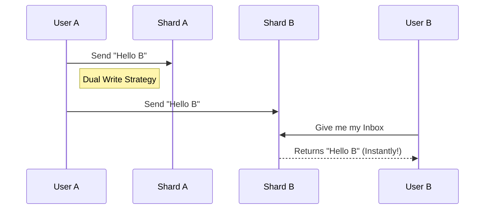
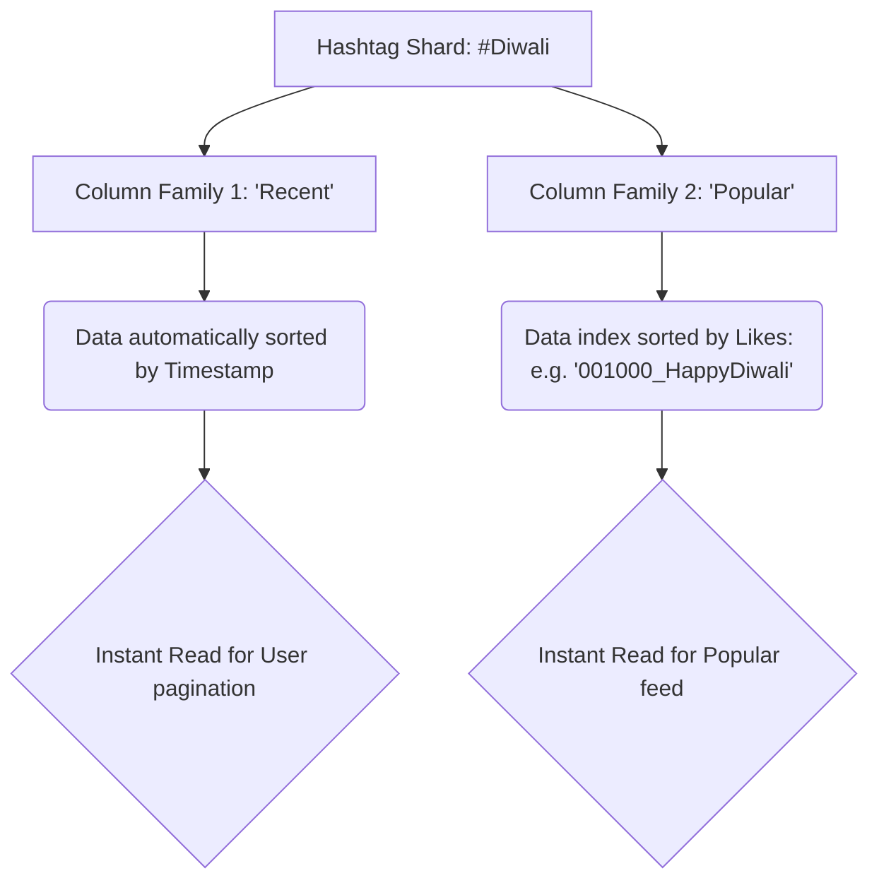
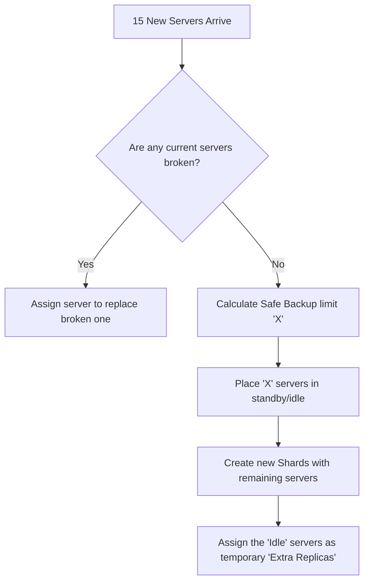

# 🗄️ SQL vs NoSQL: The Simplified System Design Guide

> **Last Updated:** February 2026
> **Author:** System Design Study Notes 
> **Goal:** Understand Databases, Sharding, and Orchestrators easily using analogies, flowcharts (Mermaid), and real-world scenarios.

---

## 🗺️ 1. The Big Picture: SQL vs NoSQL

  

Imagine you are managing an office's records.

*   **🗂️ SQL (Relational):** You use strict, structured Excel columns. Everyone must have a First Name, Last Name, and Age. If someone wants to add "Favorite Color", you have to add a new column for *everyone*, even if it's left blank.
*   **📦 NoSQL (Non-Relational):** You use a flexible filing cabinet. You toss in a folder for John (contains Name and Age), and a folder for Sarah (contains Name, Age, and Favorite Color). You don't care if they differ.

### Flowchart: When to choose which?

---

## ⚖️ 2. Why SQL is Great (but fails at massive scale)

### The Magic of ACID
SQL comes out of the box with **ACID properties**. This is just a fancy term for **"Transactions are Safe"**.
*   **A (Atomicity):** *All or Nothing.* If Rohit transfers ₹900 to Niraj, either the money leaves Rohit AND lands in Niraj, or the whole thing is cancelled. No half-transfers.
*   **C (Consistency):** *Follows the Rules.* No account balances go below ₹0.
*   **I (Isolation):** *No interferences.* If two transactions happen at the exact same millisecond, the system processes them safely as if they were in a queue. No "Dirty Reads" (reading halfway completed math).
*   **D (Durability):** *Permanent.* Once it's saved, it survives a power outage.

### The Problem: Scaling
*   **Vertical Scaling (SQL):** Upgrading from a bicycle -> motorcycle -> sports car -> semi-truck. Eventually, you can't buy a bigger engine.
*   **Horizontal Scaling (NoSQL):** Buying 10,000 bicycles. 

  

SQL completely breaks when you try to split it across many servers (**Sharding**). Cross-shard operations (like Joining a table on Server A with a table on Server B) become impossibly slow, and ACID guarantees fall apart.

---

## 🗃️ 3. The 3 Main Types of NoSQL

When horizontal scaling is mandatory, we drop SQL and choose from three NoSQL types:

1.  **🔑 Key-Value Store (e.g., Redis):** Like a dictionary. You have a `Key` (ex: `user:101`) and a `Value` (ex: `{"name": "Alice"}`). Extremely fast. Automatically sharded by Key.
2.  **📄 Document Database (e.g., MongoDB):** Like a JSON file. Sharded by a unique `Document ID`. Great for storing nested data, but you can't easily fetch just a tiny piece of the document (you usually have to fetch and rewrite the whole thing).
3.  **🗄️ Column-Family (e.g., Cassandra):** Think of it like a giant, heavily partitioned Excel sheet. Every `Row` is completely independent (acts like its own mini-database). Inside the row, data is automatically sorted by **Timestamp**, meaning fetching "Recent" items is almost instant.

---

## 🧠 4. Real-World Case Studies

Choosing the right **Sharding Key** decides if your app survives or crashes.

### 📱 Case 1: WhatsApp / Messenger
*   **Problem:** Fetching a user's Inbox messages instantly.
*   **Strategy:** Shard by **User ID**.
*   **The Trick (Dual Writes):** When User A messages User B, write the message *twice*—once into User A's shard, and once into User B's shard.

*(If we didn't dual-write, User B would have to search Shard A, Shard C, Shard Z... searching the whole world to find their messages!)*

### 🏦 Case 2: Banking System
*   **Problem:** Banks expanding across cities. Should we shard data by `City ID`?
*   **Strategy:** NO! If you shard by City, Bangalore will crash from too much traffic (a "hotspot"), and if a user moves to Mumbai, all their data needs transferring.
*   **Solution:** Shard by **User ID**. Data distributes evenly across servers globally, completely resolving hotspots.

### 🐦 Case 3: Twitter Hashtags (e.g., #Diwali)
*   **Problem:** #Diwali happens. 10,000 tweets per second pour in. We need to display the **Most Recent** top 20 tweets, and the **Most Popular** tweets. 
*   **Strategy:** **Column-Family DB (Cassandra)**. Shard by `#Hashtag`. 

---

## 🤖 5. Orchestrators & Managing Hardware

  

An **Orchestrator** is the "Manager" of the distributed system. It knows exactly which servers are alive, dead, or idle.

### Replicas vs Hot Copies
*   **Replica:** A backup worker copying data (stateful). If a hard drive crashes, we don't lose user data.
*   **Hot Copy:** A manager-in-training (stateless). Has no hard drive data, but perfectly mirrors the Orchestrator's internal memory. So, if the Orchestrator crashes, the Hot Copy takes over the load instantly (< 1 second lag).

### How a good Manager (Orchestrator) handles new budget (Extra Machines)
If the boss says, "I bought 15 new servers!", the Orchestrator follows a strict protocol to ensure safety:

**Why keep backups?** If you selfishly create new shards using *all* 15 servers, the next time a server's hard drive breaks, you will have **zero** replacements available, leading to immediate data loss! By probabilistically calculating a backup limit 'X' based on the frequency of hardware breakdown, you ensure your database is permanently safe.

---
*Prepared using the transcripts from the System Design course for easy retention and clarity!*
